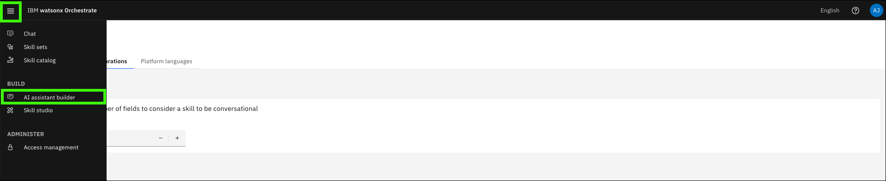
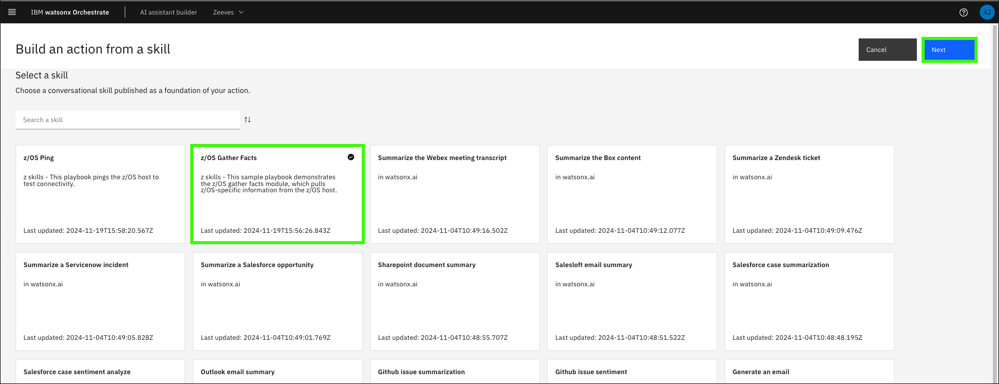
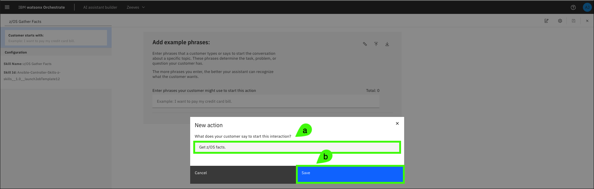
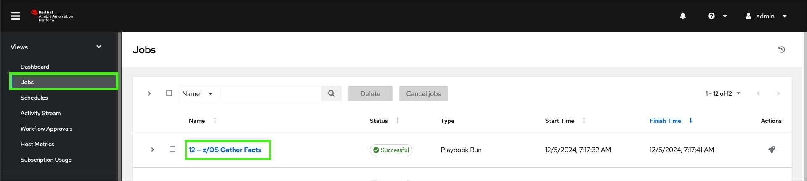

# Creating actions for your assistant
Once the skills in your application are connected to your assistant, you’re ready to begin creating actions tied to those skills. Learn more about building actions <a href="https://www.ibm.com/docs/en/watsonx/watson-orchestrate/current?topic=assistants-building-your-ai-assistant-actions" target="_blank">here</a>

# Configure the number of input fields
Before configuring actions, it’s important to modify a setting within watsonx Orchestrate that allows triggered skills to display as forms (versus conversational skills). 

1. Click your (a) profile icon and then click (b) **Settings**

    Learn more about configuring input fields <a href="https://www.ibm.com/docs/en/watsonx/watson-orchestrate/current?topic=actions-defining-how-interact-skill-in-conversation#configuring-multi-turn-conversations" target="_blank">here</a>.

    

2. Click the **Skill configurations** tab.

    

3. Enter **0** for the **Number of form fields**.

    

## Create actions
4. Click the main menu and select **AI assistant builder**.

    

5. Hover over the **Home** icon () and click **Actions**.

    

6. Click **Create action**.

    

7. Click the **Skill-based action** tile.

    

8. Select the **z/OS Gather Facts** tile and click **Next**.

    Note, the date shown in the tile should reflect when you add the skill to your application.

    

9. On the **New action** dialog, (a) enter a prompt a user of the assistant might use to initiate the action and then (b) click **Save**.

    Sample prompts:

    ```
    Get z/OS facts
    ```

    ```
    Gather z/OS facts
    ```

    

10. Add any (a) additional prompts and then (b) click the save ().

    

11. Click **Preview**.

    

12. Enter one of the prompts you specified in step 9 or 10.

    Prompt:
    ```
    Get z/OS facts
    ```

    

13. Review the returned results.

    

In the execution of this skill-based action, the skill executed properly and the output is the job id. Learn more about building actions <a href="https://www.ibm.com/docs/en/watsonx/watson-orchestrate/current?topic=assistants-building-your-ai-assistant-actions" target="_blank">here</a>.

# Verify the job in the Ansible Automation Platform console
Return to the Ansible Automation Platform (AAP) console and review the job information.

14. Click **Jobs** and expand the **## - z/OS Gather Facts** job.

    

As seen in the assistant, the actual contents of the output aren’t displayed. The utility skills are used to retrieve the job output. It is also possible to create a skill flow that executes the **z/OS Gather Facts** skill followed by the **Retrieve job output** utility skill in sequence; passing the job id from the first skill to the second, in order to view the output within the assistant. Creating a skill flow is covered in the next section.

