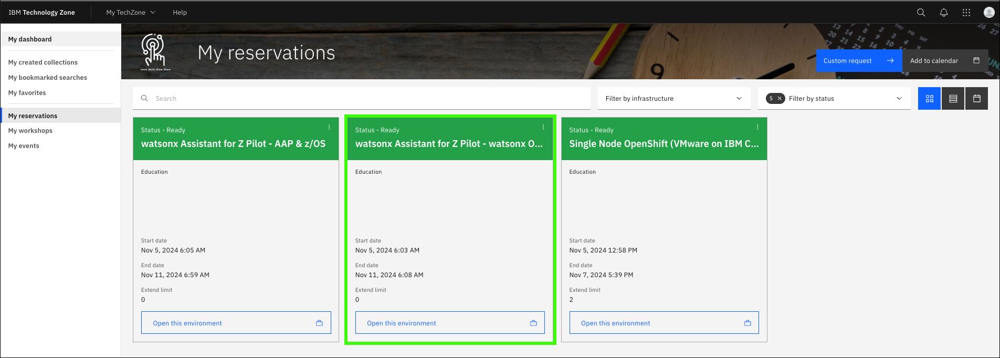
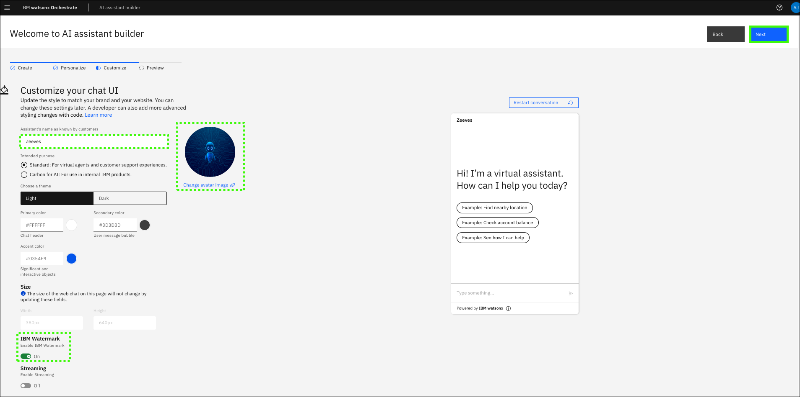
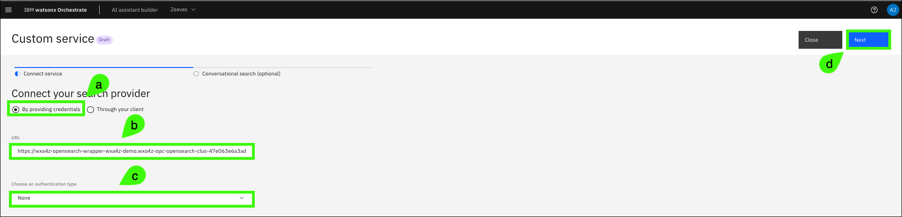
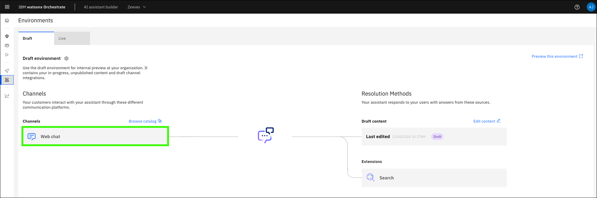
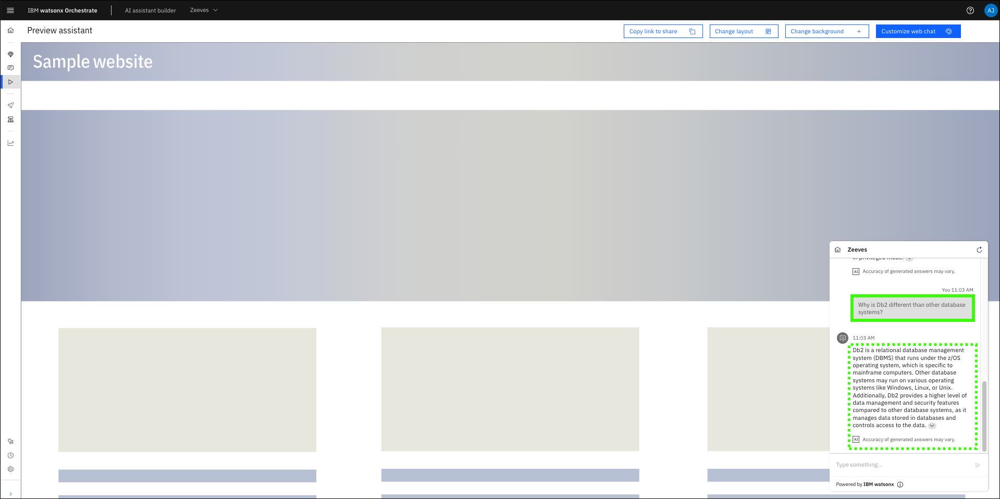

# Creating an Assistant & configuring conversational search
This section will cover how to begin using [watsonx Orchestrate](https://www.ibm.com/products/watsonx-orchestrate?p1=Search&p4=43700077722754881&p5=e&p9=58700008198244496&gad_source=1&gclsrc=ds) to create a new assistant for watsonx Assistant for Z and configure conversational search. You will be able to configure your assistant to use conversational search using a hosted [OpenSearch](https://opensearch.org/) instance. The pre-configured instance in IBM Technology Zone (ITZ) has over 220 knowledge sources and supports the Retrieval Augmented Generation (RAG) in which the Large Language Model (LLM) providing the conversational AI is augmented by this knowledge based on IBM Z documentation. All of which helps create IBM Z context-aware responses to queries with its content-grounded knowledge.

## Access the ITZ IBM Cloud account for the watsonx Assistant for Z Pilot environment
1. In the IBM Technology Zone portal, expand **My TechZone** at the top and select **My Reservations**, or click the link below.

     <a href="https://techzone.ibm.com/my/reservations" target="_blank">**ITZ My reservations**</a>
   
    

2. Click the **watsonx Assistant for Z Pilot - watsonx Orchestrate** tile.

    

3. Record the ITZ IBM Cloud account name/number associated with the reservation.

    

4. Click the **IBM Cloud Login** link.

    

    !!! Note "Steps to authenticate to IBM Cloud are not illustrated here."

        You may need to authenticate to IBM Cloud after clicking the link. These steps are not shown here as they may vary by individual.

5. Verify the current IBM Cloud account is the same as the account name/number recorded in step 3, if not the same, switch to the proper account.

    Note: the formatting of the name may appear differently than what was shown in the ITZ reservation.

    

    If the proper account is not listed, click the account drop down and select the proper account. Note, if your browser window is narrow, the account drop down may be depicted with the switch account icon ().

    

## Create your Assistant
6. Click the **resources** icon ().

    

7. Expand the **AI / Machine Learning** section and click the **watsonx Orchestrate** instance listed (the instance name will be different than shown in the image below).

    

8. Click **Launch watsonx Orchestrate**.

    

9. Click the **AI assistant builder** tile to start creating a new assistant.

    

10. Enter a name and optional description for your assistant and click **Next**.

    

11. Complete the **Personalize your assistant** form and click **Next**.

    Explore the personalization options. When creating an assistant for a client pilot consider specifying attributes that align with the client's business.

    **a**. Select **Web**.

    **b**. Select the industry of your choice.

    **c**. Select the role of your choice.

    **d**. Select the need of your choice.

    

12. Complete the **Customize your chat UI** form and click **Next**.

    Explore the customization options. When creating an assistant for a client pilot consider specifying attributes that align with the client (for example, colors and logos).

    

13. Preview your assistant and then click **Create**.

    

At this point, the assistant has been created.


<a name="configureCustomSearchURL"></a>
## Configure conversational search
The next step will be to configure **conversational search** for your assistant using a hosted instance of OpenSearch.

14. Click **Generative AI** menu item () in the left navigation.

    

15. Review the base large language model (LLM) settings.

    Notice the other LLM models available. For most pilots, the **granite-3-8b-instruct** model is appropriate.

    

16. Click **Set up your Search Integration**.

    By default, conversational search is not enabled when an assistant is created. Conversational search will take priority over general-purpose answering if both are enabled. Learn more about conversational search in watsonx <a href="https://www.ibm.com/docs/en/watsonx/watson-orchestrate/current?topic=assistants-conversational-search" target="_blank">here</a>.

    

17. Click **Custom service**.

    

18. Complete the **Custom service** form and then click **Next**.

    **a**. Select **By providing credentials**.

    **b**. Enter the following value in the **URL** field (use the copy icon to avoid typographical errors).
    ```
    {{itz.hostedOpenSearchInstance}}
    ```

    **c**. Select **None** in the **Choose an authentication type** drop-down list.

    

19. Enable **conversational search** and then click **Save**.

    
       
20. Update the conversational search **custom service** settings based upon your requirements.

    Note: the **Settings** page is divided into two sections in the images below to enhance the visibility of the screen captures. Learn more about these settings <a href="https://cloud.ibm.com/docs/watson-assistant/watson-assistant?topic=watson-assistant-conversational-search#tuning-the-generated-response-length-in-conversational-search" target="_blank">here</a>.

    The following settings have proven to work well. You can experiment with these settings to see how they affect queries for your client's pilot.

    **a**. Enable **Conversational search**.

    **b**. Select **Single turn**. Enabling multi-turn conversation (by selecting Entire conversation) is not yet supported for the solution on-prem. Please be mindful in using this option and ensure the client understands what is currently supported today by the solution.
    
    **c**. Specify the text appears to expand the list of citations in the assistant (except web chat client).

    **d**. Select **Rarely** for the tendency to say "I don't know" setting.

    **e**. Select **Verbose** for the generated response length.This setting affects the average response length. Depending on user input, variations from the selected length may occur.

    

    **f**. Leave the **Default filter** field empty.

    **g**. The **Metadata** field provides a way to adjust your assistant’s behavior during conversational search for your OpenSearch instance. This option will be explored in detail in the **Deploy a dedicated OpenSearch instance for document ingestion** section. Leave the field empty for now.

    **h**. The **Search display text** options specify the default text displayed when no results are found or when there are connectivity issues to the backend search service. You can keep the defaults or customize.

    

21. Click **Save** and then click **Close**.

    
## Additional configuration
Once you have saved and closed the **Conversational search** configuration page, there are a few more configurations needed to get the best experience from your conversational chat. Details on these settings are available <a href="https://www.ibm.com/docs/en/watsonx/waz/2.x?topic=cluster-configuring-your-assistant-use-byos" target="_blank">here</a>.

22. Hover over the **Generative AI** icon () in left navigation and click **Actions**.

    

23. Click **Set by assistant** under the **All items** menu.

    

24. Click **no matches**.

    

25. Click **Step 1** under **Conversation steps**.

    

26. Select (**a**) **without conditions** in the **Is taken** drop-down menu and then click (**b**) **Clear conditions**.

    Note, the **Is taken** value does not change from **with conditions** after selecting **without conditions**.

    

27. Delete the default text in the **Assistant says** entry field.

    

28. Select **Search for the answer** in the **And then** drop-down menu.

    

29. Click **Edit settings**.

    

30. Select **End the actions after returning results** and then click **Apply**.

    

31. Select **Step 2** (**No matches count**) under **Conversation steps** and click the delete icon ().

    

32. Click **Delete** in the confirmation dialog to delete step 2.

    

33. Click the **x** to close the **Editor** window.

    

34. Click **Fallback** in the **Actions** table.

    

35. Delete **all** of the **Conversation steps**.

    Note: the image below has been edited. Only 5 steps are show, but all 6 need to be deleted. You will need to select each step individually, click the delete icon (), and confirm the deletion.

    

36. Verify all **Conversation steps** are deleted and then click the **x** to close the **Editor** window.

    

37. Click the **global settings** ().

    

38. Click **No matches** under the **Conversation routing** tab.

    

39. Move the slider to **More often** (or select **More often** in the drop-down).

    This will ensure that actions are triggered less often unless the user’s query specifically matches the action’s input.

    

40. Click **Autocorrection**.

    

41. Click the **autocorrection** toggle to turn the feature **off**.
    
    

42. Click (a) **Save** and then (b) **Close**.

    

43. Hover over the **home** () and click **Environments**.

    

44. Click **Web chat**.

    

45. On the **Style** tab, click the **Streaming** toggle to enable streaming.

    

46. Click **Suggestions**.

    

47. Click the **Suggestions** toggle to turn this feature **off**.
    
    

48. Click **Save and exit**.

    

## Configure the base Large Language Model (LLM)
Once the above steps have been completed, there are some final enhancements that can be made to configure how the LLM will respond to your queries. This includes Adding prompt instructions as well as configuring the LLM’s answer behavior.
These options can be summarized <a href="https://www.ibm.com/docs/en/watsonx/waz/2.x?topic=assistant-configuring-base-llm" target="_blank">here</a>.

49. Hover over the **home** () and click **Generative AI**.
    
    

50. Click **Add instructions**.

    

51. Enter a **prompt instruction**.

    This option instructs the LLM in your assistant to give refined responses by adding prompt instructions. The instructions helps the LLM guide the conversations with clarify and specifically to achieve the end-goal of an action.

    Enter the prompt instructions in the field. The maximum number of characters you can enter in the Prompt instruction field is 1,000. 
        
    Below is an example prompt instruction that has worked well. Feel free to explore using your own prompt instructions.

    ```
    You are a subject matter expert on mainframe systems. Please respond to all prompts with truth and accuracy. Keep all answers short and concise, unless requested to provide details.
    ```

    **Note: Once the instructions are typed in, they are automatically saved and the LLM is immediately trained on them.**

    

52. Toggle **General-purpose answering** to **off**.

    There is also the ability to configure the answering behavior of your assistant to provide responses that are based on the preloaded content or general content.

    At the bottom of the Generative AI page (under Prompt Instructions), you will see the Answer behavior section. Once you’ve configured Conversational search, you will now see that it is enabled (toggled on) with the search integration you added previously.

    If you enable both General-purpose answering as well as Conversational search, the Conversational search answering takes precedence over General-purpose answering. 
    
    **For purposes of retrieving Z specific answers and responses, it is recommended that you turn off General-purpose answering and only leave Conversational search turned on.**

    

## Testing conversational search
Now that all of your assistant settings have been made and you have enabled conversational search, you can begin issuing queries to test the responses.

It is important to keep in mind that many of the settings configured above can be iteratively modified based on your assessment of the quality of responses. These can be revisited and changed at any point (for example, adding additional prompt instructions, changing verbosity of the responses, and modifying the indexes used for OpenSearch).

53. Hover over the **home** () and click **Preview**.

    

54. Experiment with different prompts and validate the answers are reasonable and related to IBM Z.

    Here are a few prompts and responses. Note: the responses you receive may vary from those shown below.

    **Prompt**: 

    ```
    What is the APF list in z/OS? Provide a detailed explanation?
    ```

    **Example output**:

    

    **Prompt**:

    ```
    Why is Db2 different than other database systems?
    ```

    **Example output**:

    

    **Prompt**:

    ```
    What happens during an IPL on IBM Z?
    ```

    **Example output**:

    

<!-- Should we add a query that will eventually fire a skill off and show that id doesn't do that right now? -->

You should now have a working assistant using {{offering.name}}.
Feel free to explore with different prompt instructions and settings. If you encounter any issues, the Troubleshooting section that follows may help resolve them.

Continue to the [Creating a standalone OpenSearch instance for document ingestion](documentIngestion.md) learn how to configure a dedicated OpenSearch instance for ingesting client specific documentation into the RAG model.

## Troubleshooting
The following are issues you may encounter. If the provided resolutions do not work, contact support using the methods mentioned in the [Support](../index.md#support) section of this guide.

??? Failure "Assistant responds to all prompts with, "I might have information related to your query to share, but am unable to connect to my knowledge base at the moment""

    This Assistant is unable to connect to the custom service URL specified. This could be a network issue, the service may be down, the service may be restarting, or the service is no longer running at that URL.

    Before reaching out to [Support](../index.md#support), try the following:

    - Wait a few minutes and try again. It may be the service was in the process of restarting.
        
    - If you printed this demonstration guide or saved a copy, verify you are using the most current version of the <a href="{{guide.url}}" target="_blank">lab guide</a> and the correct service URL ({{itz.hostedOpenSearchInstance}}). The URL may have changed since you saved or printed the lab guide.

