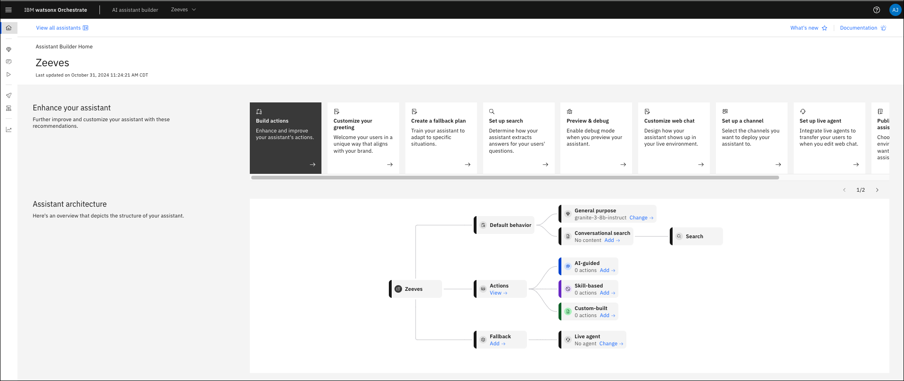
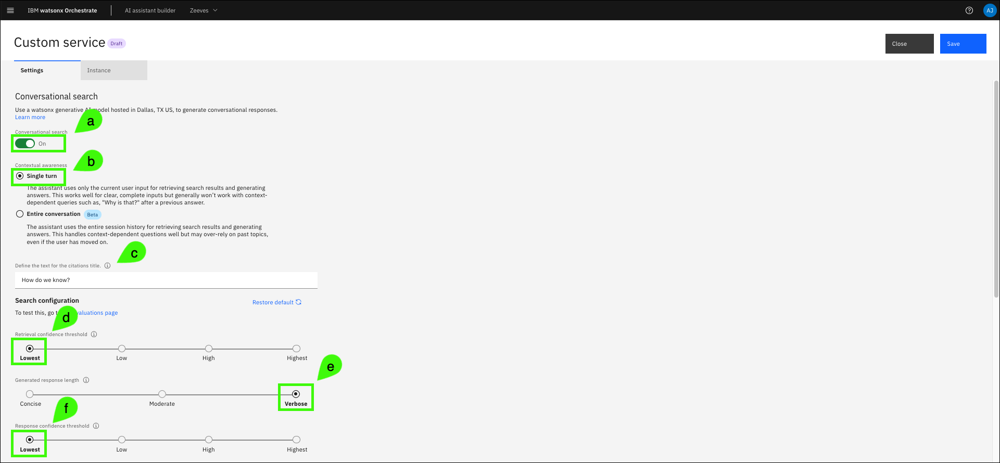
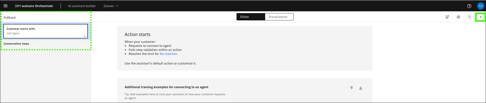

# Creating an Assistant & configuring conversational search
This section will cover how to begin using [watsonx Orchestrate](https://www.ibm.com/products/watsonx-orchestrate?p1=Search&p4=43700077722754881&p5=e&p9=58700008198244496&gad_source=1&gclsrc=ds) to create a new assistant for watsonx Assistant for Z and configure conversational search. You will be able to configure your assistant to use conversational search using a hosted [OpenSearch](https://opensearch.org/) instance. The pre-configured instance in IBM Technology Zone (ITZ) has over 220 knowledge sources and supports the Retrieval Augmented Generation (RAG) in which the Large Language Model (LLM) providing the conversational AI is augmented by this knowledge based on IBM Z documentation. All of which helps create IBM Z context-aware responses to queries with its content-grounded knowledge.

<!-- Note: In this section, you can test setting up conversational search using a hosted OpenSearch instance in ITZ. If you would like to support a use case in which you’re able to ingest your own documentation in addition to the pre-packaged IBM Z Documentation, you will need to leverage Bring Your Own Search (BYOS). The following section after this is optional and provides guidance on how to do this, i.e. deploying your own OpenSearch instance on an OCP cluster. The instance will have the pre-installed IBM Z documentation along with a data ingestion service that you can use to load your own documents. You will then be able to configure watsonx Assistant for Z and its search parameters to fetch content from these documents. -->

## Create your Assistant
1. If not already open, click the link below to open a browser to the IBM Cloud portal and authenticate using your email address.

    <a href="cloud.ibm.com" target="_blank">**IBM Cloud portal**</a>

2. Click the account menu and select the **{{itz.account1}}** account.

    

3. Click the **resources** icon ().

    

3. Expand the **AI / Machine Learning** section and click the **watsonx Orchestrate** instance listed (the instance name will be different than shown in the image below).

    

4. Click **Launch watsonx Orchestrate**.

    

5. Click the **AI assistant builder** tile to start creating a new assistant.

    

6. Enter a name for your assistant and click **Next**.

    

7. Complete the **Personalize your assistant** form and click **Next**.

    Explore the personalization options. When creating an assistant for a client pilot consider specifying attributes that align with the client's business.

    **a**. Select **Web**.

    **b**. Select the industry of your choice.

    **c**. Select the role of your choice.

    **d**. Select the need of your choice.

    

8. Complete the **Customize your chat UI** form and click **Next**.

    Explore the customization options. When creating an assistant for a client pilot consider specifying attributes that align with the client (for example, colors and logos).

    

9. Preview your assistant and then click **Create**.

    

At this point, the assistant has been created.


## Configure conversational search
The next step will be to configure **conversational search** for your assistant using a hosted instance of OpenSearch.

10. Click **Generative AI** menu item () in the left navigation.

    

11. Review the base large language model (LLM) settings.

    Notice the other LLM models available. For most pilots, the **granite-3-8b-instruct** model is appropriate.

    

12. Click **Set up your Search Integration**.

    By default, conversational search is not enabled when an assistant is created. Conversational search will take priority over general-purpose answering if both are enabled. Learn more about conversational search in watsonx <a href="https://www.ibm.com/docs/en/watsonx/watson-orchestrate/current?topic=assistants-conversational-search" target="_blank">here</a>.

    

13. Click **Custom service**.

    

14. Complete the **Custom service** form and then click **Next**.

    **a**. Select **By providing credentials**.

    **b**. Enter the following value in the **URL** field (use the copy icon to avoid typographical errors).
    ```
    {{itz.hostedOpenSearchInstance}}
    ```

    **c**. Select **None** in the **Choose an authentication type** drop-down list.

    

15. Enable **conversational search** and then click **Save**.

    
       
16. Update the conversational search **custom service** settings based upon your requirements.

    Note: the **Settings** page is divided into two sections in the images below to enhance the visibility of the screen captures. Learn more about these settings <a href="https://cloud.ibm.com/docs/watson-assistant/watson-assistant?topic=watson-assistant-conversational-search#tuning-the-generated-response-length-in-conversational-search" target="_blank">here</a>.

    The following settings have proven to work well. You can experiment with these settings to see how they affect queries for your client's pilot.

    **a**. Enable **Conversational search**.

    **b**. Select **Single turn**. Enabling multi-turn conversation (by selecting Entire conversation) is not yet supported for the solution on-prem. Please be mindful in using this option and ensure the client understands what is currently supported today by the solution.
    
    **c**. Specify the text appears to expand the list of citations in the assistant (except web chat client).

    **d**. Select **Rarely** for the tendency to say "I don't know" setting.

    **e**. Select **Verbose** for the generated response length.This setting affects the average response length. Depending on user input, variations from the selected length may occur.

    

    **f**. Leave the **Default filter** field empty.

    **g**. The **Metadata** field provides a way to adjust your assistant’s behavior during conversational search for your OpenSearch instance. This option will be explored in detail in the **Deploy a dedicated OpenSearch instance for document ingestion** section. Leave the field empty for now.

    **h**. The **Search display text** options specify the default text displayed when no results are found or when there are connectivity issues to the backend search service. You can keep the defaults or customize.

    

17. Click **Save** and then click **Close**.

    
## Additional configuration
Once you have saved and closed the **Conversational search** configuration page, there are a few more configurations needed to get the best experience from your conversational chat. Details on these settings are available <a href="https://www.ibm.com/docs/en/watsonx/waz/2.0?topic=cluster-configuring-your-assistant-use-byos" target="_blank">here</a>.

18. Hover over the **Generative AI** icon () in left navigation and click **Actions**.

    

19. Click **Set by assistant** under the **All items** menu.

    

20. Click **no matches**.

    

21. Click **Step 1** under **Conversation steps**.

    

22. Select (**a**) **without conditions** in the **Is taken** drop-down menu and then click (**b**) **Clear conditions**.

    Note, the **Is taken** value does not change from **with conditions** after selecting **without conditions**.

    

23. Delete the default text in the **Assistant says** entry field.

    

24. Select **Search for the answer** in the **And then** drop-down menu.

    

25. Click **Edit settings**.

    

26. Select **End the actions after returning results** and then click **Apply**.

    

27. Select **Step 2** (**No matches count**) under **Conversation steps** and click the delete icon ().

    

28. Click **Delete** in the confirmation dialog to delete step 2.

    

29. Click the **x** to close the **Editor** window.

    

30. Click **Fallback** in the **Actions** table.

    

31. Delete **all** of the **Conversation steps**.

    Note: the image below has been edited. Only 5 steps are show, but all 6 need to be deleted. You will need to select each step individually, click the delete icon (), and confirm the deletion.

    

32. Verify all **Conversation steps** are deleted and then click the **x** to close the **Editor** window.

    

## Troubleshooting

The following are issues you may encounter. If the provided resolutions do not work, contact support using the methods mentioned in the [Support](../index.md#support) section of this guide.

??? Failure "Assistant responds to all prompts with, "I might have information related to your query to share, but am unable to connect to my knowledge base at the moment""

    This Assistant is unable to connect to the custom service URL specified. This could be a network issue, the service may be down, the service may be restarting, or the service is no longer running at that URL.

    Before reaching out to [Support](../index.md#support), try the following:

    - Wait a few minutes and try again. It may be the service was in the process of restarting.
        
    - If you printed this demonstration guide or saved a copy, verify you are using the most current version of the <a href="{{guide.url}}" target="_blank">lab guide</a> and the correct service URL ({{itz.hostedOpenSearchInstance}}). The URL may have changed since you saved or printed the lab guide.

