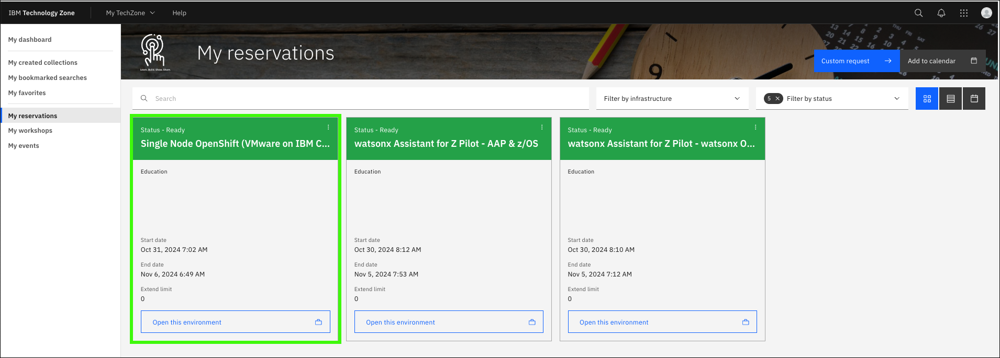
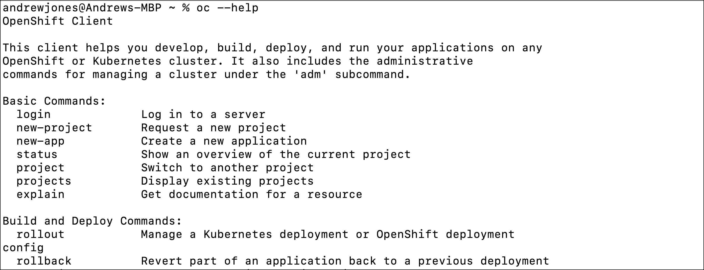
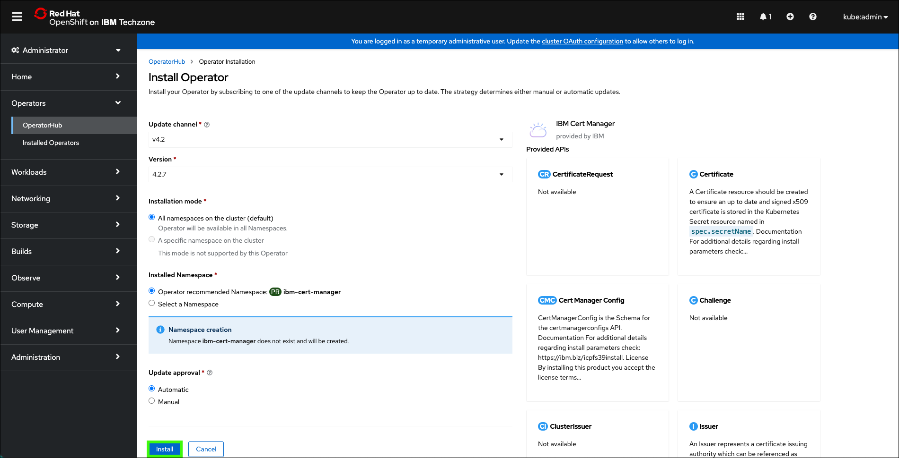
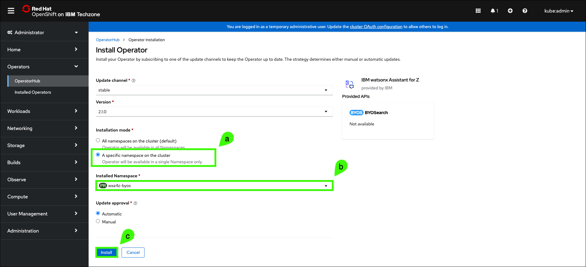
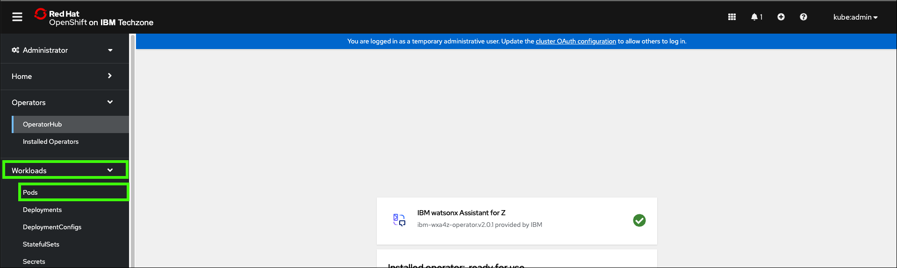
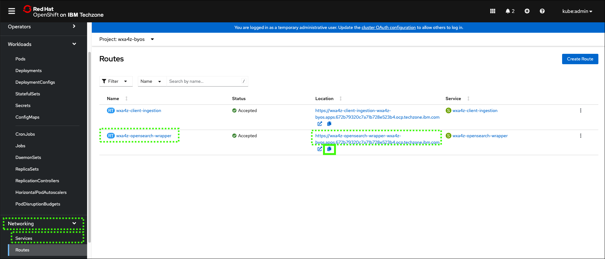

# Creating a standalone OpenSearch instance for document ingestion
This section will cover how to enable a client to ingest their own documentation into the Retrieval Augmented Generation (RAG) used by {{offering.name}}. This requires deploying a dedicated [OpenSearch](https://opensearch.org/) instance. 

Earlier, you provisioned three IBM Technology Zone (ITZ) environments. One of which was a single-node Red Hat OpenShift (SNO) cluster. If you have not already reserved this environment, or it is not in the **Ready** state, return to the 
[IBM Technology Zone environment](../TechZoneEnvironment.md) section to complete the reservation.

## Install the Red Hat OpenShift command line interface utility 
The Red Hat OpenShift command line interface (CLI) utility, known as **oc**, must be installed on your local machine. If you already have the **oc** utility installed, you can proceed to [Log into the SNO cluster](#Login2OpenShift).

1. Click the link below to open a browser window to your ITZ reservations.

    <a href="https://techzone.ibm.com/my/reservations" target="_blank">ITZ My reservations</a>

2. Click the **Single Node OpenShift** tile.

    

3. Scroll to the bottom of the reservation page and record the **Cluster Admin Username** and **Cluster Admin Password**.

    

4. Click the **OCP Console** link.

    

5. Enter the **Cluster Admin Username** and **Cluster Admin Password** values from step 3 and click **Log in**.

    

6. Click the help () and then click **Command Line Tools**.

    

7. Click the link under **oc - OpenShift Command Line Interface (CLI)** for the operating system of your local machine.

    

Clicking the above link will automatically download either a **zip** or **tar** file specific to your operating system. You should unzip or un-tar the file and place the **oc** binary in a directory that is in your default PATH. Since this will vary by operating system and individual settings, details for doing this are not provided. 

Once properly installed, verify the installation by running the **oc** command in a terminal on your local machine.

```
oc --help
```
Sample output:



## Prepare to ingest documents
Before ingesting documents, a few setup steps must be taken.

<a name="Login2OpenShift"></a>
### Login to the OpenShift cluster from your local machine
Note: if you just installed the **oc** utility, you should be able to skip the next 5 steps.
1. Click the link below to open a browser window to your ITZ reservations.

    <a href="https://techzone.ibm.com/my/reservations" target="_blank">ITZ My reservations</a>

2. Click the **Single Node OpenShift** tile.

    

3. Scroll to the bottom of the reservation page and record the **Cluster Admin Username** and **Cluster Admin Password**.

    

4. Click the **OCP Console** link.

    

5. Enter the **Cluster Admin Username** and **Cluster Admin Password** values from step 3 and click **Log in**.

    

6. Click the **kube:admin** profile drop-down and click **Copy login command**.

     

7. Click **Display Token**.

    

8. Select and copy the **Log in with this token** string.

    The steps to select and copy the value may differ by operating system, but for most, you should be able to double-click the value and then right click and select **Copy**.

    

9. Open a command prompt or terminal window on your local machine.

10. Paste the login command line in the terminal window and press **enter**.

    

### Create a working directory
11. Create a directory that will be used to store the configuration files that will be created in the next steps.

    !!! Note "Instructions may vary by your local machines operating system"
    
        The directions that follow may vary depending on your operating system. The examples provided are based upon MacOS.

    ```
    mkdir watsonxAssistant
    ```

12. Change to the new directory.

    ```
    cd watsonxAssistant
    ```

    

### Install IBM Certificate Manager on OpenShift
13. Create a file named **catalogCertManager.yaml** using a text editor and paste the following text into the file.

    !!! Important "Formatting of the yaml file is critical!"

        The content of the YAML file must be formatted exactly as shown. Use the copy icon to prevent typographical errors.

    ```
    apiVersion: operators.coreos.com/v1alpha1 
    kind: CatalogSource 
    metadata: 
      name: ibm-cert-manager-catalog 
      namespace: openshift-marketplace 
    spec: 
      displayName: ibm-cert-manager-4.2.7 
      grpcPodConfig: 
        securityContextConfig: restricted 
      image: icr.io/cpopen/ibm-cert-manager-operator-catalog@sha256:4dcf4ace4b5f166f83b31063f7e6404dbf78d8e98a9d4fcf52fedf576a55ca6c 
      publisher: IBM 
      sourceType: grpc 
      updateStrategy: 
        registryPoll: 
          interval: 30m0s
    ```

14. Install the IBM Certificate Manager operator in the OpenShift cluster.

    ```
    oc apply -f catalogCertManager.yaml
    ```

    The above command should return a message stating the **ibm-cert-manager-catalog** was created.

15. In the OpenShift web console, click **Operators** and select **OperatorHub**.

    

16. Click the **Project** to pull-down menu and click the **Show default projects** toggle.

    

17. Scroll down and select **openshift-marketplace**.

    

18. Enter **IBM Cert Manager** in the search field and then click the **IBM Cert Manager** tile.

    

19. Click **Install**.

    

20. Keep the default settings and click **Install**.

    

    The install process will take a few minutes. Do not continue until you see the message: **Installed operator: ready for use**.

    

### Install the watsonx Assistant for Z Operator (for OpenSearch)
21. In your command prompt or terminal window, create a new namespace called **wxa4z-byos** in the OpenShift cluster.

    ```
    oc create namespace wxa4z-byos 
    ```

22. Create or obtain your IBM Container Software **production entitlement key**.

    A **production entitlement key** is required to pull the container images that get deployed by the operator.

    To create this key, follow the <a href="https://github.ibm.com/alchemy-registry/image-iam/blob/master/obtaining_entitlement.md" target="_blank">instructions here</a> to create or retrieve your existing entitlement key. 

    Once you locate your existing key or create a new key continue to the next step.

23. Copy the **production entitlement key**.

    

24. Using the command below in your command prompt or terminal window, set an environment variable with your **production entitlement key** and then create a pull secret for the container registry.

    Substitute your **production entitlement key** for the **<entitlement key\>** string.

    ```
    export IBM_CS_ENT_KEY=<entitlement key>
    ```

    ```
    oc -n wxa4z-byos create secret docker-registry icr-pull-secret --docker-server=cp.icr.io --docker-username=cp --docker-password=$IBM_CS_ENT_KEY
    ```

    

25. Create a file called **catalogSource.yaml** with the following content.

    !!! Important "Formatting of the yaml file is critical!"

        The content of the YAML file must be formatted exactly as shown. Use the copy icon to prevent typographical errors.

    ```
    apiVersion: operators.coreos.com/v1alpha1 
    kind: CatalogSource 
    metadata: 
      name: ibm-wxa4z-operator-catalog 
      namespace: wxa4z-byos 
    spec: 
      displayName: "IBM watsonx Assistant for Z Operator Catalog" 
      image: icr.io/cpopen/ibm-wxa4z-catalog:2.0.2@sha256:d457aa24af07c23d7b36727a9cff95995ca1c4ed49fb980ef4f386fda09a29b4
      publisher: 'IBM' 
      sourceType: grpc 
      secrets: 
      - icr-pull-secret
    ```

26. Create your document catalog in the OpenShift operator.

    ```
    oc apply -f catalogSource.yaml
    ```

    

27. In the OpenShift web console, click **OperatorHub** and select the **wxa4z-byos** project.

    

28. Enter **ibm watsonx** in the search field and the click the **IBM watsonx Assistant for Z Operator Catalog** tile.

    

29. Click **Install**.

    

30. Select **A specific namespace on the cluster** under **Installation mode** and **wxa4z-byos** for the **Installed Namespace**, then click **Install**.

    

    The install process will take a few minutes. Do not continue until you see the message: **Installed operator: ready for use**.

    

31. In your command prompt or terminal window, run the following commands to add the container registry credential to the operator's service account.

    ```
    oc project wxa4z-byos
    ```

    ```
    oc patch serviceaccount ibm-wxa4z-operator-controller-manager --type merge -p '{"imagePullSecrets": [{"name": "icr-pull-secret"}]}'
    ```

    

32. In the OpenShift web console, click **Workloads** and select the **Pods**.

    

33. Verify the two pods that start with **ibm-wxa4z-operator** have a Status of **Running** and that all pods are **Ready**.

    

34. Run the following command to set the administrative policy for the workspace.

    ```
    oc -n wxa4z-byos adm policy add-scc-to-user privileged -z byos
    ```

    

### Deploy required secrets and the custom bring-your-own-search (BYOSearch) resource

35. Create a file called **os-secret.yaml** with the following content.

    Substitute a secure password of your choosing for the string **<OPENSEARCH_PASSWORD\>**.

    ```
    apiVersion: v1 
    stringData: 
      password: <OPENSEARCH_PASSWORD> 
    kind: Secret 
    metadata: 
      name: opensearch-creds 
      namespace: wxa4z-byos 
    type: Opaque
    ```

36. Create the secret by running the following command.

    ```
    oc apply -f os-secret.yaml
    ```

37. Create a file called **client-ingestion-secret.yaml** with the following content.

    Substitute a secure authentication key of your choosing for the string **<CLIENT_INGESTION_AUTHKEY\>**. The authentication key can just be a random password.

    ```
    apiVersion: v1 
    stringData: 
      authkey: <CLIENT_INGESTION_AUTHKEY> 
    kind: Secret 
    metadata: 
      name: client-ingestion-authkey 
      namespace: wxa4z-byos 
    type: Opaque
    ```

38. Create the secret by running the following command.

    ```
    oc apply -f client-ingestion-secret.yaml
    ```

39. Obtain and record your cluster domain used for routes by running the following command.

    ```
    oc -n openshift-ingress-operator get ingresscontroller default -o jsonpath="{.status.domain}"
    ```

    !!! Warning "Remove the trailing **%** from the cluster domain name."

        The value returned for the cluster domain may include a **%** character at the end. Do not include the **%** in the next step!

    Note, the output of the command will be a string similar to: **apps.672b79320c7a71b728e523b4.ocp.techzone.ibm.com**

40. Create a file called **byos.yaml** with the following content.

    Substitute the domain name recorded in the previous step for the string **<YOUR_CLUSTER_DOMAIN\>**. Do not include the **%** at the end of the domain name.

    ```
    apiVersion: wxa4z.watsonx.ibm.com/v1
    kind: BYOSearch
    metadata:
      name: byosearch
      namespace: wxa4z-byos
    spec:
      imagePullSecrets:
      - name : icr-pull-secret
      namespace: wxa4z-byos
      clusterName: wxa4z-byos-cluster
      clusterDomain: <YOUR_CLUSTER_DOMAIN>

      opensearch:
        secretName: opensearch-creds

        persistence:
          enabled: true
          storageClass: "managed-nfs-storage"
          accessModes:
            - ReadWriteOnce
          size: 24Gi

      wrapper:
        createRoute: true
        resources:
          requests:
            cpu: 4
            memory: "500Mi"
        limits:
            cpu: 4
            memory: "1Gi"
  
      clientIngestion:
        secretName: client-ingestion-authkey

        resources:
          limits:
            cpu: "500m"
            memory: 2Gi
            nvidia.com/gpu: "0"
          requests:
            cpu: "500m"
            memory: 1Gi
            nvidia.com/gpu: "0"
        pvc:
          storageClass: "managed-nfs-storage"
          enabled: true
          size: 24Gi
    ```

41. Run the following command to deploy BYOS on your cluster.

    ```
    oc apply -f byos.yaml
    ```

The BYOS deployment will begin and could take up to 20 minutes or more for the images to download and the deployment to complete. You can check the status by looking at the Pods view in the OCP console.

### Verify all the required pods are running
42. Verify all pods are either have the status of **Running** or **Completed**.

    

Once finished deploying and all the pods have a status of “Ready” or “Running”, you must retrieve you BYOS endpoint URL.

43. In the OCP console, click on **Networking** and then **Routes**.

    

44. Copy and record the location for the **wxa4z-opensearch-wrapper** route.


    

### Update your assistant with the new BYOS search instance

45. Configure your assistant with the route recorded in previous step.

    First, append the string **/v1/query** to complete the URL endpoint. The URL should look similar to the following:

    **https://wxa4z-opensearch-wrapper-wxa4z-byos.apps.672b79320c7a71b728e523b4.ocp.techzone.ibm.com/v1/query**

    Note, the above URL will not work for you. You must use the value of your specific OpenSearch instance recorded in the previous step.

    Next, you need to return to your assistant in the watsonx Orchestrate AI assistant builder and update the custom search integration URL. The steps to do this is illustrated in the animated gif below. You can revisit this step in the prior section [here](creatingAssistant-configuringConvoSearch.md#configureCustomSearchURL).

    ??? Tip "How to set the custom search integration URL."

        


### Install the **zassist** command

## Troubleshooting
The following are issues you may encounter. If the provided resolutions do not work, contact support using the methods mentioned in the [Support](../index.md#support) section of this guide.

??? Failure "Pods have a status of **ErrImagePull** or **ImagePullBackoff**"

    If the pods starting with **ibm-wxa4z-operator** have a status of “ErrImagePull” or “ImagePullBackoff”, you can delete the pod and it will automatically restart and pull the image successfully. Wait until the pod is re-created successfully.