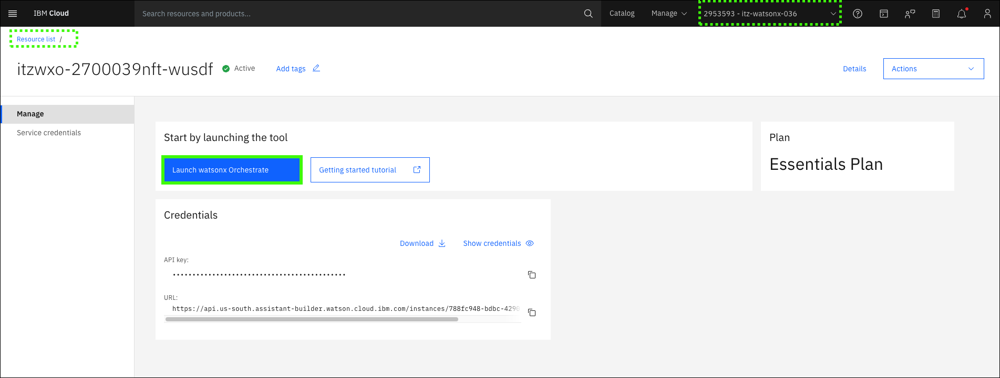

# Importing skills from Ansible Automation Platform
Once you have a better understanding of AAP and the pre-loaded automations available, you can begin to import them as skills into your watsonx Orchestrate instance which will ultimately be used for assistant guided actions.

## Import skills into your assistant
The next steps assume you have an active browser window to the watsonx Orchestrate ITZ cloud account. If you do not, refer to the initial steps in [Creating an assistant and configuring conversational search](creatingAssistant-configuringConvoSearch.md).

1. Click the **resources** icon ().

    

2. Click **Launch watsonx Orchestrate**.

    

3. Click the main menu () and then click **Skill studio**.

    

4. Expand **Create** and click **Import API**.

    

5. Click the **z/OS Skills accelerator (Trial)** tile.

    

6. Enter the following values in the **z/OS Skills accelerator** form and then click **Connect**.

    Use the **URL**, **User Name**, and **Password** values recorded in the [Explore Ansible Automation Platform](exploreAAP.md) section earlier.

    **a**: Connection Type: **ansible**

    **b**: Application Name: <enter a meaningful name for the skills you will import>

    **c**: Connection URL: <enter the URL for your AAP UI>

    **d**: User Name: <enter the AAP User Name (for UI access)>

    **e**: Password: <enter the AAP User Password>

    **f**: Search Pattern: **\***

    

