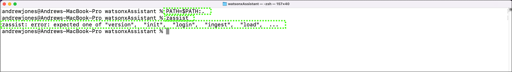

# Installing and using zassist to ingest client documents
With Bring Your Own Search (BYOS) installed and configured in your assistant, you can now prepare for document ingestion. Currently, only PDF, HTML, and DOCX file formats are supported for ingestion. 

To prepare for document ingestion, you can also reference the setup instructions located <a href="https://ibmdocs-test.dcs.ibm.com/docs/en/watsonx/waz/2.0?topic=install-zassist-ingest-data" target="_blank">here</a>.

## Install the zassist utility
The **zassist** utility is an executable program that automates the ingestion of client documentation into the RAG for watsxonx Assistant for Z. The utility is available to clients through <a href="https://www.ibm.com/software/passportadvantage/pao_customer.html" target="_blank">IBM Passport Advantage</a>.

A version of zassist is available for download for IBMers and Business Partners for conducting pilots. Follow the steps below to download and install **zassist**.

1. Click the link below and download the **zassist.zip** file.
   
    <a href="https://ibm.box.com/s/j3nt5iw4fqd5w2jgcqwxnjlsu8bpvl77" target="_blank">https://ibm.box.com/s/j3nt5iw4fqd5w2jgcqwxnjlsu8bpvl77</a>

    

2. Unzip the **zassist.zip** file.
3. Locate the appropriate executable for your local machines operating system.
4. Either copy the appropriate **zassist** executable to a directory in your command prompt or terminal window's PATH, or copy it to a directory and add that directory PATH to your PATH environment variable.

    Additional information for performing the above tasks can be found <a href="https://www.ibm.com/docs/en/watsonx/waz/2.x?topic=data-installing-zassist#tasktask_w13_lhf_4bc__steps__1" target="_blank">here</a>.
5. Verify the **zassist** utility is working.

    

## Ingest client documentation using **zassist**
With the zassist executable ready, you are now able to begin ingesting data. 

Step-by-step guidance for ingesting documents using zassist are provided in the IBM watsonx Assistant for Z documentation <a href="https://www.ibm.com/docs/en/watsonx/waz/2.x?topic=data-ingesting" target="_blank">here</a>.

These steps are not repeated in this lab guide, rather the video below illustrates all of the steps to ingest a single document.

The document ingested in the video is a compressed PDF version of the **IBM z/OS Continuous Delivery** Red Piece. You can download a copy of this document <a href="" target="_blank">here</a>.

 

