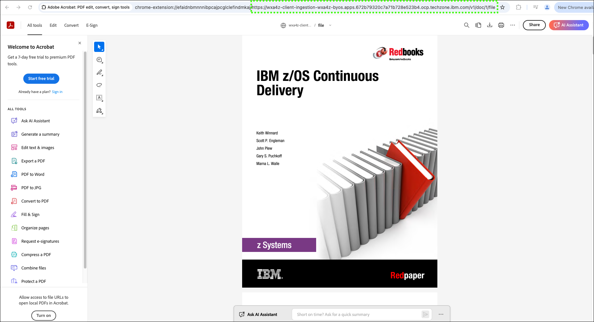

# Installing and using zassist to ingest client documents
With bring-your-own-search (BYOS) installed and configured in your assistant, you can now prepare for document ingestion. Currently, only PDF, HTML, and DOCX file formats are supported for ingestion. 

To prepare for document ingestion, you can also reference the setup instructions that are located <a href="https://ibmdocs-test.dcs.ibm.com/docs/en/watsonx/waz/2.0?topic=install-zassist-ingest-data" target="_blank">here</a>.

## Install the zassist utility
The **zassist** utility is an executable program that automates the ingestion of client documentation into the RAG for watsonx Assistant for Z. The utility is available to clients through <a href="https://www.ibm.com/software/passportadvantage/pao_customer.html" target="_blank">IBM Passport Advantage</a>.

A version of zassist is available for download for IBMers and Business Partners for conducting pilots. Follow the steps that follow to download and install **zassist**.

1. Click the following link and download the **zassist.zip** file.
   
    <a href="https://ibm.box.com/s/j3nt5iw4fqd5w2jgcqwxnjlsu8bpvl77" target="_blank">https://ibm.box.com/s/j3nt5iw4fqd5w2jgcqwxnjlsu8bpvl77</a>

    

2. Extract the **zassist.zip** file.
3. Locate the appropriate file for your local workstation's operating system.

    

4. Either copy the appropriate **zassist** file to a directory in your PATH, or copy it to a directory and add that directory to your PATH environment variable.

    Additional information for running the preceding tasks can be found <a href="https://www.ibm.com/docs/en/watsonx/waz/2.x?topic=data-installing-zassist#tasktask_w13_lhf_4bc__steps__1" target="_blank">here</a>.

5. Verify that the **zassist** utility is working.

    

## Ingest client documentation using **zassist**
With the **zassist** command installed, you are now able to begin ingesting data. 

Step-by-step guidance for ingesting documents using zassist are provided in the IBM watsonx Assistant for Z documentation <a href="https://www.ibm.com/docs/en/watsonx/waz/2.x?topic=data-ingesting" target="_blank">here</a>.

These steps are not repeated in this lab guide. The following video illustrates the steps to ingest a single document. This video has no audio.

{: .print-site-plugin-ignore }

??? Info "Don't see the video in the PDF version of the lab guide?"

    If you are viewing the PDF of the lab guide, you can access the video <a href="https://ibm.github.io/SalesEnablement-L4-watsonx-AssistantForZ/Setup/_videos/zassitIngest-final.mp4" target="_blank">here</a>.

The document that is ingested in the video is a compressed PDF of the **IBM z/OS Continuous Delivery** Red Piece. You can download a copy of this document <a href="https://github.com/IBM/SalesEnablement-L4-watsonx-AssistantForZ/blob/main/docs/Setup/_sampleDocs/redp5340-compressed.pdf" target="_blank">here</a>.

## Verify the document that is ingested is now returned as a source file for a query.
Use the watsonx Orchestrate AI assistant builder to verify your document ingestion.

6. Hover over the home () icon and click **Preview**.
7. Enter the following prompt in your assistant.

    ```
    What is z/OS continuous delivery?
    ```

    

8. Expand the sources section by clicking the ().
   
    

9. Click through the list of resources and find the reference to the Red Piece document you ingested.

    

10. Click the ingested document reference.

    

11. Accept the security risk to view the source document.

    The steps to accept the security risk for the document are not shown. The risk occurs because the certificate for the connection to the SNO instance is not secure. Notice that the URL contains the path to your SNO instance route.

    
 
## Adjusting the search behavior
Do you recall the **Metadata** field when you configured your assistant?


The Metadata field provides a way to adjust your assistant’s behavior during conversational search for your OpenSearch instance. Now that you have your own docs that are ingested for conversational search, you can set the metadata field for your assistant to use those documents in its content-grounded search. If you leave the metadata field empty, then it defaults to settings found to perform well. This replaces having to paste a complicated search string.
By default (without any string in the Metadata field), it searches all the default IBM provided documentation and all ingested customer documentation using the following value:

```
{“ibm_indices”:“*_ibm_docs_slate”,
“customer_indices”:“customer_*”}
```

Replacing the wildcard string with an explicit list of indices allows personalization. The metadata setting is where you can input specific indices (pointing to the underlying documentation) that you want your assistant to use for the content-grounded search. Out of the box there are over 220 products and topics that the OpenSearch instance has IBM Documentation for. You can find those indices and products <a href="https://ibm.box.com/s/anioal2xuwbsck8v3l4r48juzh9tbcqn" target="_blank">here</a>.

You can input a subset of indices into the “Metadata” field in cases where you only want your assistant to gather context for specific IBM products or topics. The specific indices can be listed out in this format:

```
{“ibm_indices”:“<comma separated index values>”,“customer_indices”:“customer_*”}
```

For example, if you only want your assistant to reference documentation for “Db2 Analytics Accelerator for z/OS” and no ingested client documentation, you can enter the following into the metadata field:

```
{“ibm_indices”:“ss4lq8_ibm_docs_slate”}
```

If you have a mix of IBM Documentation and client documentation ingested, then there’s an optional search string that you can use to set the “weights” used for each. 

For example:

```
{"doc_weight":
{"product_docs":0.5,
 "customer_docs":0.5},
"ibm_indicies":"*_ibm_docs_slate",
"customer_indicies":"customer_*"
}
```

In this case, “product_docs” is the weight that is assigned to “ibm_indices” and “customer_docs” is the weight that is assigned to “customer_indices”.

After you have configured all the settings for Conversational Search on the page, click “Save” in the upper-right of the page.

For more information on customizing the metadata field for conversational search, refer to this supplemental video found <href="https://ibm.ent.box.com/s/2quy4drqp3bolgd6flqm0l1c549fz64x/file/1661645917984" target="_blank">here</a>.

You are encouraged to experiment with the metadata field!

**Try setting the metadata field to the following, which weights ingested docs higher than the product docs:**

```
{"doc_weight":
{"product_docs":0.2,
 "customer_docs":0.8},
"ibm_indicies":"*_ibm_docs_slate",
"customer_indicies":"customer_*"
}
```

Now, repeat steps 6 through 8 (make sure you start a fresh preview of the assistant). Notice that the ingested Red Piece document is now the first sited reference!


## Guidance for the pilot environment
If you or your client have other documents to ingest, you can do so by repeating the steps using zassist. The Velocity Pilot ITZ environment is limited in compute and storage capacity. The following limits should be adhered to:

- Greater than 15,000 documents is not supported.

- Individual documents should be less than 10 megabytes (MB).

- Larger documents greater than 50 MB should work if the document contains mostly images.

- Loading documents can take a long time, especially with > 100 MB of text.

- It is recommended to run large loads late at night.

- When loading, ensure your workstations does not sleep during the process.

- If you receive a **batch time error**, set the batch size to a lower number for that command. For example:
  
    ```
    zassist ingest . -s 50
    ```

After ingesting all the your additional documents, proceed to the next section to learn about adding skills to your assistant.