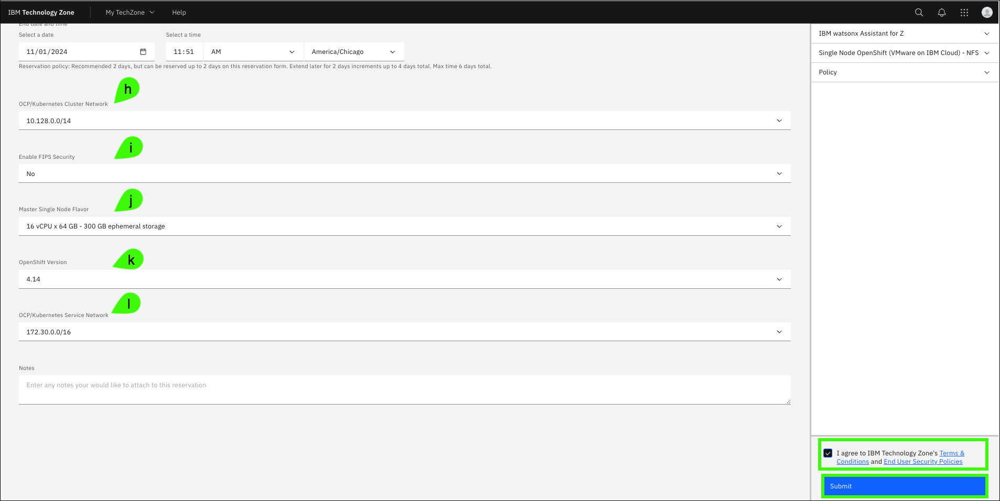
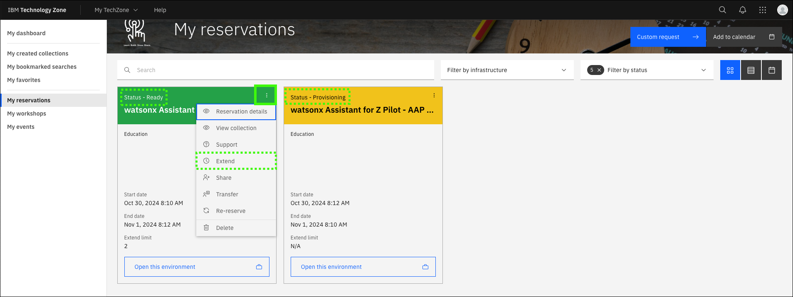
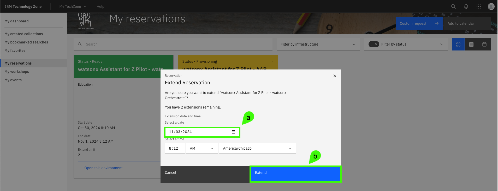

# IBM Technology Zone environment
To enable sellers to both learn how to perform client pilots of {{offering.name}}, multiple environments have been created in IBM Technology Zone (ITZ). The environments leveraged for the watsonx Assistant for Z Velocity lab environment can be found in the <a href="{{itz.collectionURL}}" target="_blank">{{itz.collectionName}}</a> collection and consist of:

- **watsonx Assistant for Z lab – watsonx Orchestrate** – a dedicated tenant of watsonx Orchestrate on IBM Cloud and is leveraged for creating and configuring the assistant, configuring conversational search, importing skills, and configuring assistant actions.

- **Ansible Automation Platform (AAP) & z/OS** – a pattern used to deploy a pre-configured instance of AAP and Wazi z/OS with pre-loaded Ansible playbooks that can be imported as skills within watsonx Orchestrate and connected to your assistant. Provides pre-loaded templates for various use cases which will be covered in a later section. Learn more about AAP <a href="https://www.redhat.com/en/technologies/management/ansible" target="_blank">here</a>. Learn more about Wazi, <a href="https://www.ibm.com/cloud/wazi-as-a-service" target="_blank">here</a>.

- **Single Node OpenShift with NFS storage** – used to provision a single-node OpenShift cluster (SNO) on IBM Cloud. The cluster is used to install a dedicated instance of [OpenSearch](https://opensearch.org/) for watsonx Assistant for Z. This environment enables ingestion of client supplied documents.

<!-- Add architecture info here -->

!!! Warning "All activities in this lab guide are required learning."

    While all 3 environments may not be required for every client pilot, to complete the Level 4 learning plan and earn the {{badge.name}} badge, you must provision all three ITZ environments and complete all sections in the lab guide. **Any statements in the ITZ collection regarding optional environments or tasks should be ignored.**

 <!-- ITZ currently restricts individual users to a maximum of two concurrent environment reservations for the purpose of education or training. To overcome this limitation, an IBM Sales Cloud opportunity number has been created: #######. You will use this number when creating your reservations. This opportunity number should only be used for the purpose of completing this training. -->

Follow the instructions in this section to create new reservation requests, extend the reservations, and access the ITZ demonstration environments. Provisioning the SNO environment in ITZ can take several hours, while the other two environments typically provisioning in under 30 minutes.

## Create a reservation request
1. Click each of the links that follow to open a browser to the reservation pages of the **{{itz.collectionName}}** ITZ environments.

    !!! Warning "You may be asked to authenticate to IBM Technology Zone"

        The steps to authenticate to ITZ are not detailed here as they may vary between users.

    <a href="{{itz.orchestrateEnv}}" target="_blank">watsonx Assistant for Z lab – watsonx Orchestrate - reservation page</a>
    
    <a href="{{itz.aapEnv}}" target="_blank">Ansible Automation Platform (AAP) & z/OS - reservation page</a>
    
    <a href="{{itz.snoEnv}}" target="_blank">Single Node OpenShift with NFS storage - reservation page</a>

!!! Important "Images below are for 1 of the 3 environments"

    **Be sure to follow these steps to create a reservation in ITZ for all three environments!**

2. Click **Reserve now**.

    The **Reserve now** option creates a reservation for immediate use. Optionally, schedule the reservation for a later date, for example, when you will be at your client's office to start a pilot.

    

3. Complete the reservation request and click **Submit**.

    The first two reservations will be similar to the first image below and and have fields **a**-**e** that will need to be completed.

    **a**. Name: specify a name for the reservation (optional).

    **b**. Purpose: select the **Education** purpose tile.

    !!! Tip "For actual client pilots..."

    For client pilots, set the **Purpose** field in the reservation to **Pilot** and provide an opportunity number to receive a longer reservation.

    **c**. Purpose description: enter a description, for example: Level 4 education.

    **d**. Preferred geography: select the region nearest your physical location for improved performance and reduced network latency.

    **e**. End date and time: the initial maximum will be set to 2 days after the current date and time. Instructions follow to extend the reservation end date.

    **f**. Accept the IBM Technology Zone's terms and conditions and security policies.

    **g**. When satisfied with the parameters, click **Submit**.

    

    In addition to the above fields, the reservation for the **Single Node OpenShift with NFS storage** will have these additional fields:

    **h**. OCP/Kubernetes cluster network: leave the default setting of **10.128.0.0/14**.

    **i**. Enable FIPS security: leave the default setting of **No**. Learn more about the Federal Information Processing Standards (FIPS) <a href="https://en.wikipedia.org/wiki/Federal_Information_Processing_Standards#:~:text=The%20Federal%20Information%20Processing%20Standards,States%20government%20agencies%20and%20contractors." target="_blank">here</a>.

    **j**. Master single node flavor: select **16 vCPU x 64 GB - 300 GB ephemeral storage**.

    **k**. OpenShift version: select **4.14**.

    **l**. OCP/Kubernetes service network: leave the default setting of **172.30.0.0/16**.

    

During the provisioning process, multiple emails are sent to you from ITZ as the provisioning process runs. One email states the reservation is provisioning and the other email states that the environment is **Ready**.

In rare cases, the provisioning process may fail. If you receive an email stating the reservation failed, try again by repeating Steps 1-3 for the environment that failed to provision. In addition, review the [Troubleshooting](#troubleshooting) section below. If issues continue, open an ITZ support ticket using the methods mentioned in the [Support](index.md#support) section of this guide.

## Extend the reservation
When the reservations are in the **Ready** state, you can extend each reservation to a total of 6 days. Remember, IBM sellers need the environment to record their Stand and Deliver and Business Partners need an environment to answer quiz questions. Plan your time accordingly. 

4. In the IBM Technology Zone portal, expand **My TechZone** at the top and select **My Reservations**.

    

5. Click the **overflow icon** () on the reservation tile and select **Extend**.

    

6. Click the **Select a date** option, (a) specify the date to extend to, and then (b) click **Extend**.

    

If you anticipate needing more time, repeat Steps 5 and 6 to extend the reservation to the maximum of 6 days. Repeat these steps for the other two reservations.

## Join the ITZ IBM Cloud accounts
Both the **watsonx Assistant for Z lab – watsonx Orchestrate** and the **Ansible Automation Platform (AAP) & z/OS** environments add you to an IBM Cloud account while your reservation is active. During the provisioning process of these ITZ environments, you should receive two emails from IBM Cloud. In order to access the environment, you must first accept the invitations to join both of the IBM Cloud accounts. 

7. Open the emails from **IBM Cloud** and click the **Join now** links.

    

8. In the **Join IBM Cloud** browser windows that open, select the **I accept the product Terms and Conditions of this registration form, and then click **Join Account**.

    

**Repeat steps 7 and 8 for the second invitation.**

After joining both accounts, verify both accounts appear in your available account list in the IBM Cloud portal.

9. Click the link below to open a browser to the IBM Cloud Portal.

    <a href="cloud.ibm.com" target="_blank">**IBM Cloud portal**</a>

10. Follow the directions to complete the authentication to IBM Cloud using the same email address you used to login to ITZ. The login steps may very depending on any two-factor authentication methods enabled. 

    

11. Click the **account** menu and verify access to the two IBM Cloud accounts listed in your ITZ reservations.

    !!! Important "These accounts may change within ITZ."

        Over time, the accounts may change for the environments. The accounts names should align with the accounts named in the invitation emails you received. 

    

    ??? Tip "Does your IBM Cloud portal view look different?"

        If your IBM Cloud portal looks different from the images above, it could be because the IBM Cloud portal has done through a design change, or your browser window is set to smaller size. Instead of the current selected account appearing in the top menu, you may see this **change account** icon: . Click this icon to view the list of accounts you can access.

        

## Accessing the environments
Each reservation provides access to its respective environment. Details for accessing each environment are provided in the **Pilot setup** sections that follow in the lab guide.

Once all three reservations are in the **Ready** state and you have accepted the invitations to the IBM Cloud accounts, proceed to the next section to complete the pilot setup.

## Troubleshooting
??? Failure "If your reservation for the Single Node OpenShift environment fails..."

    If your reservation for the Single Node OpenShift environment fails, try selecting one of the **eu-gb region** options as the **Preferred Geography**. 