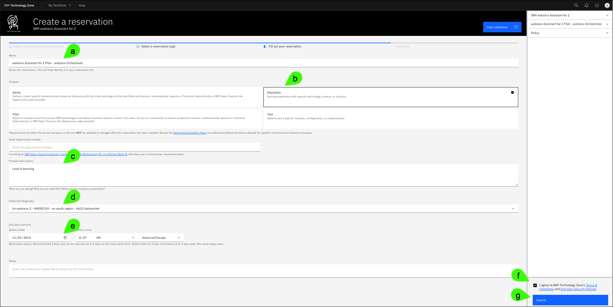

# IBM Technology Zone environment
*

<!-- The environments leveraged for the watsonx Assistant for Z Velocity lab environment can be found here and consist of:
1. watsonx Assistant for Z lab – watsonx Orchestrate – a dedicated tenant of watsonx Orchestrate on IBM Cloud and is leveraged for much of the assistant configuration, configuring conversational search, importing skills and configuring assistant actions
2. watsonx Assistant for Z lab – AAP & z/OS – a pattern used to deploy a pre-configured instance of Ansible Automation Platform and WAZI z/OS with pre-loaded Ansible playbooks that can be imported as skills within watsonx Orchestrate and connected to your assistant. Provides pre-loaded templates for various use cases which will be covered in a later section.
3. Single Node OpenShift with NFS storage – an optional environment used to provision a single-node OpenShift cluster (SNO) on IBM Cloud used to install a dedicated instance of OpenSearch for watsonx Assistant for Z. This is an optional component in cases where client document ingestion is in scope for a lab and you need a dedicated instance of OpenSearch for conversational search. -->

To enable sellers to demonstrate {{offering.name}}, an environment was created in IBM Technology Zone (ITZ). This environment mimics a typical client deployment of {{offering.name}}, similar to this deployment architecture.
    

Follow the instructions in this section to create a new reservation request, extend the reservation, and access the ITZ demonstration environment.

## Create a reservation request
Follow these steps to create a reservation in ITZ.

1. Click the following link to open a browser to the reservation page of the **{{itz.collectionName}}**.

    !!! Warning "You may be asked to authenticate to IBM Technology Zone"

        The steps to authenticate to ITZ are not detailed here as they may vary between users.

    <a href="{{itz.environment}}" target="_blank">{{itz.collectionName}} - reservation page</a>

2. Click **Reserve now**.

    The **Reserve now** option creates a reservation for immediate use. Optionally, schedule the reservation for a later date, like when you will be at your client's office.

    

3. Complete the reservation request and click **Submit**.

    **a**. Optionally, change the **Name** field for the reservation.

    **b**. Select the **Education** purpose tile.

    **c**. Enter a **Purpose description**.

    **d**. Select any geography in the **Preferred Geography** drop-down.

    **e**. The **End date and time** will be set to 2 days after the current date and time.

    **f**. Accept the IBM Technology Zone's terms and conditions and security policies.

    **g**. When satisfied with the parameters, click **Submit**.

    

## Extend the reservation
The ITZ provisioning process takes approximately 15 minutes. Multiple emails are sent to you from ITZ as the provisioning process runs. One email states the reservation is provisioning and the other email states that the environment is **Ready**. 

In rare cases, the provisioning process may fail. If you receive an email stating the reservation failed, try again by repeating Steps 1-3.

When the reservation is in the **Ready** state, you can extend your reservation to a total of 6 days. Remember, IBM sellers need the environment to record their Stand and Deliver and Business Partners need an environment to answer quiz questions.

4. In the IBM Technology Zone portal, expand **My TechZone** at the top and select **My Reservations**.

    

5. Click the **overflow icon** () on the reservation tile and select **Extend**.

    

6. Click the **Select a date** option, specify the date to extend to, and then click **Extend**.

    

If you anticipate needing more time, repeat Steps 5 and 6 to extend the reservation to the maximum of 6 days.

## Accessing the demonstration environment
Access to the {{offering.name}} demonstration environment is provided through a web interface to a fictitious company's intranet website.

7. Click on reservation tile in the ITZ **My reservations** page.

    

8. Click **Open your IBM Cloud environment**.

    

    !!! Warning "You may be prompted to authenticate"

        In some instances, you may be prompted to authenticate when attempting to access the **Open our IBM Cloud environment** link. Use the same IBM ID and password used to reserve the ITZ environment.

      
## The demonstration portal page
The demonstration portal page provides two ways of accessing the {{offering.name}} virtual assistant. 

### The chat icon
The first method is to use the assistant chat icon that appears at the lower right of the page. The **Hi! I'm a virtual assistant. How can I help you today?** dialog appears after a few seconds as the page loads.

9. Click the **Virtual Assistant chat icon**.

    

This action opens the virtual assistant in the current browser page as a pop-up dialog. This approach provides an integrated view of the web page and the virtual assistant dialog; however, the dialog could be considered small for giving a live demonstration if the audience is expected to read the output.

10.  Close the **Virtual Assistant** dialog.

    

### The full page virtual assistant
The second user interface available for the virtual assistant is a full browser page experience.

11. Scroll to the bottom of the page and click **Techbot (in a new tab)** under **Technology**.

    

    The full-page virtual assistant interface opens in a new browser window or tab (this is dependant on your browser preferences). The full-page virtual assistant interface is used for all screen captures in later chapters.

### Using the virtual assistant
Enter a query into the field and press ++return++ or click the **Send** icon ().
    

Proceed to the next section to run through different {{offering.name}} client scenarios detailed in this demonstration guide.