# Leveraging AIOps skills for assistant actions

In this section, you will explore the process of importing the **pre-packaged AIOps skills** that ship with the product and leveraging them as **Assistant actions** to provide operational insights into a z/OS system through an AI conversation with the Assistant. As an example, you can query a question about the health of your system and the assistant will return environment specific information about your running system. 

## placeholder

-provide details of the 47 different AIOps skills from Seismic
-link to the skill descriptions (Seismic/Github)
-Note that it won't be targeting the Wazi aaS back-end system from TechZone, but rather a "real" z/OS back-end for the purpose of demoing the flow 

## Importing the AIOps skills

-For the purpose of building your Pilot/Sandbox environment on TechZone, the JSON file with all the pre-packaged skills are provided below. The JSON file is fully configured and all you must do is import the file via Skills Studio. 

-Download the AIOps skills JSON file from here in Box:

-Go to Orchestrate, screenshots, etc.


## Adding to your personal skills and testing outputs

-provide the bearer token

## Connecting assistant to your app

## Building guided actions for your AIOps assistant

The IBM Documentation details the specific steps for configuring assistant action flows: https://www.ibm.com/docs/en/watsonx/waz/2.x?topic=assistants-building-actions-aiops-assistant-flows

Each subsection details the steps for configuring certain action flows, for example, the **LPAR flow**, **Db2 subsystems flow**, etc. 

Please reference the official IBM documentation 

This section will detail the steps to create the **LPAR flow** as detailed here (in the IBM Documentation). Please ensure to reference the IBM documentation when setting up the remainder of the flows. 

However, the steps involved to setup the different flows are similar:

1. Creating session variables (link to that tab in docs page) for that particular action flow as detailed here: 

2. Importing the necessary skills as **skill-based actions** within your assistant

3. Creating a **custom-built** action to guide users through the flow. 

## Building out the LPAR flow

The **LPAR flow** is a conversation that begins with a user input that starts the action, for example, ***"Show all my LPARs"***. The conversation continues as the AIOps assistant gathers more information and ends when the AIOps complestes the requested task or answers the customer's question. 

### Creating the session variables for LPAR flow

Once you've imported the AIOps skills into your watsonx Orchestrate environment and connected the app to your assistant, the first step in creating the LPAR flow is to define the relevant session variables which you can find here: https://www.ibm.com/docs/en/watsonx/waz/2.x?topic=flows-creating-variables

Note that within the **Variables table** on the page above, there are 7 specific **LPAR variables** that you will need to define when building out the **LPAR flow**. Ensure that you're referencing this table when building out the other subsystem flows to make available the necessary variables to your assistant. 

For the **LPAR flow**, there are 7 variables you will need to define:

- allLPARTable (type: Any)
- LPARNormalizedTable1 (type: Any)
- LPARNormalizedTable2 (type: Any)	
- LPARIdList (type: Free text)
- selectedLPARId (type: Free text)
- selectedLPARIdIndex (type: Number)
- selectedSMFId	(type: Free text)

1. Navigate to **AI assistant builder** 
   
   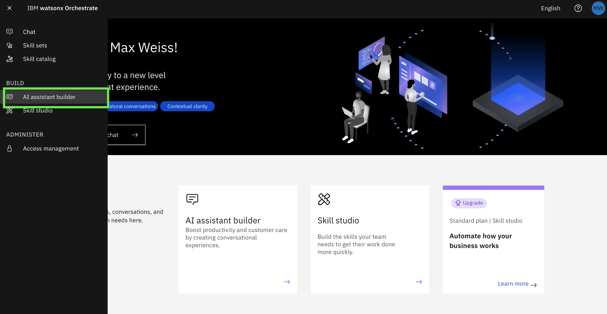

2. Select the **Actions** page from the left-hand menu
   
   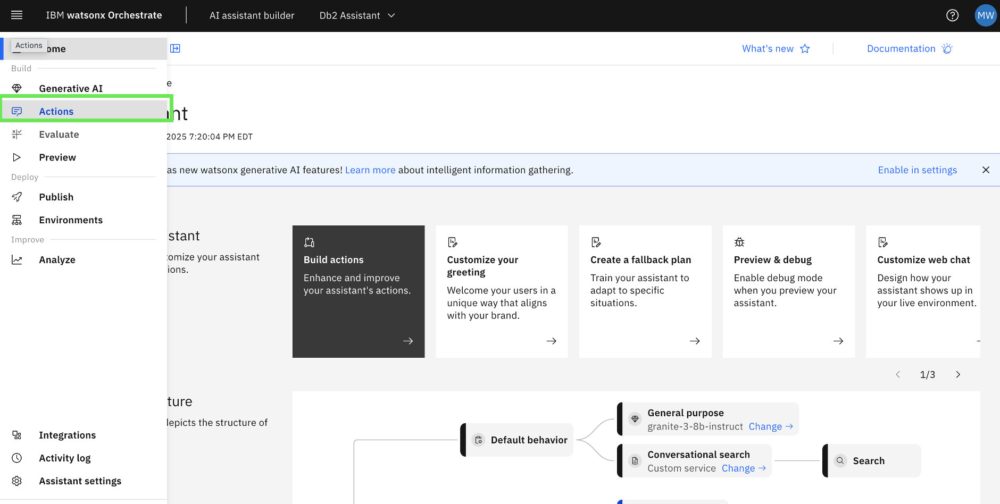

3. On the **Actions** page, click on **Created by you** under the **Variables** section
   
   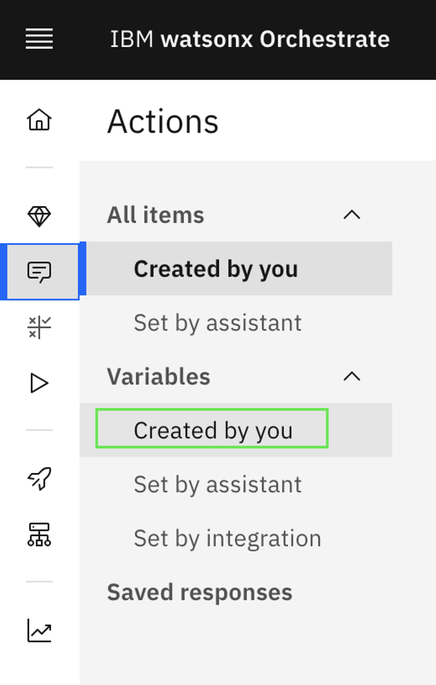

4. In the **Variables** window, click on **New variable +** in the top-right corner. 
   
   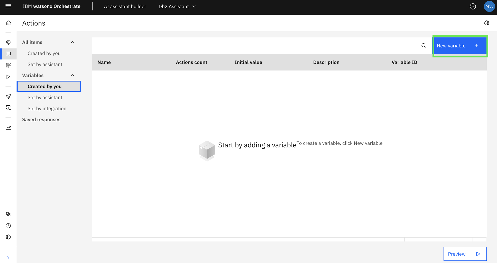

5. You will now add the first variable for the **LPAR flow** specified above, called ***allLPARTable*** with ***type: Any***. 
   
   In the **Session variable** window, enter the following **Name** and **Type** in the relevant fields. Leave all other defaults. 

   ***Name:***
   ```
   allLPARTable
   ```

   ***Type:***
   ```
   Any
   ```

   Once done, the variable window should look like the following:

   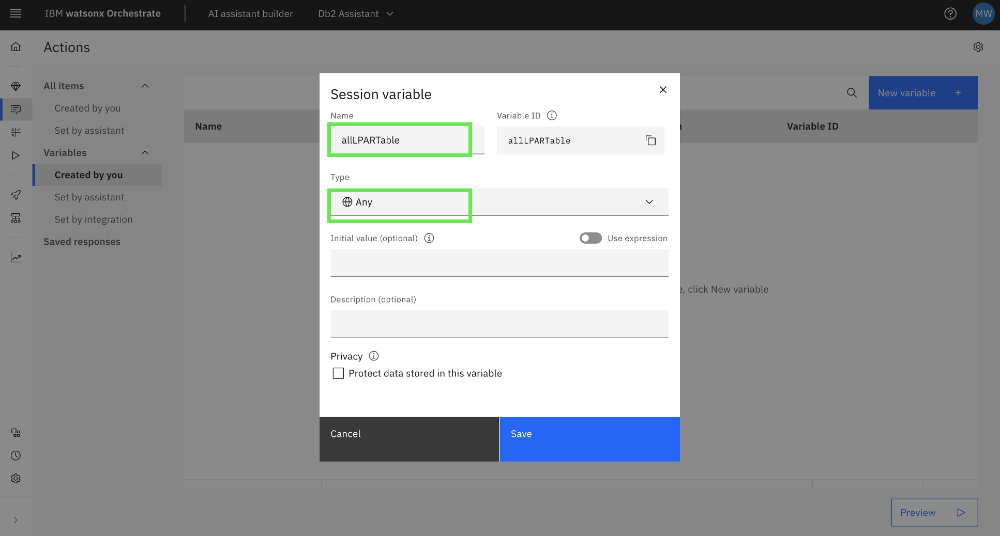

6. Click **Save** to save the new variable. 
   
   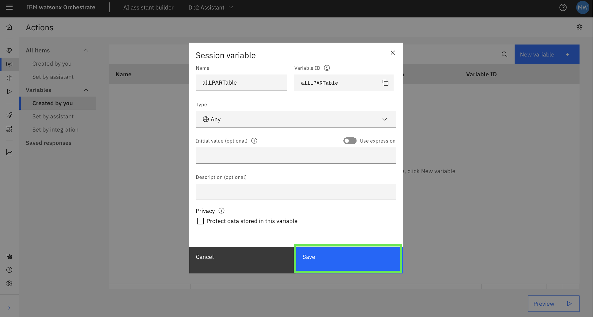

   Once saved, you should now see your first variable created in the list:

   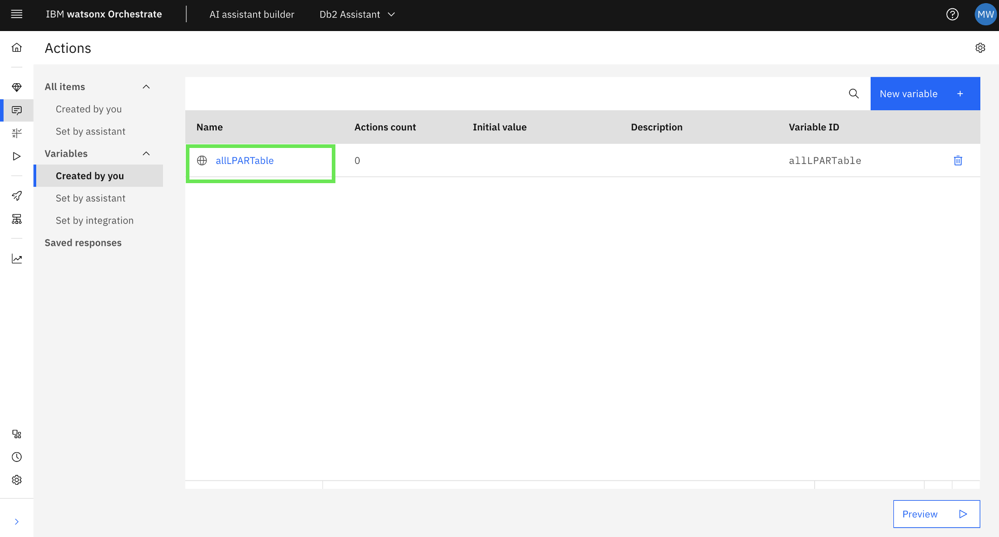

7. Now **repeat steps 4 - 6** for the remaining 6 variables listed above. 
   
   When finished, your variables list should look like the following, containing all 7 variables with their respective variable **types**:

   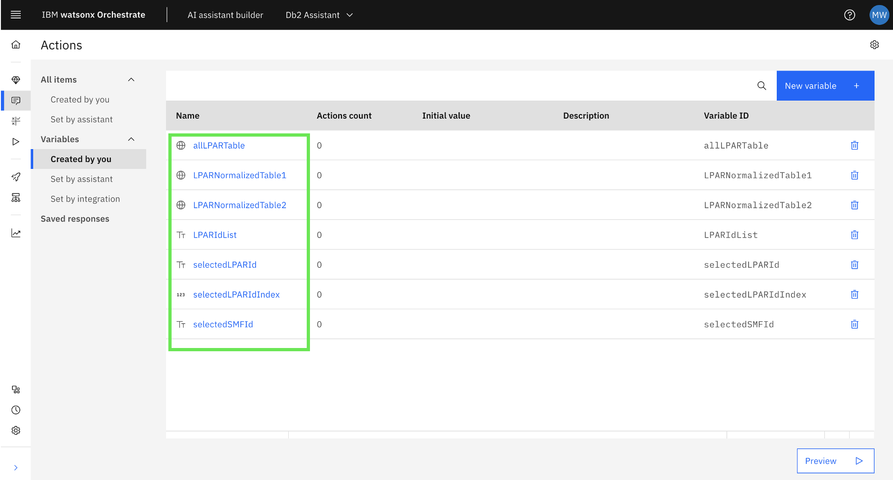

### Creating the skills-based actions for LPAR flow

Once you have the **session variables** defined as described above for the **LPAR flow**, the next step is to define **skill-based actions** using the relevant skills for the **LPAR flow**. 

The three skills that are relevant to the **LPAR flow** which you will need to create **skills-based actions** for are:

- ***Returns information about all z/OS systems***
- ***Retrieve a z/OS-system by LPAR name***
- ***Retrieve jobs running on a z/OS system***

For the other AIOps assistant flows, you would be using a different set of skills that you previously imported. But the above 3 are the ones that are needed to build out the **LPAR flow**. 

1. First, navigate to the your actions list by clicking on **Created by you** under **All items**
   
   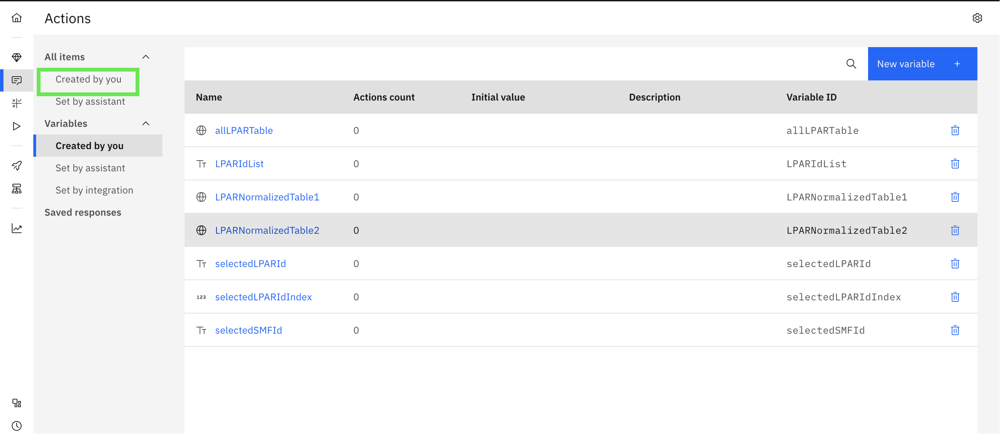

2. Click on **New action +** in the top-right corner
   
   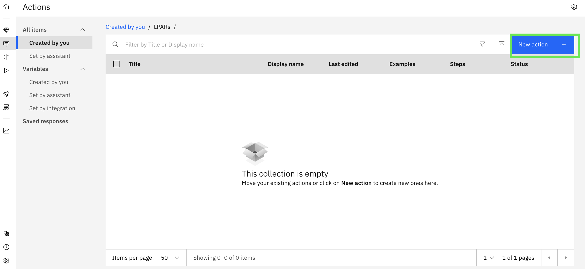

3. Select the tile for **Skill-based action**
   
   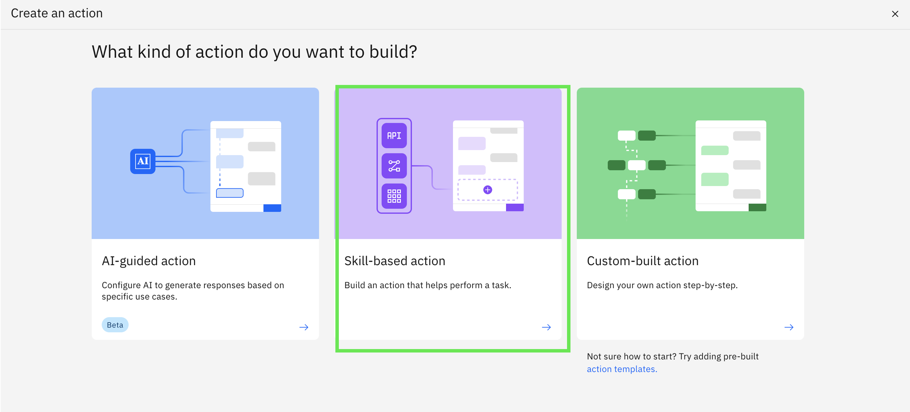

4. Select the previously imported skill titled ***Returns information about all z/OS systems*** and then click **Next**. 
   
   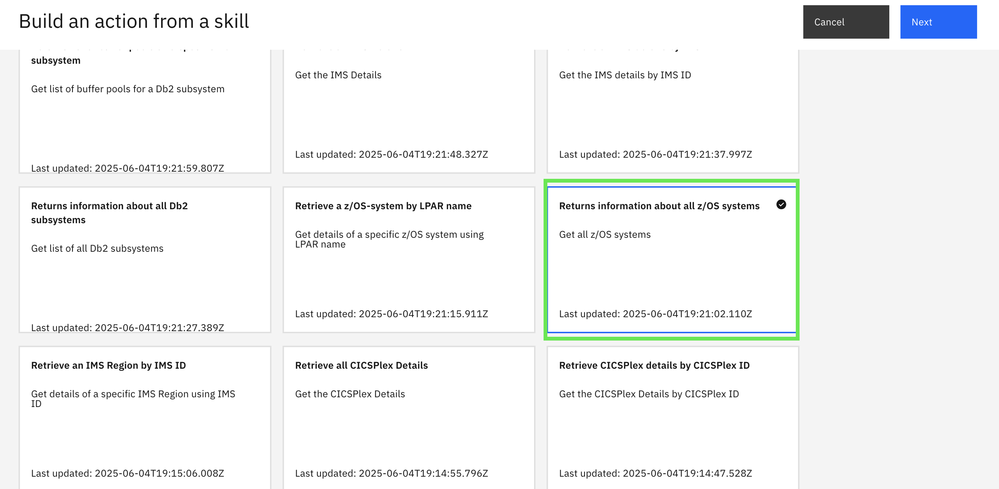

5. In the new action dialogue, click **Cancel** 
   
   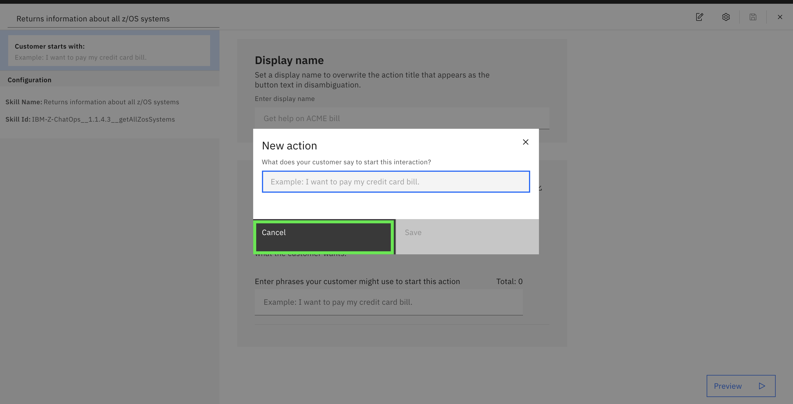

6. Then close out of the action page by clicking on the **x** in the top-right corner. 
   
   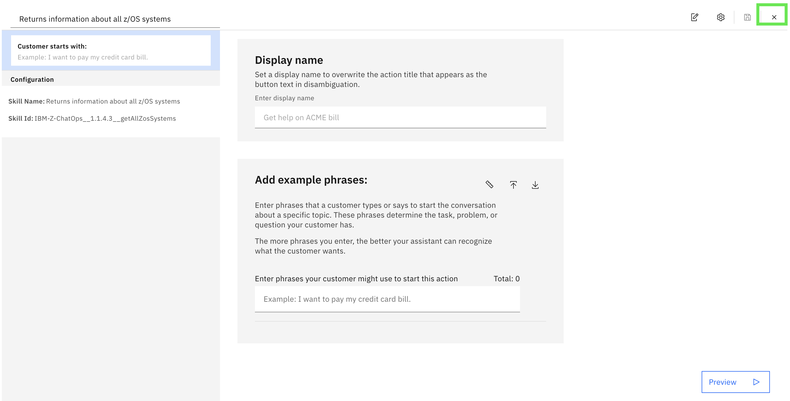

7. You should now be able to see your new action as shown below:
   
   

8. Now **repeat steps 2 - 6** in order to add actions for the following imported skills:
   
   - ***Retrieve a z/OS-system by LPAR name***
   - ***Retrieve jobs running on a z/OS system***
  
   When finished, you should see all 3 **skill-based actions** added to your list as shown below:

   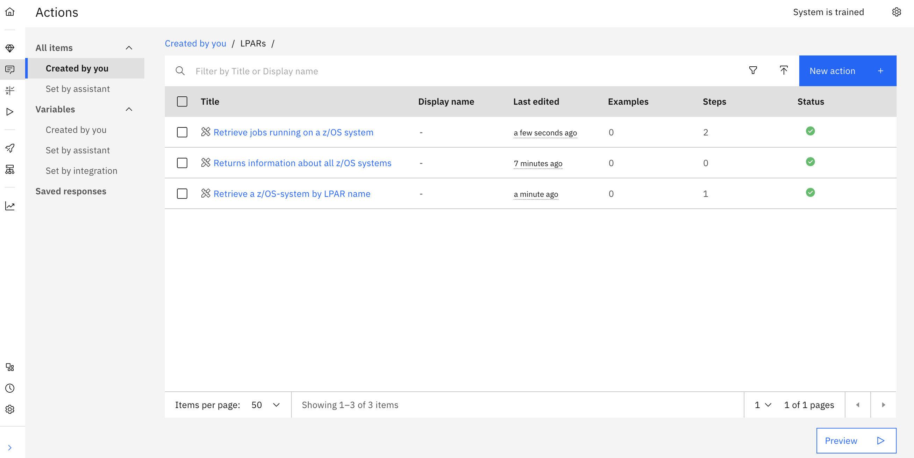


### Creating the custom-built action for LPAR flow

Now that you have all the relevant skills configured as **skill-based actions**, the final step is to build out the full **AIOps LPAR flow** by creating a new **custom-built action**.

1. Just as you did previously, click on **New action +** in the top-right corner.
   
   **screenshot**

2. Click on the tile for **Custom-built action**
   
   **screenshot**

3. In the **New action** dialogue, enter ***Show all my LPARs*** for the starter prompt and click **Save**. 
   
   **screenshot**

By default, Step 1 is selected. Follow the below instructions to complete the configuration.

#### Step 1:

1. Click on the **And then** drop-down and click on **Go to a subaction**. 
   
   **screenshot**

2. In the **Go to** field, select the action called ***Returns information about all z/OS systems***, then click **Apply**.
   
   **screenshot**

3. Click on **New step +**

#### Step 2:

1. Click on **Set variable values** 
   
   **screenshot**

2. Then click on **Set new value +**
   
   **screenshot**

3. In the drop-down, select **Session variables** and then **allLPARTable** as shown below:
   
   **screenshot**

4. In the **To** field, select **Expression**
   
   **screenshot**

5. Expand the **Expression** text box by clicking on the icon shown below:
   
   **screenshot**

6. In the expanded Expressions text box, type a `$` to reference a variable, then click on **Returns information about all...(Step 1)**. Then click on **1. Returns information about all z/OS systems result variable** as shown below:
   
   **screenshot**

7. Followed by that variable, enter `.message` and click **Apply**. 
   
   **screenshot**

8. Now you will set a value for another session variable. 
   
   Click on **Set new value +**

9. In the drop-down, select **Session variables** and then **LPARNormalizedTable1** as shown below:
    
    **screenshot**
   
10. Again, in the **To** field, select **Expression** and ***expand*** the text box. 
    
    **screenshot**

11. In the text box, type a `$` to reference a variable, then click on **Session variables** and then **allLPARTable**:
    
    **screenshot**

12. Following the variable reference, add the following:
    ```
    .toString().replace("LPAR Name","LPARName").toJson()
    ```

    The result should look like the following:

    **screenshot**

13. Then click **Apply**
    
    **screenshot**

14. You should now have 2 session variables defined as shown below:
    
    **screenshot**

    Next, **repeat steps 8 - 13** in order to set the last 2 values for the following variables:

    **Set:**
    ```
    LPARNormalizedTable2
    ```
    **To:**
    ```
    LPARNormalizedTable1.toString().replace("SMF ID", "smfId").toJson()
    ```
    <br>
    <br>
    
    **Set:**
    ```
    LPARIdList
    ```
    **To:**
    ```
    LPARNormalizedTable1.joinToArray("%e.LPARName%", true)
    ```

    The result should look like the following:

    **screenshot**

15. In the **Assistant says** field, type ***Do you want to see details of a specific LPAR?***
    
    **screenshot**

16. Click **Define customer response** and select **Confirmation**. 
    
    **screenshot**

17. Click on **New step +**

#### Step 3:

1. In the **Is taken** field, click on **without conditions** and select **with conditions**.
   
   **screenshot**

2. In the default condition, click **Yes** and instead select **No**. 
   
   **screenshot**

3. In the **And then** drop-down, select **End the action**. 
   
   **screenshot**

4. Click on **New step +**

#### Step 4:

1. In the **Is taken** field, click on **without conditions** and select **with conditions**.
   
   Leave the default condition set to **Yes**

2. In the **Assistant says** text box, type ***Which LPAR instance detail would you like to see?***
   
   **screenshot**

3. Click **Define customer response* and then click **Options**
   
   **screenshot**

4. In the **Edit response** window, toggle the **Dynamic** switch to the **On** position. 
   
   **screenshot**

5. Then click on the **Choose source variable** drop-down and select **Session variables** and then the **LPARIdList** session variable you created earlier. 
   
   **screenshot**

6. Then click **Apply**. 
   
   **screenshot**

7. Then click **New step +**

#### Step 5:

1. Click on **Set variable values**
   
   **screenshot**

2. Then click on **Set new value +**
   
   **screenshot**

3. In the drop-down, select **Session variables** and then **selectedLPARId** as shown below:
   
   **screenshot**

4. In the **To** field, select **Expression** and then expand the text box.
   
   **screenshot**

5. In the text box, type a `$`, then click on **Action step variables** and then **4. Which LPAR instance detail would you like to see?**
   
   **screenshot**

6. Followed by that variable, enter `.value` and click **Apply**. 
   
   **screenshot**

7. Now you will set a value for another session variable. 
   
   Click on **Set new value +**

8. In the drop-down, select **Session variables** and then **selectedLPARIdIndex** as shown below:
   
   **screenshot**

9. In the **To** field, select **Expression** and then expand the text box. 
   
10. In the text box, type a `$`, then click on **Session variables** and then **LPARIdList**.
    
    **screenshot**

11. Following the referenced variable, type ***.indexOf(***
    
    **screenshot**

12. After the open parentheses, add a space and then type another `$` to reference the next variable.
    
    **screenshot**

13. Then select **Session variables** and then **selectedLPARId** as shown below:
    
    **screenshot**

14. Once done, add a close parentheses `)` and delete the extra space after the `(`. The final expression should look like the following:
    
    **screenshot**

15. Then click **Apply**. 

16. Finally, **repeat steps 7 - 14** to add a third variable value:
    
    **Set:**
    ```
    selectedSMFId
    ```
    **To:**
    ```
    LPARNormalizedTable2.get(selectedLPARIdIndex).smfId
    ```
   
    The final result should look like the following:

    **screenshot**

17. In the **And then** drop-down, select **Go to a subaction** 
    
    **screenshot**

18. In the **Go to a subaction** window, click on the drop-down and select **Retrieve a z/OS-system by LPAR name** subaction. 
    
    **screenshot**
   
19. Then click **Apply**. 

20. Click on the **Edit passed values** option and click on **Set new value +**. Then click on **1. LPAR name**.
    
    **screenshot**

21. In the **To** field, click on **Session variables** and then **selectedLPARId**.
    
    **screenshot**

22. Then click **Apply**
    
    **screenshot**

23. Then click **New step +**

#### Step 6:

1. In the **Assistant says** text box, type ***Would you like to see the top 5 jobs running on this LPAR?***
   
   **screenshot**

2. In the **Define customer response** drop-down, select **Confirmation**. 
   
   **screenshot**

3. Then click **New step +**

#### Step 7:

1. In the **Is taken** field, click on **without conditions** and select **with conditions**.
   
   **screenshot**

2. In the default condition, click on **Yes** and instead select **No**.
   
   **screenshot**

3. In the **And then** drop-down, select **End the action**
   
   **screenshot**

4. Then click **New step +**.


#### Step 8: 

1. In **Is taken** field, click on **without conditions** and select **with conditions**. 
   
   Leave the default condition as shown below:

   **screenshot**

2. In the **And then** drop-down, select **Go to a subaction**. 

3. In the **Go to a subaction** window, click on the drop-down and select **Retrieve jobs running on a z/OS system**. 
   
   **screenshot**

4. Click **Apply**. 
   
   **screenshot**

5. Then click on **Edit passed values**. And then click on **Set new value**
   
   **screenshot**

6. In the drop-down, select **SMF id**.
   
   **screenshot**

7. In the **To** drop-down, select **Session variables** and then select **selectedSMFId** as shown below:
   
   **screenshot**

8. Then click **Apply**. 
   
   **screenshot**


Congrats! Your custom-built action for the **LPAR flow** is completed. Make sure to click the **Save** icon in the top-right corner and exit out of the action-builder page so you can test out the flow. 


Now test out your **LPAR flow** use case by prompting your assistant with ***Show all my LPARs**:

 