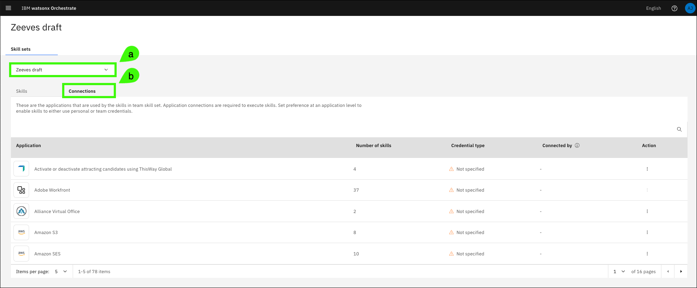
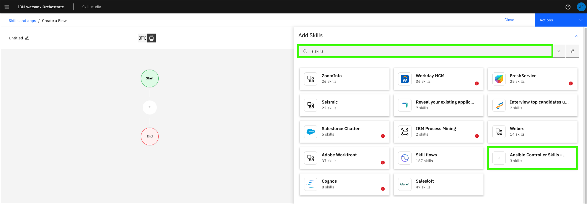
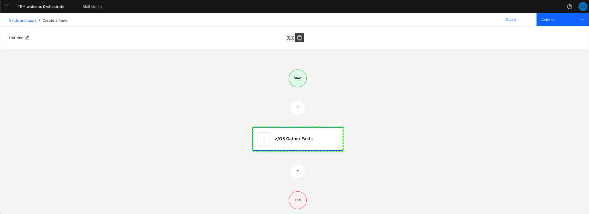
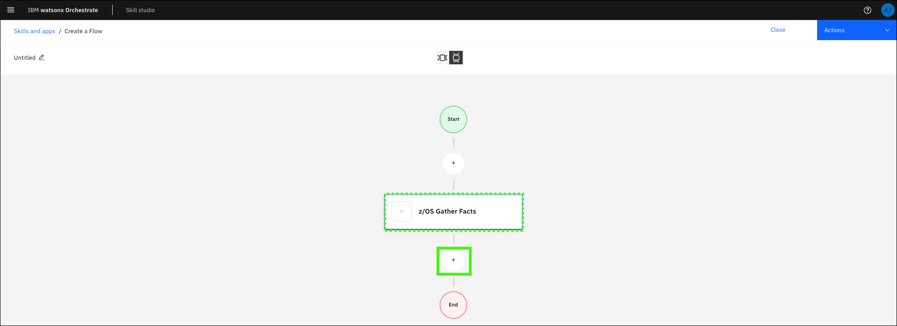
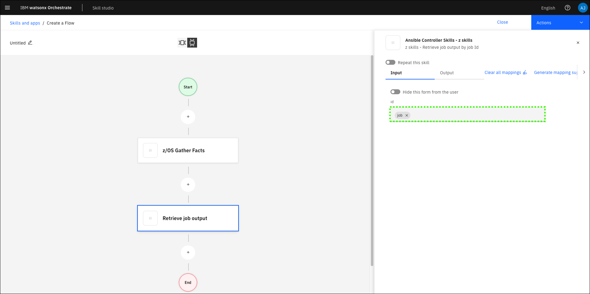
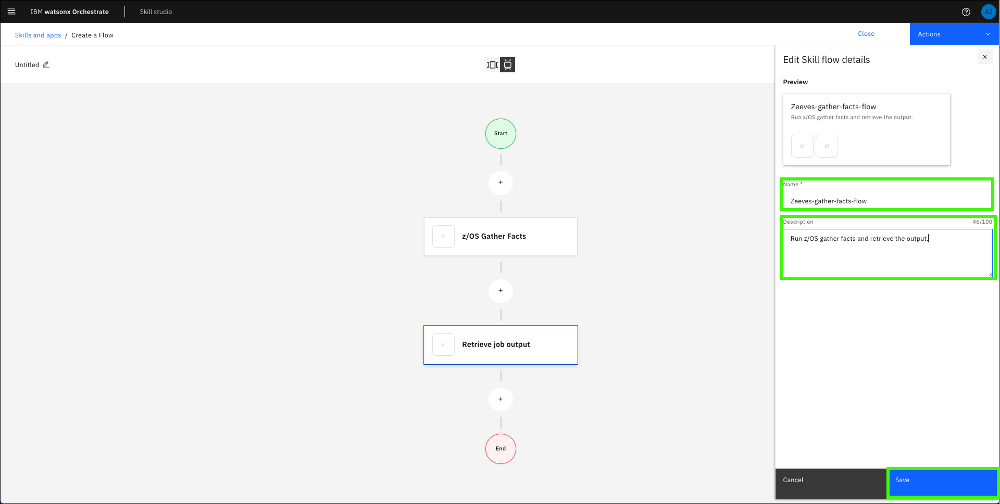
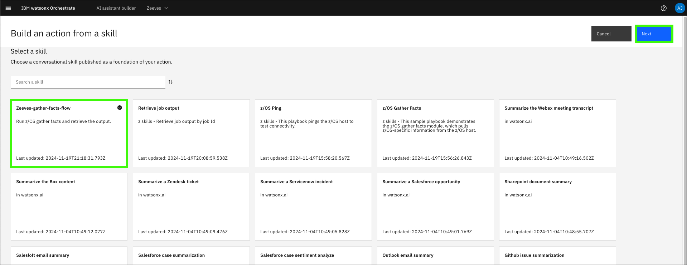
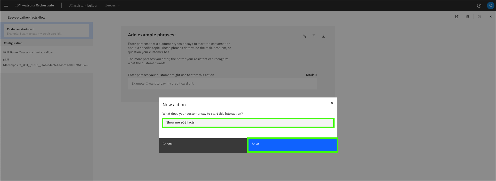
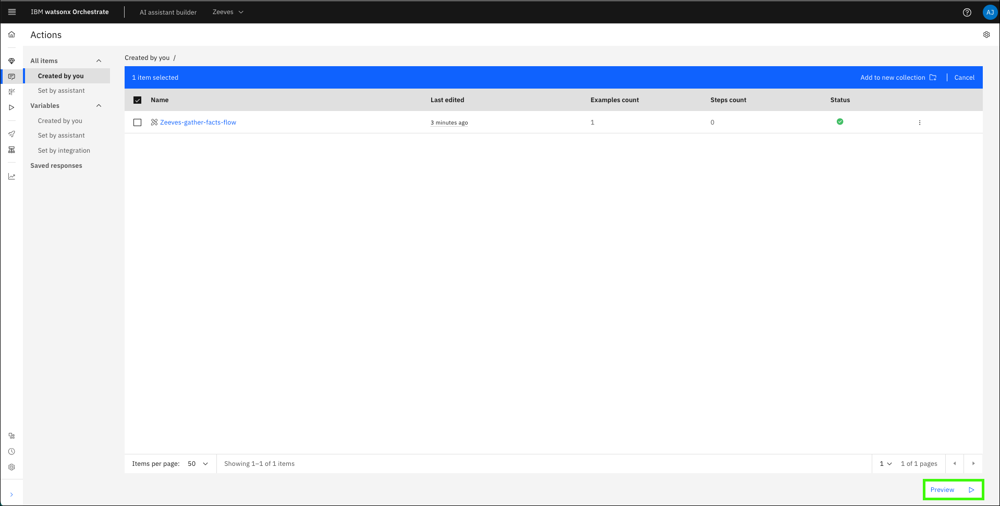
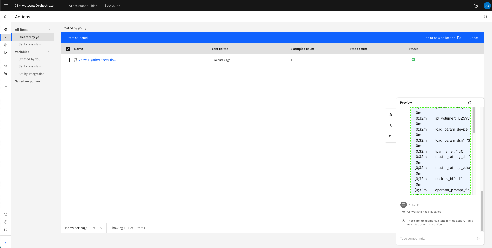

# Creating skill flows
In the previous section, you ran the **Gather z/OS facts** skill, but the output was not displayed in the assistant.
To both run the action and display the results, a skill flow is needed. Skills are often more valuable when combined with other skills. You can create a skill flow to use two or more skills together to finish a task (like returning the output of a previous skill). When you create a skill flow, you map the output of one skill as the input for subsequent skills. Learn more about creating skill flows <a href="https://www.ibm.com/docs/en/watsonx/waz/2.x?topic=combining-skills-into-skill-flows" target="_blank">here</a>.

As mentioned in a previous section, default utility skills that are provided with the watsonx Assistant for Z skills collection. The **Retrieve job output** utility skill is used to return the output of a skill.

## Add the utility skill

1. Open IBM watsonx Orchestrate **Skill studio**.

    

2. Expand **Create** and click **Import API**.

    

3. Click the **z/OS Skills accelerator (Trial)** tile.

    

4. Enter the following values in the **z/OS Skills accelerator** form and then click **Connect**.

    Use the **URL**, **User Name**, and **Password** values recorded in the [Explore Ansible Automation Platform](exploreAAP.md) section earlier.

    **a**: Connection Type: `ansible`

    **b**: Application Name: <use the same application name from the previous section\>

    **c**: Connection URL: <enter the URL for your AAP UI\>

    **d**: User Name: <enter the AAP User Name (for UI access)\>

    **e**: Password: <enter the AAP User Password\>

    **f**: Search Pattern: `*`

    

5. Expand **Ansible Utility Skills** and click **Ansible Utility Skills**.

    

6. Select **Retrieve job output** and click **Save as draft**.

    

7. Click the ellipses () for the **Retrieve job output** skill and select **Enhance this skill**.

    

8. Review the skill settings and then click **Publish**.

    

9. Select **Skill sets** from the main menu.

    

10. Select (a) your draft assistant in the **Team Skills** drop-down list and (b) click the **Connections** tab.

    

11. Click the **Search** () icon.

    

12. Search for the application name you specified earlier.

    

13. Click the (a) ellipses () for your application and (b) click **Edit connection**.

    

14. Verify that the application is **Connected** (**a**) and then click **Close** (**b**).

    !!! Note "Connect the application if it is not connected."

        Use the AAP user name (admin) and the AAP password for your ITZ reservation.

    

## Add the skills to your Personal skills
1. Click **Skill catalog** in the main menu.

    

2.  Search for the application name you specified earlier.

    

3.  Click the tile for your application.

    Note, the tile name is proceeded by **Ansible Controller Skills**.

    

4.  Click **Add skill** for each of the skills you want to add to the flow.

    

## Create the skill flow
1. Click **Skill studio** in the main menu.

    

2.  Expand the **Create** drop-down menu and click **Skill flow**.

    

3.  Click the **+** icon.

    

    Next, you need to add the **z/OS Gather Facts** skill and the **Retrieve job output** skill to the skill flow. Use the **Search apps** function to locate the skills.

4. Search for the application name you specified earlier and click the tile.

    

5.  Click **Add Skill** in the **z/OS Gather Facts** tile.

    

6.  Verify the **z/OS Gather Facts** skill is added to the skill flow.

    

7.  Click the **+** icon **after** the **z/OS Gather Facts** tile.

    

8.  Repeat steps 5 and 6 for the **Retrieve job output** skill. 

    After adding the **Retrieve job output** skill, your skill flow should look like:

    

    Next you must map the output values of the first skill to the input of the second skill. In this case, pass the job ID output from **z/OS Gather Facts** as an input for **Retrieve job output**. 

9. Click the **Retrieve job output** tile.

    

10. Select the **Input** tab and click the **id** field.

    

11. Click the **z/OS Gather Facts** skill in the **Mapping data for "id"** section.

    

12. Click the **job** icon.

    

13. Verify that the **job** appears in the **id** field.

    

14. Optionally, toggle the **Hide this from the user** setting.

    For this lab guide, this option is left disabled. Learn more about this option <a href="https://www.ibm.com/docs/en/watsonx/waz/2.x?topic=combining-skills-into-skill-flows#hiding-input-and-output-forms" target="_blank">here</a>.

    

15. Click the **x** to close mapping window.

    

16. Click the pencil ().

    

17. Enter a (a) **Name** and (b) **Description** for your skill flow and then (c) click **Save**.

    

18. Expand the **Actions** pull-down and click **Save as draft**.

    

19. Expand the **Actions** pull-down and click **Enhance**.

    

    On the **Enhancing the skill** pages, you can:

    - modify the skill name, description, and version
  
    - add phrases (prompts) that will be recognized by the assistant to call the skill flow

20.  Click the **Phrases** tab.

    

21. Replace the existing **phrases** (prompts) and then click **Publish**.

    Notice that the default prompts are either not intuitive (the skill flow name) or a bit verbose. Replace the existing phrases with phrases that you anticipate users will use.

    <!-- !!! Bug "Be careful with the sample phrases that you specify."

        During the development of the lab guide, it was discovered that some sample phrases with a `/` character can cause issues with the actions. Avoid using **z/OS** in the your sample phrases. This issue has been reported to the offering team. -->

    Example prompts:
    ```
    Show me z/OS facts
    ```
    ```
    Gather and display z/OS facts
    ```

    

## Enable the skill flow in your assistant

1. Click **AI assistant builder** in the main menu.

    

2.  Hover over the **Home** () and click **Actions**.

    

3.  Click **New action**.

    

4.  Click the **Skill-based action** tile.

    

5.  Click the skill flow that you created earlier and then click **Next**.

    **Note**: it may take a minute for the tiles to appear on the screen.

    

6.  Enter an example prompt for the skill and click **Save**.

    You can use one of the prompts you used earlier for the skill flow.

    ```
    Show me z/OS facts
    ```

    

7.  Enter any additional phrases (prompts) and then click the **save** ().

    

8. Click close (**x**).

    

9. Select the *original* skill that you created (**a**) (not the skill flow you just created), click the ellipses (**b**), and then click **Delete** (**c**).

    

10. Wait for system training to complete.

    **Note**: The message changes to "System is trained" and then disappears.

    

11. Click **Preview**.

    

12.  Enter one of the prompts you specified into the assistant preview.

    ```
    Show me z/OS facts
    ```

    

13. **Wait 10 seconds** and then click **Apply**.

    **Note**: It is important to wait for the first job to complete before submitting the second job in the flow.

    

14. Review the results from the skill flow.

    Use both scroll bars in the assistant preview to review all the returned information. The output is similar to what was seen in the AAP web console. The character strings like `[0;32m` are special characters that are not properly displayed in the assistant preview interface.

    

    ??? Example "Sample output form the Z/OS gather facts flow."

        Content 

        Identity added: /runner/artifacts/16/ssh_key_data (/runner/artifacts/16/ssh_key_data)
        [WARNING]: Collection ibm.ibm_zos_core does not support Ansible version 2.14.2
        
        PLAY [Gather z/OS-specific facts.] *********************************************
        
        TASK [Gather all facts about z/OS host.] ***************************************
        ok: [zos_host]
        
        TASK [Print gathered facts about the master catalog.] **************************
        ok: [zos_host] => {
            "msg": [
                "master catalog dsn: CATALOG.VS01.MASTER",
                "master catalog volser: OPEVS1"
            ]
        }
        
        TASK [Print only CPC and IODF info from gathered z/OS facts.] ******************
        ok: [zos_host] => {
            "msg": [
                "manufacturer: IBM",
                "model: A00",
                "plant: C1",
                "iodf name: PROV.IODF00",
                "iodf config: DEFAULT"
            ]
        }
        
        TASK [Print out all gathered facts about the z/OS host.] ***********************
        ok: [zos_host] => {
            "ansible_facts": {
                "arch_level": "2",
                "cpc_nd_manufacturer": "IBM",
                "cpc_nd_model": "A00",
                "cpc_nd_plant": "C1",
                "cpc_nd_seqno": "20D90792EB76",
                "cpc_nd_type": "008562",
                "edt": "00",
                "hw_name": "",
                "ieasym_card": "(00,K2)",
                "io_config_id": "00",
                "iodate": "",
                "iodesc": "",
                "iodf_config": "DEFAULT",
                "iodf_name": "PROV.IODF00",
                "iodf_unit_addr": "DE28",
                "ioproc": "",
                "iotime": "",
                "ipaloadxx": "K2",
                "ipl_volume": "D25VS1",
                "load_param_device_num": "DE28",
                "load_param_dsn": "SYS0.IPLPARM",
                "lpar_name": "",
                "master_catalog_dsn": "CATALOG.VS01.MASTER",
                "master_catalog_volser": "OPEVS1",
                "nucleus_id": "1",
                "operator_prompt_flag": "M",
                "parmlib_dsn": "K2.PARMLIB",
                "parmlib_volser": "USRVS1",
                "primary_jes": "JES2",
                "product_mod_level": "00",
                "product_name": "z/OS",
                "product_owner": "IBM CORP",
                "product_release": "05",
                "product_version": "02",
                "smf_name": "VS01",
                "sys_name": "VS01",
                "sysplex_name": "LOCAL",
                "tsoe_rel": "05",
                "tsoe_ver": "4",
                "vm_name": ""
            }
        }

        PLAY RECAP *********************************************************************
        zos_host                   : [0;        32mok=4                            [0m changed=0    unreachable=0    failed=0    skipped=0    rescued=0    ig      nored=0   
        

The previous scenario might or might not be relevant for your client's use case. The scenario illustrates how to sequence skills together in a skill flow to create an action that your assistant triggers based on prompts that use the pre-configured Ansible automation templates. You are encouraged to create your own skill flows and prompts that use other skills available within the AAP instance. As an example, create a skill flow for the **z/OS Ping** skill. Be sure to add the **Retrieve job output** skill to view the results.

Next, learn about custom-built actions.