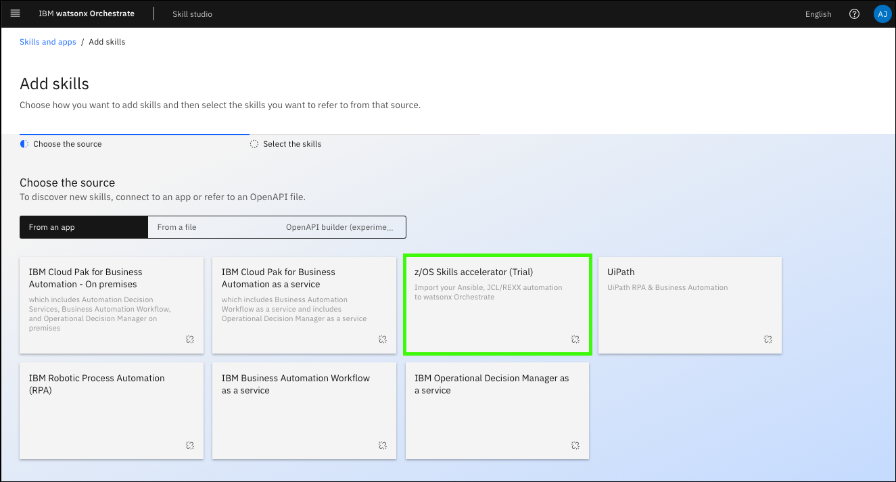
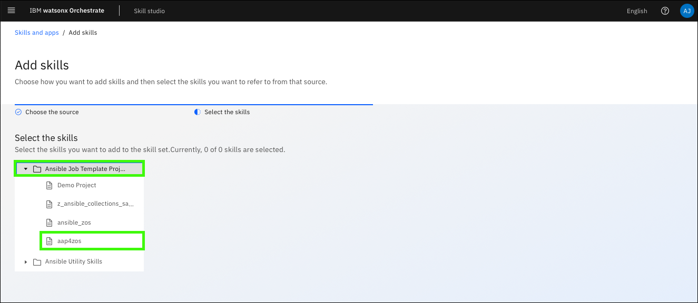
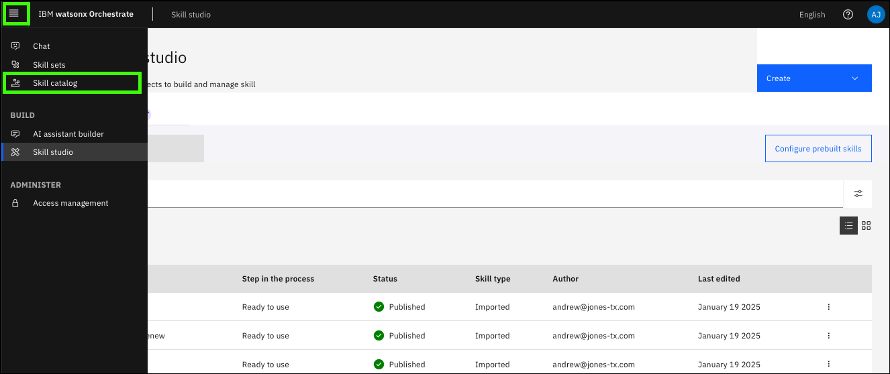
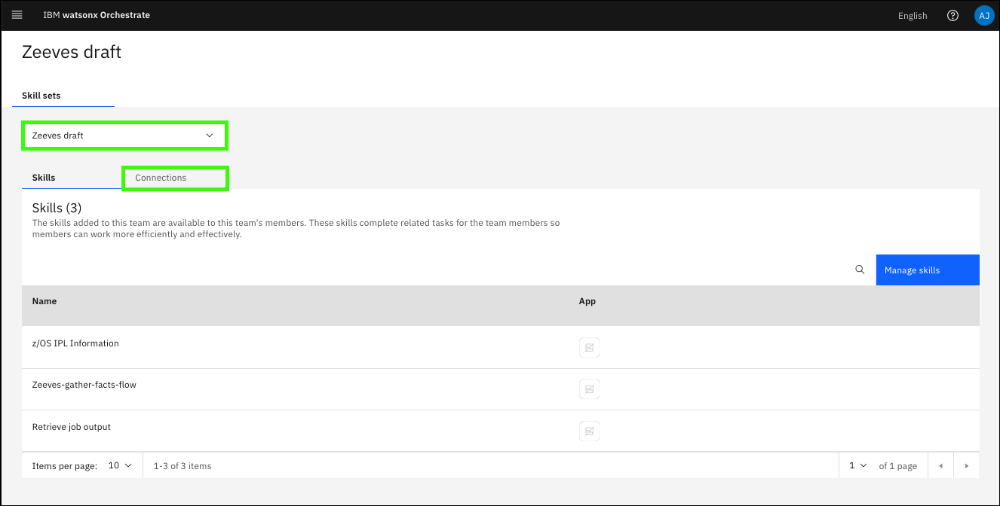
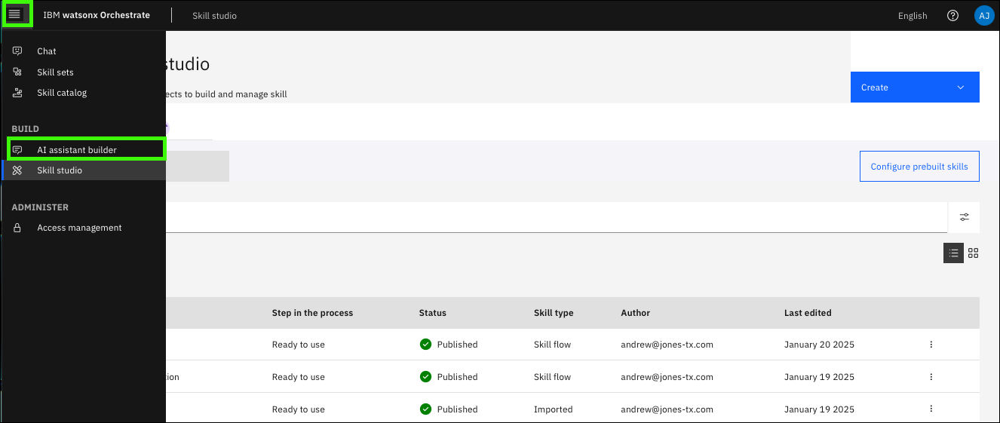

# Use case: SSL Certificate renewal on z/OS
Now, shift roles to that of a mainframe Security Administrator. Your client would like to understand how watsonx Assistant for Z can help them to ensure their critical security certificates are up-to-date and reduce the risk of expired certificates disrupting their organization’s services. 

Secure Sockets Layer (SSL) certificates, often referred to as digital certificates, are used to establish an encrypted connection between communicating parties over a network. Certificate management is crucial for maintaining the security of a company’s z/OS environment. It has been a while since the Security Administrator performed the  tasks to manage and renew a certificate, but recalls there being many steps required on z/OS and various RACF commands that need run to renew a certificate. Rather than going to their senior Security Administrator for assistance, you can demonstrate how leveraging watsonx Assistant for Z can help them automate the certificate renewal process by infusing Ansible automation into natural conversation, as well as providing step-by-step guidance on the processes to determine certificate expiration and renewing certificates.

In this scenario, you will leverage the Ansible automation templates provided with your AAP and WAZI z/OS environment to create assistant actions to guide the client through the process of identifying their SSL certificate’s expiration dates, and automating the certificate renewal process for them. This will save them time and improve their productivity.

## Create an initial Certificate Authority (CA) certificate to sign future SITE certificates
For this use case, a Certificate Authority (CA) certificate is needed to sign new SITE certificates. 

1. Open and log into the Ansible Automation Platform (AAP) web console. 

    !!! Tip "Don't remember how?"
 
        Refer to the first 5 steps in [Explore Ansible Automation Platform](../../skills/exploreAAP.md).

2. Click **Templates** under the **Resources** section.

     
     
3. Click the **launch** icon () for the **z/OS Certs - Create Cert** template.

     

4. On the **Survey** screen, modify the **Certificate Label** and **Type** fields with the values that follow and then click **Next**. 

    **a**: **Certificate Label**
    ```
    TESTCA
    ```

    **b**: **Type**
    ```
    CERTAUTH
    ```

    !!! Note "Leave the default values for all other fields."

        

5. Click **Launch**.

        

6. Review the output of the job.

     In the output of the playbook, notice a new keyring was created, a certificate was created, and the certificate ws connected to the key ring.

         

7. Locate the line **TASK [GENERATE new certificate]**, click the **changed: [zos host]**.

        

8.  Click **JSON**.

       

9.  Review the **RACDCERT** command that was run to generate the certificate and then click **x** to close the window.

       
    
## Create an *expiring* certificate
Now create an expiring certificate using the CA certificate you just created.

1. Return to the **Templates** tab and click the **launch** icon () for the **z/OS Certs - Create Cert** template.

       

2. On the **Survey** screen, modify the fields that follow with the values specified and then click **Next**. 

    **a**: **Type**
    ```
    SITE
    ```

    **b**: **Sign with**
    ```
    CERTAUTH
    ```

    **c**: **Sign Label**
    ```
    TESTCA
    ```

    **d**: **Common Name**
    ```
    company.com
    ```

    **e**: **Expiration Date**
    
    Enter a date that occurs within the next 30 days. The date must be in the format YYYY-MM-DD.

    !!! Note "Leave the default values for all other fields."

    Unlike the first certificate you created which was *self-signed*, this certificate will be signed by the local certificate authority using the CA you created.

    !!! Note "The image below does not highlight all the fields that need to be modified!"

      

3. Click **Launch**.

       

4. Verify the job was successful and inspect the output of the job.

      

## Renew the *expiring* certificate
Now that you have a certificate and it is expiring within 30 days, it is time to renew the certificate.

1. Return to the **Templates** tab and click the **launch** icon () for the **z/OS Certs - Search and Renew** template.

      

2. On the **Survey** screen, modify the fields that follow with the values specified and then click **Next**.

    **a**: **Certificate Label**
    ```
    TESTSITE
    ```

    **b**: **Type**
    ```
    SITE
    ```

    **c**: **Sign with**
    ```
    CERTAUTH
    ```

    **d**: **Sign Label**
    ```
    TESTCA
    ```

    **e**: **Expiration Date**
    
    Specify a new expiration date in the format YYYY-MM-DD.

    !!! Note "The image below does not highlight all the fields that need to be modified!"

      

3. Click **Launch**.

      

4. Verify the job was **Successful** and review the output.

    **Note**: you may need to click the **Reload Output** button after the job completes to view the full output.

    Review the tasks that were run within the automation to renew the certificate. Some of the steps completed include:

    - Run the RACF_CERTIFICATE_EXPIRATION z/OS Health Check

    - Submit JCL to pull a report on the z/OS Health Check

    - Search the output of the report for the given certificate label

    - Print out the expiring certificate, if it is found. You should see: ‘TESTSITE expiring – True’

    - If the certificate is expiring, kick off a series of RACDCERT commands to do the following:
  
         - Backup the expiring certificate
       
         - Rekey the certificate and give it a new temporary label
       
         - Generate a CSR for the new certificate
       
         - Sign the new certificate with the local CA
       
         - Delete the old certificate
       
         - Relabel the new certificate to use the same label as before
       
         - Refresh the digital certificate list
  
      

## Create another *expiring* certificate
Create one more expiring certificate to use with the your assistant and new skills you will create.

1. Return to the **Templates** tab and click the **launch** icon () for the **z/OS Certs - Create Cert** template.

      

2. On the **Survey** screen, modify the fields that follow with the values specified and then click **Next**.

    **a**: **Certificate Label**
    ```
    DEMOCERT
    ```

    **b**: **Type**
    ```
    SITE
    ```

    **c**: **Sign with**
    ```
    CERTAUTH
    ```

    **d**: **Sign Label**
    ```
    TESTCA
    ```

    **e**: **Common Name**
    ```
    company.com
    ```

    **f**: **Expiration Date**
    
    Enter a date that falls within the next 30 days in the format YYYY-MM-DD.

    !!! Note "The image below does not highlight all the fields that need to be modified!"

     

3. Click **Launch**.

     

4. Verify the **DEMOCERT** was successfully created.

     

## Import the Ansible automations into watsonx Orchestrate

For this use case, configure the assistant to guide the user through the process of identifying their SSL certificate’s expiration date and automate the certificate renewal process. To do so, import the needed AAP templates into watsonx Orchestrate as skills.

For this use case, the ansible templates you will import are:

- z/OS Certs – List Cert
- z/OS Certs – Search and Renew
- Retrieve job output (utility skill)

1. Open **Skill studio** in watsonx Orchestrate.

    

2. Click **Create** and then click **Import API**.

    

3. Click the **z/OS Skills accelerator (Trial)** tile.

    

4. Enter the following values in the **z/OS Skills accelerator** form and then click **Connect**.

    Use the **URL**, **User Name**, and **Password** values recorded in the [Explore Ansible Automation Platform](exploreAAP.md) section earlier.

    **a**: Connection Type: 
    ```
    ansible
    ```

    **b**: Application Name: 
    ```
    certs
    ```

    **c**: Connection URL: 
    
    <Enter the URL for your AAP UI\>

    **d**: User Name: 
    
    <Enter the AAP User Name (for UI access)\>

    **e**: Password:
    
    <Enter the AAP User Password\>

    **f**: Search Pattern: 
    ```
    *
    ```

    

5. Expand the **Ansible Job Template Proj...** folder and then click **aap4zos**.

    

6. Select **Z/os certs - list cert** and **Z/os certs - search and renew** and then click **Save as draft**.

    !!! Tip "Scroll through the table of skills to find the required skills."

    

7. Click the ellipses () for the **z/OS Certs - List Cert** skill and select **Enhance this skill**.

    

8.  Review the skill enhancement options and then click **Publish**.

    

9.  Repeat steps 7 and 8 for the **z/OS Certs - Search and Renew** skill.

10. **Challenge**: You also need to add the **Retrieve job output** utility to your **certs** app just like you did when creating the **Gather Facts** skill flow. Repeat steps 2 - 8 to add the **Retrieve job output** utility skill to your **certs** app. 

## Verify all the skills are successfully imported and create the app connection.

1. Open **Skill catalog** in watsonx Orchestrate.

    

2. Enter **certs** in the search bar.

    

3. Click the **certs** tile.

    

4. Click **Add skill +** for each of the 3 skills in the certs app.

    

5. Click **Connect app**.

    

6. Enter your **AAP Username** and **AAP Password** and then click **Connect app**.

    

7. Verify the app is connected.

    

## Connect the app to the assistant.

1. Open **Skill catalog** in watsonx Orchestrate.

    

2. Select the **Draft** version of your assistant and click **Connections**.

    

3. Enter **certs** in the search bar.

    

4. Click the ellipses () for the *certs** app and select **Connect app**.

    

5. Click **Connect app**.

    

6. Enter your **AAP Username** and **AAP Password** and then click **Connect app**.

    

## Create a skill flow to retrieve certificate expiration dates.
The goal of this scenario to configure the assistant to automate the certificate renewal process for the client. The first step in that process is to help the security administrator identify the expiration date of their z/OS certificate. You have now imported the **z/OS Certs – List Cert** skill from Ansible Automation Platform. Next, create a skill flow using that skill which can later be leveraged in a natural conversation through assistant actions.

First, create a skill flow to retrieve and display the expiration date of a z/OS certificate based on the certificate label the user provides.

1. Open **Skill studio** in watsonx Orchestrate.

     

2. Click **Create** and then click **Skill flow**.

     

3. Click the **+** icon.

     

4. Click the **certs** app.

    !!! Tip "Search on **certs** if you do not see the tile for your app."

    

5. Click **Add Skill +** in the **z/OS Certs - List Cert** tile.

    

6. Click the **+** icon **below** the **z/OS Certs - List Cert** skill and repeat steps 4 and 5 to add the **Retrieve job output** skill.

7. Click the **Retrieve job output** skill.

    

8. Click the **id** field.

    

9. Click **z/OS certs - List Cert**.

    

10. Click **job**.

    

11. Click the **z/OS Certs - List Cert** tile.

    

12. On both the **Input** and **Output** tabs for the **z/OS Certs - List Cert** skill, enable the **Hide this form from the user** options.

    To enhance the user experience, hide the input and output forms from the user. This will disable the List Cert skill form from being displayed. Rather than the user entering in their certificate details as input to the skill form, those details can be gathered into the skill through user prompts when creating an assistant action. This enables a more natural conversation flow when interacting with the assistant.

    

13. Repeat step 12 for the **Output** of the **Retrieve job output** skill.

    

The output of the **List Cert** skill includes a large amount of data. In the assistant, only the **certificate expiration date** is needed. In the next steps, transform the output to only return the **certificate expiration date**.

14. Click the **+** icon **below** the **Retrieve job output** skill.

    

15. Click the **Custom forms**.

    

16. Click **Add skill +** in the **Input form**.

    

17. Click the **Input form** skill.

    

18. Click **Add input field +**.

    

19. Click **Paragraph text** and then click **Next**.

    

20. Enter `certificate expiration date` in the **Display label** field and click **Apply**.

    **Display label**:
    ```
    certificate expiration date
    ```

    

21. Click the **certificate expiration date** entry field.

    

22. In the **Mapping data for "certificate expiration data"** section, click **Retrieve job output**.

    

23. Click **content**.

    

24. Click **Add transformation +**.

    A **transformation** is used to extract the **certificate expiration date** from all the job output data.

    

25. Click the **Select** drop-down and select **Get substring by regular expression**.

    

26. Cut and paste the *regular express* that follows to extract the certificate end date and then click **Add**.

    **Regular Expression**:
    ```
    (?<=End Date: ).[^"]*
    ```

    !!! Note 

        There are several ways to transform data to match the type of output you need. In the above example, regular expression is used to get the needed output (the certificate expiration date). This regular expression was tested against the output of the z/OS Certs – List Cert Ansible job to extract the value assigned to the ‘End Date’ field in the job’s output. After completing this use case, you can experiment with other regular expressions to extract additional information from the job’s output. 

        For more information on transforming data within watsonx Orchestrate, review the documentation found <a href="https://www.ibm.com/docs/en/watsonx/watson-orchestrate/current?topic=flows-mapping-values-input-fields#transforming-data" target="_blank">here</a>.

    

27. Enter `certificate expiration date` in the form title and toggle on the **Hide this form from the user** option.

    **Form title**:
    ```
    certificate expiration date
    ```

    

Next, create an output for to return the the transformed data from the input skill.

28.  Click the **+** icon **below** the **Input form**.
    
    

29.  Click **Custom forms**.

    

30. Click **Add Skill +** in the **Output form** tile.

    

31. Click the **Output form** skill.

    

32. Click in the **Custom forms** text entry field and enter `#` (the pound key, also know as the number sign or hash key).

    Typing the `#` will open a new dialog window.

    

33. Expand (**a**) **Input form**, select (**b**) **certificate expiration date**, and then click (**c**) **OK**.

    

34. Enable the **Hide this form from the user** option.

    !!! Question "Why hide some of the forms?"

        You may be wondering why hide the input and output forms for the skills in the skill flow. This is done to execute the automation based on user prompts for the inputs of the skills. This is done through natural conversation with the assistant when the skill flow is configured as an assistant ‘action’ (you will do this soon). Although the final output is hidden, it is accessible as a variable in a custom-built action. The value can be displayed exactly at the point it is expected in the conversation.

    

35. Click the **pencil** icon ().

    

36. Enter `Retrieve certificate expiration` in the **Name** field and click **Save**.

    **Name**:
    ```
    Retrieve certificate expiration
    ```

    

37. Click **Actions** and then click **Save as draft**.

    

38. Click **Actions** and then click **Enhance**.

    

39. Review the skill flow settings and click **Publish**.

    

Congratulations! You’ve just created a new skill flow that accomplishes part of the use case – retrieving and displaying the expiration date of a z/OS certificate based on the certificate label the end-user provides. You will see this in action in the following sections.

In the next section, you will create one more simpler skill flow for the z/OS Certs – Search and Renew skill you previously imported. Once this additional skill flow is created, you will add both skill flows as skill-based actions which can be called in a custom-built action to map inputs to the skill flows through natural conversation.

## Create a skill flow for certificate renewal
The final step before configuring the assistant with actions is to create a skill flow for renewing certificates. Recall the z/OS Certs – Search and Renew automation imported the from Ansible Automation Platform earlier. The skill flow you create next will comprise of that single skill. There is no need to return the output. After the automation is triggered, the user can verify the new expiration date by running the retrieve certificate expiration date flow.

1. In **Skill studio**, click **Create** and then click **Skill flow**.

    

2. Click the **+** icon.

     

3. Click the **certs** app.

    !!! Tip "Search on **certs** if you do not see the tile for your app."

    

4. Click **Add Skill +** in the **z/OS Certs - Search and Renew** tile.

    

As mentioned, there is no need to return the ansible job output of this skill when it’s executed. The The **z/OS Certs - Search and Renew** is used to set default values for some of the inputs. For the purpose of this use case, we can assume that the Security Administrator will be renewing their SITE certificates which are signed with a previously generated Certificate Authority.

5. Click the **z/OS Certs - Search and Renew** skill.

    

6. Click **Input**.

    

7. Hover over the **extra_vars.cert_type_survey** input field and click the pencil icon ().

    

8. Click in the **extra_vars.cert_type_survey** input field and enter `SITE`.

    **extra_vars.cert_type_survey**:
    ```
    SITE
    ```

    !!! Warning "Do not enter spaces before or after the word `SITE`."

    

9. Repeat 7 and 8 for the **extra_vars.sign_with_survey** field and enter the word `CERTAUTH`.

    **extra_vars.sign_with_survey**:
    ```
    CERTAUTH
    ```

    !!! Warning "Do not enter spaces before or after the word `CERTAUTH`."

    

10. Enable the **Hide this form from the user** option for both the **Input** and **Output** forms.

    !!! Note "The image that follows only shows the **Output** form, but enable the option for both forms."

    

11. Click (**a**) the pencil icon () for the skill flow,  enter (**b**) `Cert Renewal skill flow` in the **Name** field, and click (**c**) **Save**.

    **Name**: 
    ```
    Cert Renewal skill flow
    ```

    

12. Click **Actions** and then click **Save as draft**.

    

13. Click **Actions** and then click **Enhance**.

    

14. Review the skill flow settings and click **Publish**.

    

## Add the skill flows to the assistant
Next, create 2 skill-based actions using the skill flows. This enables the ability to call the skill flow as a sub-action within a new custom-built action. For this use case, you will create 2 skill-based actions using your previously created skill flows:

- Retrieve certificate expiration – maps the user prompted certificate label as input and extracts the certificate expiration date from the Ansible job’s output.

- Cert Renewal skill flow – maps the user prompted certificate label and new expiration date as input and executes the Search and Renew Ansible job to extend the expiration date of the certificate.
  
Once the 2 skill flows are added as skill-based actions, integrate the actions into a custom-built action that defines the entire conversation flow. The flow assists the Security Administrator with the certificate renewal process.

1. Open **AI assistant builder** in watsonx Orchestrate.

    

2. Click **Actions**.

    

3. Click **New action+**.

    

4. Click **Skill-based action**.

    

5. Click the **Retrieve certificate expiration** tile and then click **Next**.

    

6. Click **Cancel** on the **New action** dialog.

    !!! Note "For this use case, the action is triggered from a custom-built action. To prevent the skill flow from being executed as the skill-based action, do not enter any example phrases."

    

7. Click **x** to close the **Retrieve certificate expiration** skill.

    

8. Repeat steps 3 - 7 to create a skill-based action for the **Cert Renewal skill flow**.

    !!! Note "This action is also triggered from a custom-built action. Do not enter any example phrases."

9. Verify both skill-based actions are available.

    

## Create a custom-built action for SSL Certificate Renewal
Next, create a custom-built action that executes the new skill-based actions as sub-actions. Configure the custom-built action to enable a natural conversation with the assistant, gather relevant details from the end-user, and map those details to the action inputs. 

Recall the use case in scope for this section – demonstrate how an assistant can automate the SSL Certificate Renewal process and guide users through the process in a natural conversation.

1. Click **New action +**.

    

2. Click **Custom-built-action**.

    

3. Enter `z/OS certificate expires soon` and then click **Save**.

    **What does your customer say to start this interaction**:
    ```
    z/OS certificate expires soon
    ```

    

The conversational search capability provided by watsonx Assistant for Z can provide step-by-step guidance for determining certificate expiration and renewing certificates, and is grounded on Z domain-specific knowledge. In the first step to be taken when the end-user prompts the assistant with `z/OS certificate expires soon`, configure the assistant to use conversational search to provide a response on the process and the ability to automate the process.

4. Click the **And then** drop down and select **Search for the answer**.

    

The result is that any time the user’s input matches the example phrase `z/OS certificate expires soon`, the first step taken is for the assistant to use conversational search and provide a response to their original question.

Like in the IPL Information scenario, add a custom search query so when conversational search is executed in the first conversation step, the query being used is hard-coded and is not necessarily what the end-user inputted.

5. Click **Edit settings**.

    

6. Enter the following prompt to be used in the **Custom search query** field and then click **Apply**.

    **Custom search query**:
    ```
    My z/OS certificate is going to expire soon. How do I retrieve the expiration date for my certificate?
    ```

    

7. Click **Next step+**.

    

8. Enter the following response in the **Assistant says** field.

    **Assistant says**:
    ```
    Would you like to run the skill to retrieve your certificate’s expiration date?
    ```

    

9. Click the **Define customer response** option list and select **Confirmation**.

    The **Confirmation** option prompts the user to select `Yes` or `No`.

    

10. Click **Next step +**.

    

11. Click the **Is taken** option list and select **with conditions**.

    This step handles the flow when the user selects `Yes` in the previous step, indicating that want to run the skill to retrieve the certificate’s expiration date. To run the **Retrieve certificate expiration action** created earlier, the assistant  needs the certificate label. This label is mapped as input to the skill.

    

12. Enter the following text in the **Assistant says** field.

    **Assistant says**:
    ```
    What is your certificate label?
    ```

    

13. Click the **Define customer response** drop-down list and select **Free text**.

    

14. Click **Next step+**.

    

15. Click the **Is taken** option list and select **with conditions**.

    After the user enters the certificate label as free text, the next step is to run the **Retrieve certificate expiration** skill-based action created earlier. To do so, map the user input to the skill flow and retrieve the expiration date for that certificate.

    

16. Click the **And then** option list and click **Go to a subaction**.

    Notice the default condition validates the free text is defined from the previous step.

    

17. Click the (**a**) **Go to** option list, select the (**b**) **Retrieve certificate expiration** skill-based action, and then click (**c**) **Apply**.

    

18. Click **Edit passed values**.

    To execute the **Retrieve certificate expiration** subaction using the users certificate label, the passed value needs to be modified.

    

19. Click **Set new value +** and then select **extra_vars.cert_label_survey**.

    

20. In the **To** field, select **Action step variables**, and then select **What is your certificate label?**.

    

21. Click **Apply**.

    

22. Click **Next step +**.

    

23. Click the **Is taken** option list and select **with conditions**.

    In the previous step, you configured the assistant to run the Retrieve certificate expiration subaction you created, passing the certificate label the user inputted to the skills inputs. Recall when the **Retrieve certificate expiration** skill flow was created, the output form at the end of the skill flow was hidden. That form contained the expiration date. As a result, nothing is returned when executing the subaction in the previous step. Now, configure the custom-action to provide that output as a response.

    

24. Enter the following text in the **Assistant says** field.

    **Assistant says**:
    ```
    Below is your certificate’s expiration date:
    ```

    

25. While still in the **Assistant says** field, press **return** and then type `$`.

    !!! Note "The `$` is a special key that lists available functions. The image below is edited to show you must type the `$`, but it will not be displayed on your screen."

     
    
26. Click **Retrieve certificate expiration (step 4)** and then click **Retrieve certificate expiration result variable**.

     

27. Review the **Assistant says** field and then click **Save** ().

     

## Test the **z/OS certificate expires soon** custom-built skill
Before completing the use case, test the **z/OS certificate expires soon** custom-built skill using the **DEMOCERT** certificate created earlier.

1. Click **Preview**.

    

2. 


