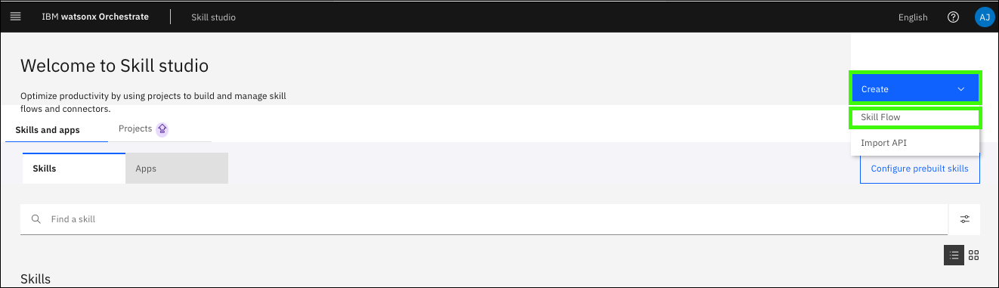

 # Use case: Db2 Error Message Debugging

 Database Administrators (DBAs) often spend significant time performing many routine database management tasks. And may often require manual intervention, increasing the risk of human error, slowing down operations and reducing overall productivity. And especially for early-tenure staff members, the troubleshooting and diagnosing error messages can take longer than necessary due to knowledge gaps, manual processes and lack of automation. 

 This scenario will show how a purpose-built assistant flow can help streamline the process of understanding a particular error message, generating accurate and current answers to questions, along with step-by-step guidance to learn more with conversational AI. Additionally, the assistant has the ability to recommend skills at different points in the conversation to help automate the resolution on their behalf, depending on the error message. This results in less time spent debugging error messages and improving the time-to-resolution of Db2 for z/OS errors.

 ## Test the Db2 Reorg Ansible Automation in AAP

 **placeholder**

 ## Importing the Ansible Playbooks as Skills

 For this use case, you will need to import 3 Ansible templates into watsonx Orchestrate as skills. 

 The Ansible templates you will import are:

 - Db2 Reorg
 - Retrieve job output (*utility skill*)
 - Retrieve job status (*utility skill*)

1. Open **Skill studio** in watsonx Orchestrate.
    
    

2. Click **Create** and then click **Import API**.

    

3. Click the **z/OS Skills accelerator (Trial)** tile.

    

4. Enter the following values in the **z/OS Skills accelerator** form and then click **Connect**.

    Use the **URL**, **User Name**, and **Password** values recorded in the [Explore Ansible Automation Platform](../../skills/exploreAAP.md) section earlier.

    **a**: Connection Type: 
    ```
    ansible
    ```

    **b**: Application Name: 
    ```
    db2-error
    ```

    **c**: Connection URL: 
    
    <Enter the URL for your AAP UI\>

    **d**: User Name: 
    
    <Enter the AAP User Name (for UI access)\>

    **e**: Password:
    
    <Enter the AAP User Password\>

    **f**: Search Pattern: 
    ```
    *
    ```

    

    


5. Expand the **Ansible Job Template Proj...** folder and then click **aap4zos**.

    

6. Select **Db2 Reorg** and then click **Save as draft**.

    

7. Click the ellipses () for the **Db2 Reorg** skill and select **Enhance this skill**.

    

8.  Review the skill enhancement options and then click **Publish**.

    

9.  **Challenge**: You also need to import the **Retrieve job output** and **Retrieve job status** utility skills to your **db2-error** app just like you did when creating the **Gather Facts** skill flow. Repeat steps 2 - 8 to import the **Retrieve job output** and **Retrieve job status** utility skills to your **db2-error** app. 
    
    Once done, you should be able to see all 3 skills in your **Skills Catalog** in the **Published** state.


## Verify all the skills are successfully imported and create the app connection.

1. Open **Skill catalog** in watsonx Orchestrate.

    

2. Enter **db2-error** in the search bar and click the application tile..

    

3. Click **Add skill +** for each of the 3 skills in the db2-error app and then click **Connect app**.

    

4. Enter your **AAP Username** and **AAP Password** and then click **Connect app**.

    

5. Verify that the app is connected.

    

## Connect the app to the assistant.

1. Open **Skill sets** in watsonx Orchestrate.

    

2. Select the **Draft** version of your assistant and click **Connections**.

    

3. Enter **db2-error** in the search bar.

    

4. Click the ellipses () for the *db2-error* app and select **Connect app**.

    

5. Click **Connect app**.

    

6. Enter your **AAP Username** and **AAP Password** and then click **Connect app**.

    

## Create a skill flow to extract and display job completion details

**The goal of this...**

Recall in the AAP template you executed earlier the output that was displayed showing:

- asfads
- asdfa
- asdf

You will build a skill flow that extracts this information from the Ansible automation's output and formats and displays it to the end user.

1. Open **Skill studio** in watsonx Orchestrate. 
   
    
   
2. Click **Create** and then click **Skill flow**.

     

3. Click the **+** icon.

     

4. Click the **db2-error** app.

    !!! Tip "Search on **db2-error** if you do not see the tile for your app."

    

5. Click **Add Skill +** in the **Retrieve job output** tile.

    

6. Click the **+** icon below the **Retrieve job output** skill. Next you'll add the **Input form** skill to extract certain output details. 

    

7. Click the **Custom forms** app tile. 
   
    

8. Click **Add skill +** in the **Input form** tile. 
   
    

9. **Repeat steps 6 - 8** to add the **Output form** skill after the previous skill from the same ***Custom forms*** app. The resulting skill flow should like the following:
    
    


Now that you have the skill flow built out, you will modify the inputs/outputs to display useful information about the **Db2 Reorg** automation post-completion. 

10. Click on the **Input form** tile and enter a **Form title**, such as ***Job completion details***.
    
    

11. Then click on **Add input field +**.
    
    

12. Select **Paragraph text** and then click **Next**. 
    
    

13. For this input field, enter a **Display label** of ***Return Code*** and then click **Apply**. 
    
    

14. Click on the resulting text box for the **Return Code** field. 
    
    

    Then in the  **Mapping data** window, select your **Retrieve job output** skill, and then click on the **content** skill output. 

    

    The result should look like the following:

    

15. Now **repeat steps 11 - 14** to add two more **Input fields** with **Display labels** titled:

    - Job ID
    - Image Copy DSN

    Once done, you should see the following with all 3 Input Fields:

    

16. Next, you will add **transformations** to each of the input fields to extract the relevant information from the Ansible output. 
    
    Underneath the **Return Code** input field, click on **Add transformation +**.

    

17. Click on the **Operator** drop-down and select **Get substring by regular expression**.
    
    

18. In the **Regular Expression** field, copy and paste the following string and then click **Add**.
    
    **Regular Expression**:
    ```
    (?<=Return Code: ).[^"]*
    ```
    
    

19. Now repeat steps 16 - 18 for both the **Job ID** and **Image Copy DSN** Input fields, however, using the following reugular expressions for each:
    
    - **Job ID**: `(?<=Job ID: ).[^"]*`
    - **Image Copy DSN**: `(?<=Image Copy DSN: ).[^"]*`
  
    Afterwards, you should have set regular expression transformations for all 3 Input fields:

    

20. Next, you will modify the **Output form** skill tile to display the 3 transformed fields to the end-user.
    
    Click on the **Output form** skill tile within your skill flow.

    

21. Click in the **Custom forms** field and enter `#` (the pound key, also known as the number sign or hash key).
    
    Typing the `#` opens a new dialog window. 

    

22. Expand **Input form**, select **Return Code**, and then click **OK**. 
    
    
    
    The result will look like the following:

    

23. Now **repeat steps 20 - 22** to add the transformed outputs of the other 2 fields:
    - **Job ID**
    - **Image Copy DSN**

    The result will look like the following:

    

24. To complete the skill flow, click on the **Retrieve job output** skill tile and hide both the Input and Output tabs. This disables the Retrieve job output skill form from being displayed. Instead, the job id from the Db2 Reorg skill will be automatically passed to the Retrieve job output skill as you will see later. 
    
    To do this, click on the **Retrieve job output** skill tile. 

    

25. On the **Input** tab, click on the **Hide this form from the user** toggle as shown below to enable it. 
    
    

26. Next, click on the **Output** tab and, again, click on **Hide this form from the user** toggle.
    
    

27. Finally, click on the **Input form** skill tile in your skill flow and click on the toggle to **Hide this form from the user**. 
    
    

28. Before saving your skill flow, you must give it a name. Click on the **pencil** icon ().

    

29. Enter `Job completion details` in the **Name** field and click **Save**. 
    
    **Name**:
    ```
    Job completion details
    ```

    

30. Click **Actions** and then click **Save as draft**.

    

31. Click **Actions** and then click **Enhance**.

    

32. Review the skill flow settings and click **Publish**.

    

    You should then see your new skill flow in the **Skill Studio** titled **Job completion details** in the **Published state**:

    

**You created a new skill flow that accomplishes part of the use case – retrieving and displaying the expiration date of a z/OS certificate based on the certificate label the user provides.**

## Add skills to your assistant as skill-based actions

Next, you will add the imported skills, including your newly created skill flow to your assistant as **skill-based actions** in order to call them from a **custom-built action** you will later create to handle the Db2 error debugging flow a user may initiate via natural conversation. 

In this section, you will add the following skills/skill flows to your assistant as **skill-based actions**:

- **Db2 Reorg** - imported from AAP
- **Retrieve job status** - imported from AAP as *utility skill*
- **Retrieve job output** - imported from AAP as *utility skill*
- **Job completion details** - skill flow you previously created to extract and return job-specific completion details
  
1. Open **AI assistant builder** in watsonx Orchestrate.

    

2. Click **Actions**.

    

3. Click **New action+**.

    

4. Click **Skill-based action**.

    

5. Click the **Db2 Reorg** tile and then click **Next**.

    

6. Click **Cancel** on the **New action** dialog.

    !!! Note "For this use case, the action is triggered from a custom-built action. To prevent the skill flow from being run as the skill-based action, do not enter any example phrases."

    

7. Click **x** to close the **Db2 Reorg** skill.

    

8. Repeat steps 3 - 7 to create a skill-based action for the following skills and skill flow you previously added:
   - **Retrieve job status**
   - **Retrieve job output**
   - **Job completion details**

    !!! Note "These actions are also triggered from a custom-built action. Do not enter any example phrases."

    When finished, all 4 new actions should appear in your **Actions list** similar to the following:

    


## Create a custom-built action for Db2 error Debugging

Next, you will create a custom-built action that handles the end-to-end debugging process when a user reports a Db2 error message. The steps in this section illustrate one way of accomplishing this. 

### Provide error message troubleshooting

The expected prompt when a user has to begin the debugging process may be something like ***I need help debugging***. 

Lets create a custom-built action to handle this. 

1. Click **New action +**. 
   
   **screenshot**

2. Click **Custom-built action**. 
   
   **screenshot**

3. Enter ***I need help debugging*** and then click **Save**. 
   
   **screenshot**

4. In the **Step 1** tile, in the **Assistant says** text box, type ***Please provide the error message***. 

    **screenshot**

5. Click the **Define customer response** option list and select **Free text** 
   
   **screenshot**
    
    This will prompt the user to enter their error message. 

6. Click **New step +**. 
   
   **screenshot**

7. In the **Step 2** tile, click the **Is taken** option list and select **with conditions**
   
   Then click the **And then** drop down and select **Search for the answer**. 

   **screenshot**

8. Click **Edit settings**, and in the **custom search query** field, enter the following prompt:
   
   `What is Db2 for z/OS error message`

   Followed by that text, enter the `$` symbol to select a variable. In the pop-up window, select **Action step variables** --> **1. Please provide the error message**.

   **screenshot**

    Then click **Apply**. 

    **screenshot**

9. 