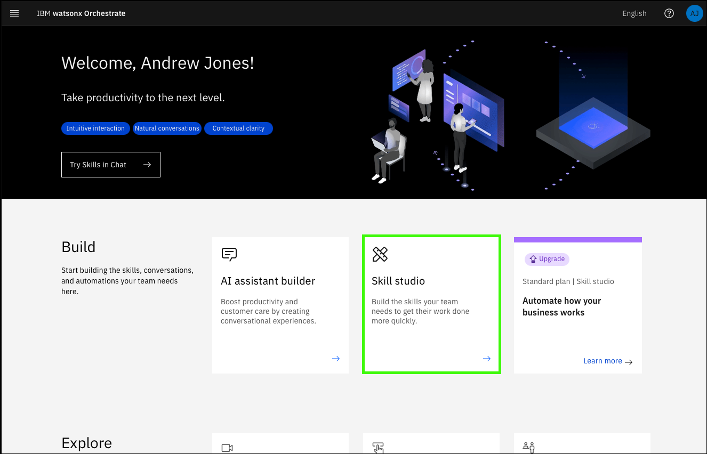

# Use case: Retrieve IPL information
Next, explore a use case to improve productivity for early-tenure system programmers (SysProg) who are preparing for an upcoming initial program load (IPL) for a logical partition (LPAR).

To prepare for the IPL, the SysProgs need to familiarize themselves with the process. Rather than spending time reading through the wide array of documentation available online, they would like to leverage the content-grounded capabilities provided by watsonx Assistant for Z to help them get accurate responses to their questions quickly and leverage automations.

As part of the pilot, they have already explored with prompting the assistant with questions. One example prompt they’ve asked the assistant is *“What information is needed to perform an IPL on a z/OS LPAR?”* In the response, the SysProg realizes there is information they must understand about their system in preparation for the IPL, for example the IPL Volume and the IPL LOAD PARM.

For this use case, you show how a simple automation for retrieving this type of information can be infused in a natural conversation with watsonx Assistant for Z by leveraging pre-packaged skills to automate various tasks on z/OS. The pre-packaged skills ship as an OpenAPI JSON file. Learn more about OpenAPI <a href="https://www.openapis.org/" target="_blank">here</a>. The file includes skill definitions that can be uploaded to the Skill Studio within watsonx Orchestrate to import the pre-packaged skills. However, the file must first be customized for your z/OS server before using the skills.

The list of pre-packaged skills available include:

- Authorized program list
- z/OS IPL Information
- Display zOS parmlib datasets
- Unix System services options
- Display zOS subsystems
- List spool files
- Retrieve dataset content
- Retrieve spool file content
- Retrieve z/OS Management facility (z/OSMF) job status

A great value of watsonx Orchestrate is the ability to build skills that anyone can use. You can build your own custom skills by importing an OpenAPI file into watsonx Orchestrate as a JSON or YAML file. For more information on building skills by importing OpenAPI files, refer to the documentation <a href="https://www.ibm.com/docs/en/watsonx/watson-orchestrate/current?topic=skills-building-by-importing-openapi-files" target="_blank">here</a>.

Watsonx Orchestrate also makes it possible to build, edit, and generate OpenAPI specifications by using the OpenAPI builder. With the OpenAPI Builder, you can use the AI function to simplify the process of generating these specifications. For more information on using the OpenAPI Builder, refer to the documentation <a href="https://www.ibm.com/docs/en/watsonx/watson-orchestrate/current?topic=skills-using-openapi-builder" target="_blank">here</a>.

For this use case, you will be importing the skill for retrieving a z/OS server’s IPL information. The next steps walk you through the process of downloading that OpenAPI JSON file and customizing it for your environment.

## Download and customize the watsonx Assistant for Z OpenAP JSON file
1. Download the watsonx Assistant for Z OpenAP JSON file.
   
       <a href="https://github.com/IBM/SalesEnablement-L4-watsonx-AssistantForZ/raw/refs/heads/main/docs/Setup/_sampleDocs/wxa4z-skillpak-prepackaged-skills.json.zip" target="_blank">wxa4z-skillpak-prepackaged-skills.json.zip</a>

2. Extract the file.

3. In a text editor, open the `wxa4z-skillpak-prepackaged-skills.json`, modify the server's url field as described, and save the file.
   
    **File name**: 
    ```
    wxa4z-skillpak-prepackaged-skills.json
    ```

    Substitute the string `<your z/OSMV URL>` with your Wazi as a Service (WaaS) instance URL. Your WaaS URL is based on your ITZ AAP URL which can be obtained from your ITZ watsonx Assistant for Z Pilot - AAP & z/OS reservation.

    The AAP URL will be similar to:

    ```https://itzvsi-aap-ppxbcno.techzone.ibm.com```

    Change the ```aap``` porition to ```zos``` and append ```:10443``` to the URL value. **Record this value for later use!** Your new URL will be similar to:

    ```https://itzvsi-zis-ppxbcno.techzone.ibm.com:10443```

    Before:

    

    After:

    

    !!! Warning "In watsonx Orchestrate, each app is associated with a single URL."
         
        If you have not imported previous skills into an app called `z/OS operations`, the default values in the **info** section are fine. If you already have a app named "z/OS operations", modify the **info** section to meet your needs.
       
        For more information on modifying the OpenAPI JSON file, see the instructions <a href="https://www.ibm.com/docs/en/watsonx/waz/2.x?topic=importing-prepackaged-zos-skills" target="_blank">here</a>.

## Set the RACF passphrase for z/OSMF authentication
For your skills to execute successfully on your WaaS instance, you need to ensure you can authenticate to it from watsonx Orchestrate. To achieve this, you will setup a new RACF Passphrase for the `IBMUSER` ID which is a pre-defined user ID on the WaaS server. The following steps will take you through the
steps of setting a new passphrase for your user and verifying access.

1. Open and log into the Ansible Automation Platform (AAP) web console. 

    !!! tip "Don't remember how to do this?"

        Refer to the first 5 steps in [Explore Ansible Automation Platform](../../skills/exploreAAP.md).

2. Click **Templates** under the **Resources** section.

    

3. Click the launch icon () for the **z/OS TSO Command(s)** template.

    

4. Replace the default command with the text that follows and substituting a password of your choosing for the string `YOUR PASSWORD PHRASE` and then click **Next**.

    ```
    ALTUSER IBMUSER PHRASE('YOUR PASSWORD PHRASE') NOEXPIRE RESUME
    ```

    !!! tip "Avoid typographical errors later... keep the password simple."
    
       If you type the command yourself, be sure to include the single quotes before and after the password. **Record the password as it will be needed later.** We will refer to this as your **WaaS password**."

    

5. Click **Launch**.
   
    

6. Verify the job is **Successful** by locating the message `"failed": false` in the job output.

    

7. Verify you can log in to z/OSMF in a new browser tab.

    Use the WaaZ URL created earlier and append `/zosmf` to the string. The URL will be similar to: `https://itzvsi-zos-pwgabob.techzone.ibm.com:10443/zosmf`.

    

    !!! Warning "Accept any *connection not private* messages to open the page."

8.  Enter (**a**) `IBMUSER` for the **z/OS USER ID**, (**b**) the password you specified in step 4 for the **z/OS PASSWORD**, and then (**c**) click **LOG IN**.
   
    

9.  Close the new browser tab after verifying a screen similar to the image that follows is displayed.

    
    
## Import and publish the pre-packaged skills as an OpenAPI file

1. Open **Skills studio** in watsonx Orchestrate.

    

2. Click **Create** and then click **Import API**.

    

3. Click **From a file**.

    

4. Click **Drag and drop files here or click to upload** in the **Import a skill file** window.

    

5. Locate and select your the json file you modified earlier and then click **Upload**.

    


6. Verify you receive the message **The Open file or skill package is good to go!** and then click **Next**.

    

    !!! Failure "Not good to go?"

        If the file does not load properly you will need to verify not formatting or errors were made in your json file. Return to the previous section to verify the file contents and then reload the JSON file.

7. Select the **z/OS IPL Information** skill and then click **Add**.

    **Note**: Only the **z/OS IPL Information** skill is required for this use case, but you can add as many skills as you like for testing purposes.

    

8.  Click the ellipses icon (~) for the **z/OS IPL Information** skill and then click **Enhance this skill**.

    

9.  Review the skill enhancements options and then click **Publish**.

    

10. If you added other skills in step 7 repeat steps the previous 2 steps for each skill you added.

## Configure your appURL to connect to the WaaS server
1. In **Skill studio** click the **Apps** tab.

    

2. In the search field, enter the name of the application in the search field. Unless you modified the `info` section of the JSON file, the default name is **z/OS operations**.

    

3. Click the ellipses icon (~) for the **z/OS Operations** and then click **Edit**.

    

4. Click the **Configuration** tab.

    

5. Click **Test connection**.

    **Note**: the **Server URL** field should match the URL you created for your WaaS server. It should be similar to: `https://itzvsi-zos-pwgabob.techzone.ibm.com:10443`.

       

6. Enter (**a**) `IBMUSER` in the **username** field, (**b**) your **WaaS password** created earlier in the **password** field, and then (**c**) click **Connect app**.

       

7. Verify the connection is successful and then click **Save**.

     

8.  Repeat step 2 above to verify the **Configuration status** is **Configured**.

     

## Test the skill
1. Open **Chat** in watsonx Orchestrate.
2. Click **Add skills 

Page 112 step 