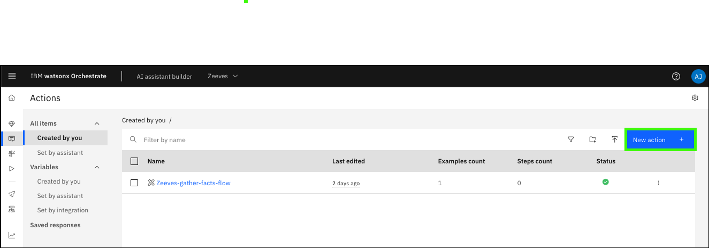

# Use case: Retrieve IPL information
Next, explore a use case to improve productivity for early-tenure system programmers (SysProg) who are preparing for an upcoming initial program load (IPL) for a logical partition (LPAR).

To prepare for the IPL, the SysProgs need to familiarize themselves with the process. Rather than spending time reading through the wide array of documentation available online, they would like to use watsonx Assistant for Z. The content-grounded capabilities that are provided by watsonx Assistant for Z return accurate responses to their questions quickly and uses automations to perform actions.

As part of the pilot, they already explored prompting the assistant with questions. In one example prompt, they asked the assistant is *“What information is needed to perform an IPL on a z/OS LPAR?”* In reading the response, the SysProg learns they need information about their system in preparation for the IPL. For example, the IPL Volume and the IPL LOAD PARM.

For this use case, show how a simple automation for retrieving this type of information can be infused in a natural conversation with watsonx Assistant for Z. You use pre-packaged skills to automate various tasks on z/OS. The pre-packaged skills are provided as an OpenAPI JSON file. Learn more about OpenAPI <a href="https://www.openapis.org/" target="_blank">here</a>. The file includes skill definitions that can be uploaded to the Skill Studio within watsonx Orchestrate to import the pre-packaged skills. First, the file must first be customized for your z/OS server.

The list of pre-packaged skills available include:

- Authorized program list
- z/OS IPL Information
- Display zOS parmlib datasets
- Unix System services options
- Display zOS subsystems
- List spool files
- Retrieve dataset content
- Retrieve spool file content
- Retrieve z/OS Management facility (z/OSMF) job status

A great value of watsonx Orchestrate is the ability to build skills that anyone can use. You can build your own custom skills by importing an OpenAPI file into watsonx Orchestrate as a JSON or YAML file. For more information on building skills by importing OpenAPI files, refer to the documentation <a href="https://www.ibm.com/docs/en/watsonx/watson-orchestrate/current?topic=skills-building-by-importing-openapi-files" target="_blank">here</a>.

Watsonx Orchestrate also makes it possible to build, edit, and generate OpenAPI specifications by using the OpenAPI builder. With the OpenAPI Builder, you can use the AI function to simplify the process of generating these specifications. For more information on using the OpenAPI Builder, refer to the documentation <a href="https://www.ibm.com/docs/en/watsonx/watson-orchestrate/current?topic=skills-using-openapi-builder" target="_blank">here</a>.

For this use case, you are importing the skill for retrieving a z/OS server’s IPL information. The next steps walk you through the process of downloading that OpenAPI JSON file and customizing it for your environment.

## Download and customize the watsonx Assistant for Z OpenAP JSON file
1. Download the watsonx Assistant for Z OpenAP JSON file.
   
       <a href="https://github.com/IBM/SalesEnablement-L4-watsonx-AssistantForZ/raw/refs/heads/main/docs/Setup/_sampleDocs/wxa4z-skillpak-prepackaged-skills.json.zip" target="_blank">wxa4z-skillpak-prepackaged-skills.json.zip</a>

2. Extract the file.

3. In a text editor, open the `wxa4z-skillpak-prepackaged-skills.json`, modify the server's url field as described, and save the file.
   
    **File name**: 
    ```
    wxa4z-skillpak-prepackaged-skills.json
    ```

    Substitute your Wazi as a Service (WaaS) instance URL for the string `<your z/OSMF URL>`. Your WaaS URL is based on your ITZ AAP URL that can be obtained from your watsonx Assistant for Z Pilot - AAP & z/OS ITZ reservation.

    The AAP URL is similar to:

    ```https://itzvsi-aap-ppxbcno.techzone.ibm.com```

    Change the ```aap``` string to ```zos``` and append ```:10443``` to the URL value. **Record this value for later use!** Your new URL is similar to:

    ```https://itzvsi-zos-ppxbcno.techzone.ibm.com:10443```

    Before:

    

    After:

    

    !!! Warning "In watsonx Orchestrate, each app is associated with a single URL."
         
        If you have not imported previous skills into an app called `z/OS operations`, the default values in the **info** section are fine. If you already have a app named "z/OS operations", modify the **info** section to meet your needs.
       
        For more information on modifying the OpenAPI JSON file, see the instructions <a href="https://www.ibm.com/docs/en/watsonx/waz/2.x?topic=importing-prepackaged-zos-skills" target="_blank">here</a>.

## Set the RACF passphrase for z/OSMF authentication
For your skills to run successfully on your WaaS instance, you need to ensure that you can authenticate to it from watsonx Orchestrate. To achieve successful authentication, setup a new RACF Passphrase for the `IBMUSER` ID that is a pre-defined user ID on the WaaS server. The following steps take you through the steps of setting a new passphrase for your user and verifying access.

1. Open and log in to the Ansible Automation Platform (AAP) web console. 

    !!! tip "Don't remember how?"

        Refer to the first 5 steps in [Explore Ansible Automation Platform](../../skills/exploreAAP.md).

2. Click **Templates** under the **Resources** section.

    

3. Click the launch icon () for the **z/OS TSO Command(s)** template.

    

4. Replace the default command with the text that follows and substituting a password of your choosing for the string `YOUR PASSWORD PHRASE` and then click **Next**.

    ```
    ALTUSER IBMUSER PHRASE('YOUR PASSWORD PHRASE') NOEXPIRE RESUME
    ```

    !!! tip "Avoid typographical errors later... keep the password simple."
    
       If you type the command yourself, be sure to include the single quotes before and after the password. **Record the password as it will be needed later.** We will refer to this as your **WaaS password**."

    

5. Click **Launch**.
   
    

6. Verify that the job is **Successful** by locating the message `"failed": false` in the job output.

    

7. Verify that you can log in to z/OSMF in a new browser tab.

    Use the WaaZ URL created earlier and append `/zosmf` to the string. The URL is similar to: `https://itzvsi-zos-pwgabob.techzone.ibm.com:10443/zosmf`.

    

    !!! Warning "Accept any *connection not private* messages to open the page."

8.  Enter (**a**) `IBMUSER` for the **z/OS USER ID**, (**b**) the password you specified in step 4 for the **z/OS PASSWORD**, and then (**c**) click **LOG IN**.
   
    

9.  Close the new browser tab after verifying a screen similar to the image that follows is displayed.

    
    
## Import and publish the pre-packaged skills as an OpenAPI file

1. Open **Skills studio** in watsonx Orchestrate.

    

2. Click **Create** and then click **Import API**.

    

3. Click **From a file**.

    

4. Click **Drag and drop files here or click to upload** in the **Import a skill file** window.

    

5. Locate and select the JSON file that you modified earlier and then click **Upload**.

    


6. Verify that you receive the message **The Open file or skill package is good to go!** and then click **Next**.

    

    !!! Failure "Not good to go?"

        If the file does not load properly you will need to verify not formatting or errors were made in your json file. Return to the previous section to verify the file contents and then reload the JSON file.

7. Select the **z/OS IPL Information** skill and then click **Add**.

    **Note**: Only the **z/OS IPL Information** skill is required for this use case, but you can add as many skills as you like for testing purposes.

    

8.  Click the ellipses icon () for the **z/OS IPL Information** skill and then click **Enhance this skill**.

    

9.  Review the skill enhancements options and then click **Publish**.

    

10. If you added other skills in step 7, repeat the previous 2 steps for each skill added.

## Configure your appURL to connect to the WaaS server
1. In **Skill studio**, click the **Apps** tab.

    

2. In the search field, enter the name of the application in the search field. Unless you modified the `info` section of the JSON file, the default name is **z/OS operations**.

    

3. Click the ellipses icon () for the **z/OS Operations** and then click **Edit**.

    

4. Click the **Configuration** tab.

    

5. Click **Test connection**.

    **Note**: the **Server URL** field must match the URL you created for your WaaS server. It is similar to: `https://itzvsi-zos-pwgabob.techzone.ibm.com:10443`.

       

6. Enter (**a**) `IBMUSER` in the **username** field, (**b**) your **WaaS password** created earlier in the **password** field, and then (**c**) click **Connect app**.

       

7. Verify that the connection is successful and then click **Save**.

     

8.  Repeat step 2 above to verify that the **Configuration status** is **Configured**.

     

## Test the skill
1. Open **Chat** in watsonx Orchestrate.

    

2. Click **Add skills from the catalog**.

    

3. In the search apps field, enter the name of the application. Unless you modified the `info` section of the JSON file, the default name is **z/OS operations**.

    

4. Locate and click the tile for your app (**z/OS operations**).

    

5. Click **Add skill +** for the **z/OS IPL Information** skill.

    

6. Repeat step 5 for any additional skills you added to the app.
7. Click **Connect app**.

    

8. Enter (**a**) `IBMUSER` in the **username** field, (**b**) your **WaaS password** created earlier in the **password** field, and then (**c**) click **Connect app**.

    
   
9. Verify that the skill is connected.

    

10. Open **Chat** in watsonx Orchestrate.

    

11. Click the **z/OS IPL Information** tile.

    

    !!! Warning "The name of the tile may be different."

        If you added multiple skills to your app, the tile name may be **z/OS operations** and the number of skills included will be shown.

12. Using the defaults in the form, click **Apply**.

    

13. Review the returned information.

    The provided output shows information the early-tenure SysProg needs to prepare for an IPL on their z/OS LPAR. For example, the date and time the system was last IPL’ed, the z/OS release level, the IPL volume, the IPL LOAD PARM used during the IPL, and other details.

    If you loaded other pre-packaged skills, test them now.

    

## Connect the app to your assistant
Before configuring the **z/OS IPL Information** skill as an assistant action, the app containing the skill must first be connected to the assistant.

1. Open **Skill sets** in watsonx orchestrate.

    

2. Click the **Skill sets** drop-down list and select the **Draft** of your assistant.

    

3. Click **Connections**.

    
   
4. Enter your skill app name (**z/OS operations**) in the search bar.

    

5. Click the ellipses icon (~) for the **z/OS operations** app and then click **Connect app**.

    

6. In the dialog, click **Connect app**.

    

7. Enter (**a**) **IBMUSER** in the username field, (**b**) your **WaaS password** in the password field, and then (**c**) click **Connect app**.

    

## Create an action for your assistant
Next, create a skill-based action that uses the **z/OS IPL Information**. Recall, with the **z/OS Gather Facts** skill flow that was created earlier, adding the skill as a skill-based action allows the skill to run based on user prompts to the assistant.

Skill-based actions also serve another purpose. After creating the skill-based action, you can then call that action from a custom-built action. This is accomplished through subactions. For this use case, create an action that triggers the **z/OS IPL Information** skill on z/OS to display the LPARs IPL information. That action is integrated into another custom-built action (as a subaction) to provide a customized user experience.

1. Open **AI assistant builder** in watsonx Orchestrate.

    

2. Select **Actions**.

    

3. Click **New action +**.

    

4. Click **Skill-based action**.

    

5. Click **z/OS IPL Information** and then click **Next**.

    

6. Enter a prompt like **Display IPL information** that starts the skill and then click **Save**.

     Prompt:
     ```
     Display IPL information
     ```

     

7. Click the **Save** icon ().

    

8. Click **Preview**.

    

    !!! Warning "Wait for the **Your changes are being added.** message to disappear before proceeding."

9. Enter the prompt (**Display IPL information**) to test the skill.

    

10. Using the defaults in the form, click **Apply**.

    

11. Verify the results.

    

12. Click the **delete** icon () to remove the example phrase (**Display IPL information**) from the skill.

    Next, you will add this skill-based action as a subaction to a custom-build action. To have the custom-built action started rather than the skill-based action, the existing *example phrases* need to be removed.

    

13. Verify (**a**) all **example phrases** are deleted, (**b**) click the **Save** icon (), and then (**c**) click **x** to close the action.

    

## Create a custom-built action
Custom-built actions allow you to define each step of a conversation with your assistant. You can define steps with or without conditions to control the user responses. You can include your skill-based actions as sub-actions. You can pass generated values between the subactions.

Recall the use case of an early-tenure SysProg who is preparing for an upcoming IPL on one of their LPARs. After going through documentation, the SysProg found that there is information that is needed about their LPAR before they can begin the IPL process. To gather that information, the SysProg might ask the assistant “How do you retrieve the information needed to IPL a z/OS LPAR? Provide a detailed response”. A response the assistant might return is shown in the following image.


A custom-built action can help the SysProg to take the next steps that are required by adding next-step action suggestions and start skills to gather the needed information.

1. Click **New action +**.

    

2. Click **Custom-built action**.

    

3. Enter an example phrase (**Retrieve IPL information**) to prompt the assistant to start the custom-built action and click **Save**.

    Prompt:
    ```
    Retrieve IPL information
    ```

    

4. Review the form to create a custom-built action.

    A custom-built action can consist of multiple steps with each step that is taken with or without conditions. Each step specifies the assistant's response and the next step to start.
   
    !!! Note "For client demonstrations and pilots..."

        For client demonstrations and pilots, it is possible to add a custom search query such that when conversational search is executed in the 1st step, the query being used is hard-coded and isn’t necessarily what the end-user inputted. This can be done by clicking on the Edit settings option under Search for the answer and specifying a custom search query that specifies the exact query to be used.

5. Click the **And then** drop-down list and select **Search for the answer**.

    

6. Click **Edit settings**.

    

7. Enter a **Custom search query** and click **Apply**.

    Custom search query:
    ```
    How do you retrieve the information needed to IPL a z/OS LPAR? Provide a detailed response
    ```

    

8. Click **Next step +**.

     The new custom-built action only responds with a description of how to retrieve the IPL information. Now, infuse automation into the conversation and ask the user if they want to perform the action.

     

9. In the **Assistant says** field, enter a response asking if the user wants to display the IPL information.

    Assistant says:
    ```
    Would you like to display your LPARs IPL information?
    ```

     

10. Click the **Define customer response** drop-down and select **Confirmation**.

     Now, after providing a conversational search-based response to the original question, the assistant asks the user if they want to display the IPL information and prompts the user to select **Yes** or **No**.

     

11. Click **Next step +**.

     

12. Click the **Is taken** drop-down and select **with conditions**.

     

13. Review the **Conditions**.

     Notice that the default condition is based on **Step 2** and the user clicking **Yes** when prompted.

     

14. Enter **Retrieving your system's IPL information...** in the **Assistant says** field.

     Assistant says:
     ```
     Retrieving your system's IPL information...
     ```

     

15. Click the **And then** drop-down and select **Go to a subaction**.

     

16. Click (**a**) the **Go to** drop-down, (**b**) select your skill-based action (**z/OS IPL Information**), and then (**c**) click **Apply**.

     

17. Click **Save** () and then click **x**.

     

## Test the custom-built action
You can now practice demonstrating the flow of this use case. Recall the steps that were taken and the scenario of the early-tenure SysProg being tasked with preparing for an upcoming IPL.

1. Click **Preview**.

    

2. Enter **How do you retrieve the information needed to IPL a z/OS LPAR?** in the assistant prompt.

     Prompt:
     ```
     How do you retrieve the information needed to IPL a z/OS LPAR?
     ```

    !!! Tip "Use the **Change layout** option to open a full page view of the assistant."

    

3. Review the response.

     By using the conversational search capability of watsonx Assistant for Z, grounded on Z-domain knowledge in the Z RAG, the user is able to quickly find an answer to their question. The assistant returns a response that shows the exact operator command they might use, and the types of details it provides which is relevant for preparing for an upcoming IPL. For example, the system’s release level, the LOAD LIB information used for the IPL, the IODF device, the IPL device, and other system information.
    
     You are also able to improve their productivity by infusing automations into the natural conversation that will provide them exactly the information they need to accomplish their task.

     

4. Click **Yes**.

     

5. Using the defaults in the form, click **Apply**.

     

6. Review the response to the custom-built action.

     The output provides relevant pieces of information the early-tenure SysProg needs to prepare for an IPL on their z/OS LPAR. For example, when the system was last IPLed, the z/OS release they have running (2.5), the IPL volume (D25VS1), the IPL LOAD PARM (LOADK2) used during the last IPL, and other relevant details.
    
     

The ability to infuse skills and automations into the conversation allows the user to issue the operator command on their system directly within the assistant itself. The assistant provides a single interface for retrieving details that are required for the IPL process to go smoothly and increases the user's efficiency.