#Use case: RACF administration support
!!! Info "This is a ***challenge*** use case."

     In this use case, step-by-step directions are not provided. Use the knowledge gained from previous sections of the lab guide to complete updates to the assistant to meet the use case requirements. Several help tips are provided and a sample demonstrate flow is included.

This use case explores the ability of watsonx Assistant for Z to provide self-service support for activities related to Resource Access Control Facility RACF (RACF) Administration support. The client mentioned that their RACF Administrators are often inundated with requests to help reset user's Time Sharing Option (TSO) passwords. Also, requests to grant users certain authorizations to RACF profiles required for the users to complete their jobs are numerous.

Creating a custom-built action for the assistant that provides self-service options to users requesting RACF assistance. Depending on the assistance being requested, the assistant will trigger automations that complete tasks on their behalf without intervention from the RACF Administrator.

!!! Warning "The actions and configuration that follow are meant purely for demonstration purposes."

     The actions and configuration that follow are meant purely for demonstration purposes to show the art of the possible with watsonx Assistant for Z. There are security considerations to keep in mind when configuring assistants for this purpose, including user authentication and the ability to authorize users to execute certain automations. However, by following the steps in this section, you will show the level of customization that is possible with watsonx Assistant for Z and different an assistant can improve productivity.

1. Create an app with the required TSO skills.

    !!! Tip "Use **Skills studio** to create the app."

    **App name**:
    ```
    TSO Command
    ```
    
    Skills to include: 
    **z/OS TSO COmmand(s)** 
    **Retrieve job output** (utility skill)

    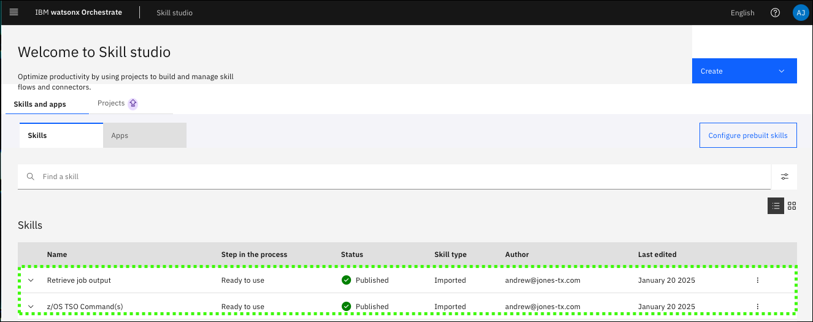

2. Create a connection for the app.

    !!! Tip "Use **Skills catalog** to create the app."

    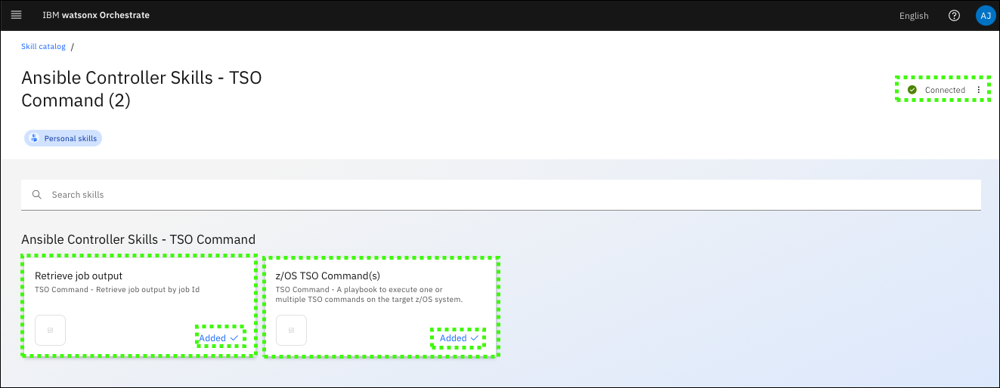

3. Create a skill flow to get the output of the **TSO Command**.

    !!! Tip "Use Skills studio to create the skill flow."

    The skill flow should run the **TSO Command** skill and then the **Retrieve job output** utility skill. The output from the **TSO Command** should be mapped to the input of the **Retrieve job output** utility skill. Hide both the input and output forms for the **TSO Command** skill.

    **Skill flow name**:
    ```
    TSO COMMAND
    ```

    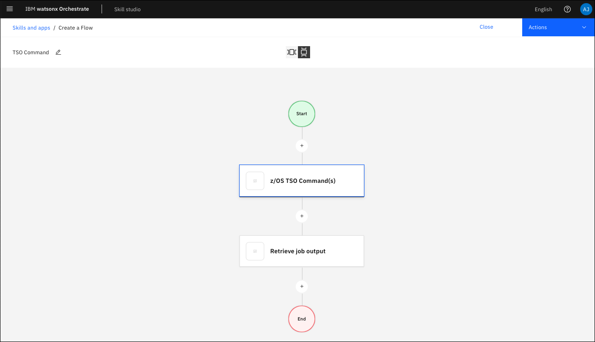

4. Add the skills to the **draft** version of the assistant.

    !!! Tip "Use **Skill sets** to add the skills to the assistant."

    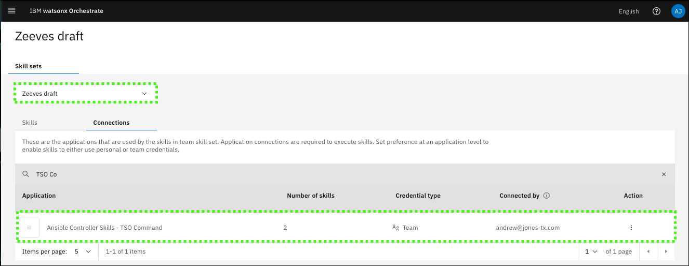

5. Create a skill-based action that uses the skill flow.

    Create an action that triggers the skill flow to execute TSO commands on z/OS and then display the output of those commands. 

    !!! Tip "Use **AI Assistant builder** to create the action."

    !!! Tip "Do not add example phrases to the skill-based action."

    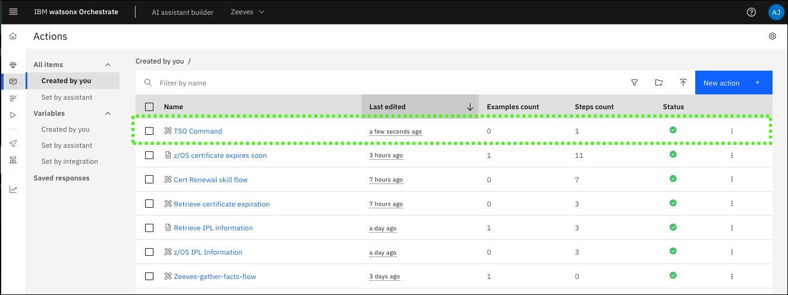

6. Create a custom-built action for RACF administration support.

    !!! Tip "Use **AI Assistant builder** to create the action."

    **Phrase to start the interaction**:
    ```
    RACF assistance
    ```

    The steps for the custom-built action follow:

    **Step 1.** *Without conditions*, prompt the user for their RACF User ID as *free text*.

    **Assistant says**:
    ```
    What is your RACF User ID?
    ```

    The step should look like the following image:

    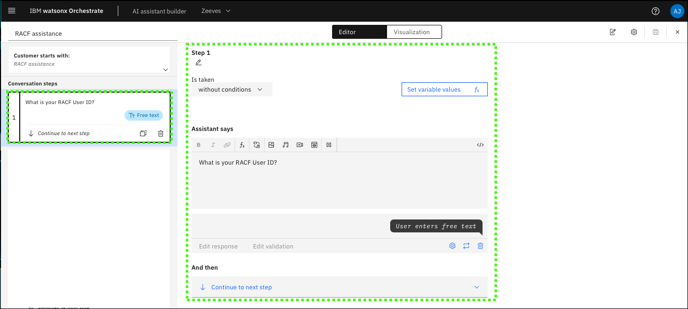

    !!! Warning "Use the following guidance when entering prompts and expressions in the following custom-built action steps."

        Do NOT use the copy and paste icon if the string contains a `$`. Type each string manually.

        When `$` appears in the string to enter, type the `$` character and then select the variable specified in the `<>`. For example: `User passphrase changed to $<7. Please enter your new RACF passphrase>`

        Use the `single quote` character **'** for all single quotes shown.


    **Step 2.** *Without conditions*, use provided user ID and display a message that the assistant is checking the current privileges.

    **Assistant says**:

    `Checking user privileges for $<1. What is your RACF User ID>`

    Include in the **Assistant says** the provided user ID by including the function *1. What is your RACF User ID*. 

    Add an **And then** option to run the **TSO Command** as a subaction. 
    
    Edit the **passed values** for the subaction and add a new passed value for *1. extra_vars.zos_tso_command*. The **To** of the variable will be an **Expression** and include the string:
    
    `'LIST USER ' + $<1. What is your RACF User ID>`
    
    After the `+ `, enter a `$` and select **Action step variables** and then select **1. What is your RACF User ID**.

    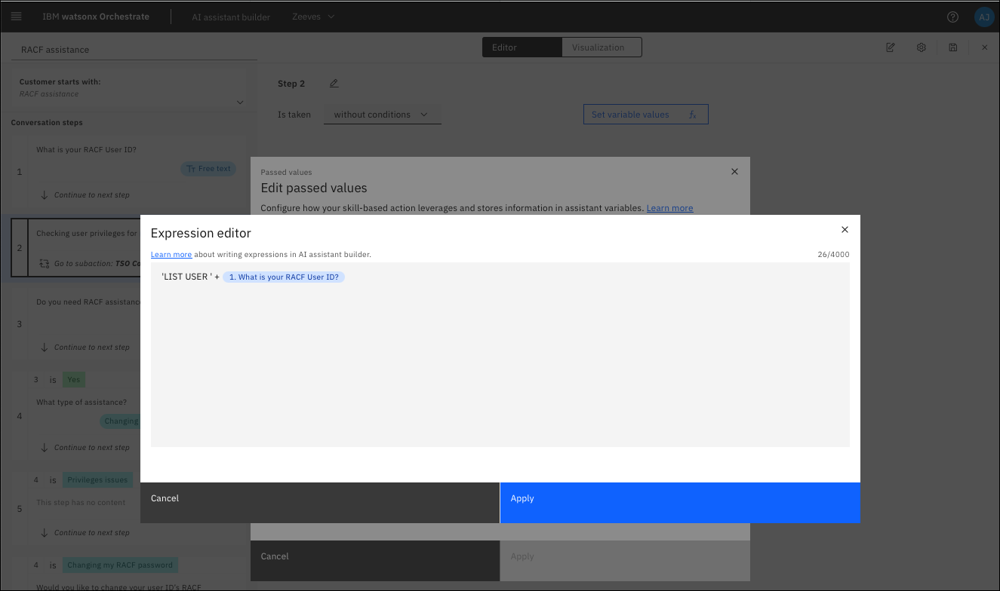

    The step should look like the following image:

    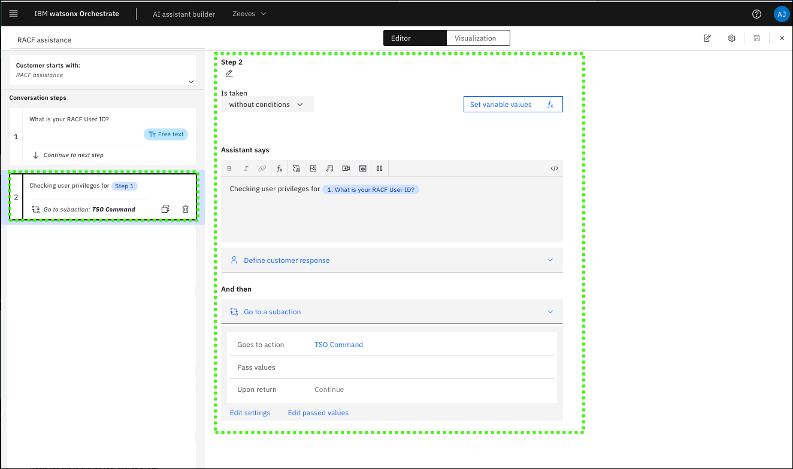    

    **Step 3.** *Without conditions*, prompt the user if they want RACF assistance and get a `Yes` or `No` confirmation.

    **Assistant says**:
    ```
    Do you need RACF assistance?
    ```

    The step should look like the following image:

    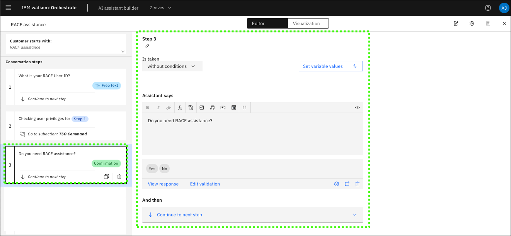    

    **Step 4.** *With conditions*, prompt the user what type of assistance they need.

    **Assistant says**:
    ```
    What type of assistance?
    ```

    Create a **Options** type **Customer response** with two options:
    ```
    Changing my RACF password
    ```
    and
    ```
    Privileges issue
    ```

    Change the **Customer response** settings to **Always ask for this information, regardless of previous messages.**

    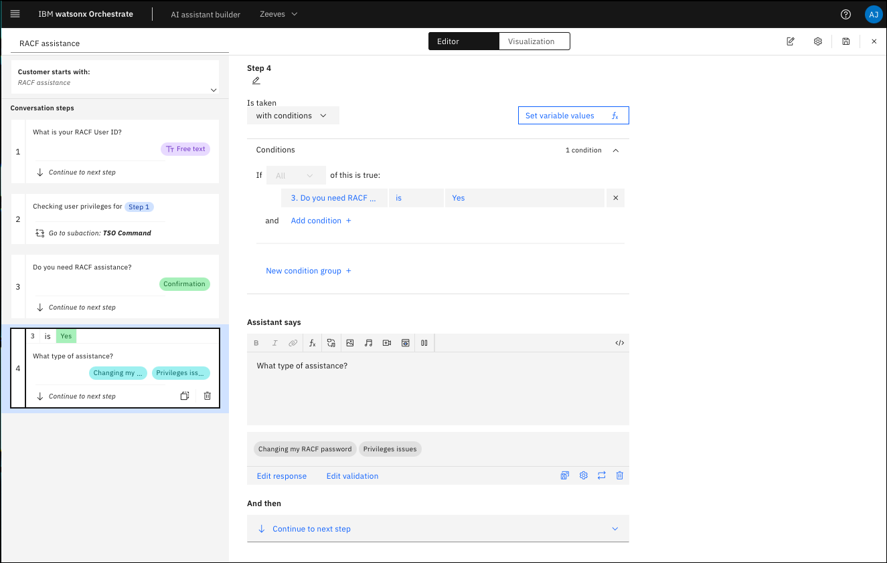

    The step should look like the following image:

    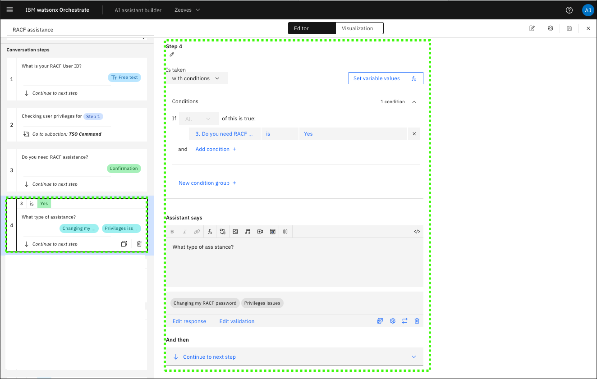   

    **Step 5.** *With conditions*, change the condition **Step 4. What type of assistance?** and the value of **Privilege issue**.

    **Assistant says**:
    ```
    Notifying the RACF Administrator.
    ```

    !!! Note "Other options exist."

        There are alternative actions that can be taken if the user selects ‘Privileges issue’. For example, the assistant can trigger an automated email to the RACF administrator. At the time of writing this documentation, Orchestrate does not allow Outlook integrations to IBM’s Outlook organization, so this action cannot be demonstrated. But for the purpose of the flow, simply have the assistant respond with ‘Notifying the RACF Administrator’ for demonstration purposes.

    The step should look like the following image:

    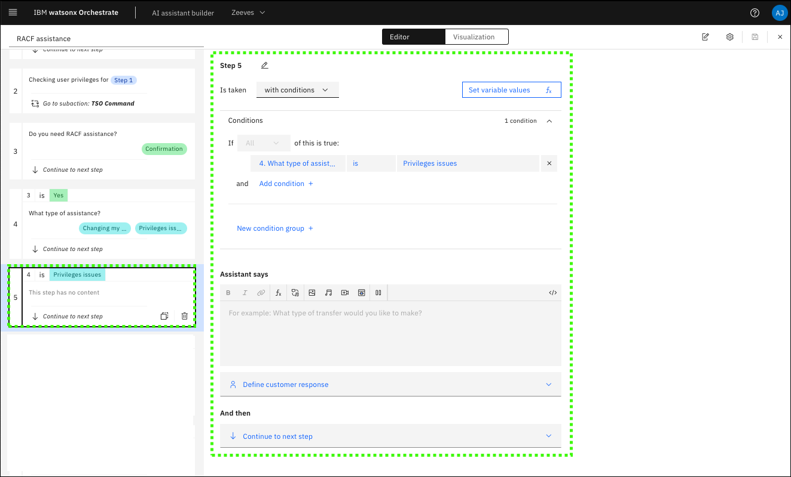   

    **Step 6.** *With conditions*, change the condition **Step 4. What type of assistance?** and the value of **Changing my RACF password**, and add a `Yes` or `No` confirmation.

    **Assistant says:**
    ```
    Would you like to change your user ID’s RACF passphrase?
    ```

    The step should look like the following image:

    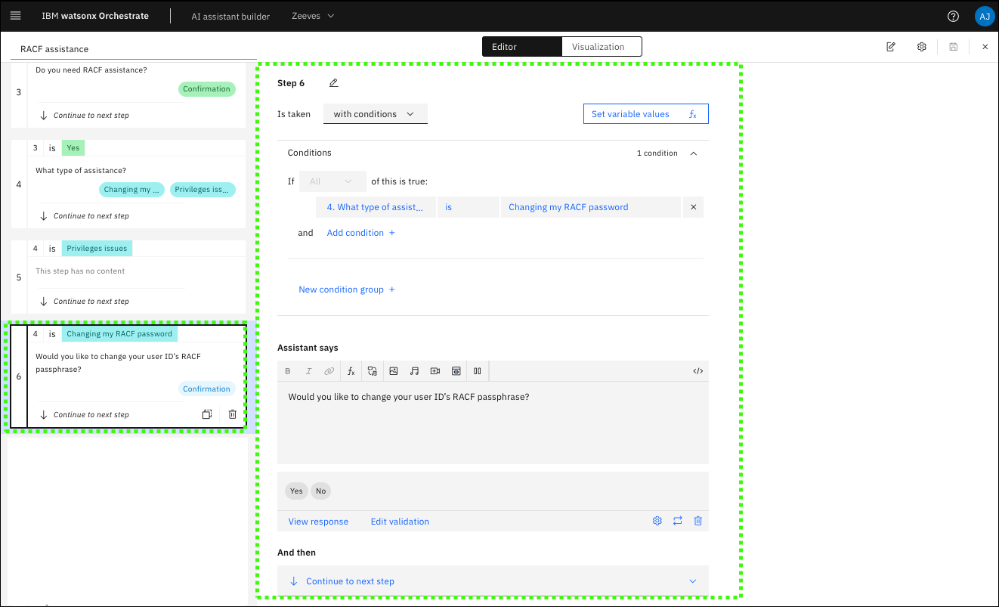  

    **Step 7.** *With conditions*, prompt the user to enter their new password as *free text*.

    **Assistant says**:
    ```
    Please enter your new RACF passphrase.
    ```

    The step should look like the following image:

    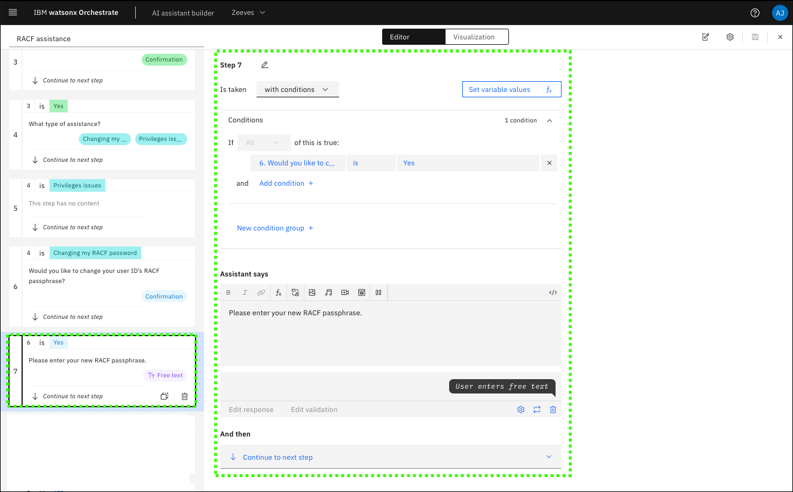  

    **Step 8.** *With conditions*, change the condition to **Step 6. Would you like to change your user IDS passphrase** equals `Yes`, inform the user the password is bing changed, and create a **TSO Command** subaction to change the passphrase.

    **Assistant says**:
    ```
    Issuing RACF command ...
    ```

    !!! Warning "The formatting of the values that follow is important."

        When creating the **To** expression for the passed values, be very careful with typing the expression. Do NOT cut & paste this value. Type each charter. All quotes are single-quotes. The `$<>` denotes typing `$` and then selecting the appropriate **action step variable**.

    Edit the passed values for the TSO Command subaction to include the **1. extra_vars.zos_tso_command** variable with a **To** expression with the value of:

    `'ALTUSER ' + $<1. What is your RACF User ID?> + ' PHRASE(''$<7. Please enter your new RACF passphrase>'') NOEXPIRE RESUME'`

    The expression should look like the following image:

    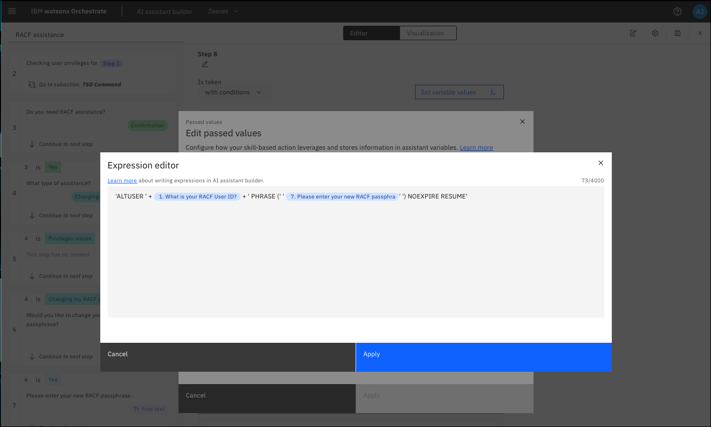

    The step should look like the following image:

    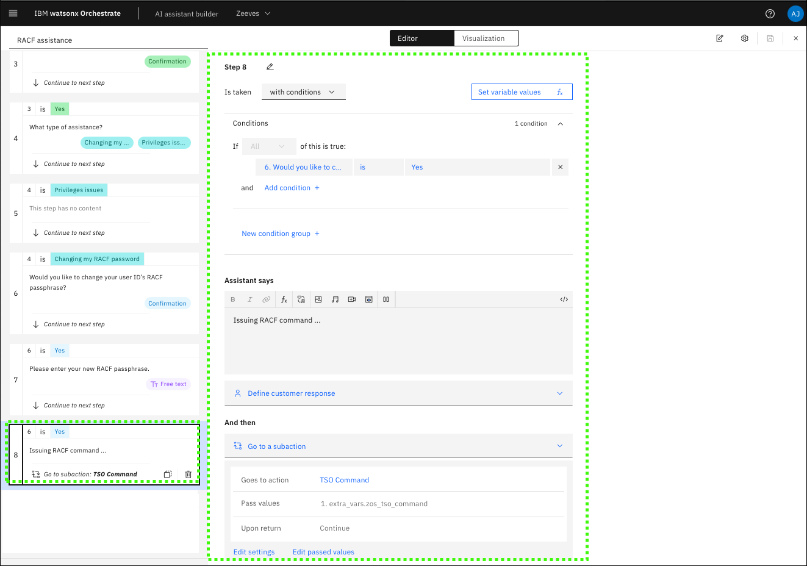  

    **Step 9.**: *With conditions*, change the condition to **Step 6. Would you like to change your user IDS passphrase** equals `Yes`, and inform the user the passphrase has been changed. Change the **And then** option to **End the action**.

    **Assistant says**: 
    
    `User passphrase changed to $<7. Please enter your new RACF passphrase.>`

    When entering the above string, after typing `$` select the **7. Please enter your new RACF passphrase**.

    The step should look like the following image:

    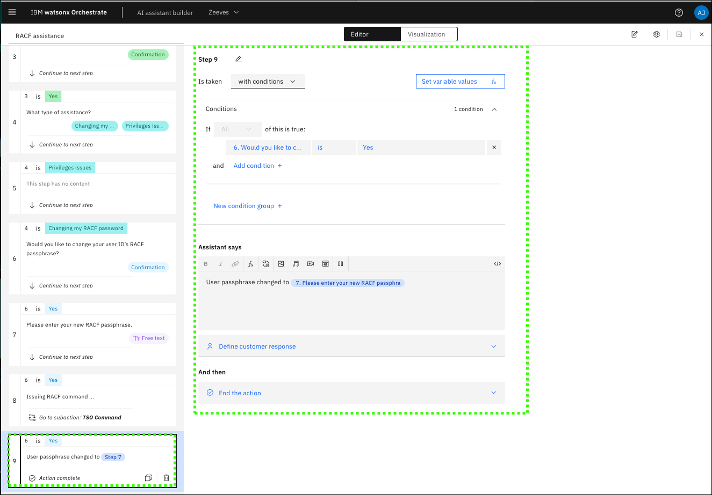  

7. Be sure to save your custom-built action.

8. Demonstrate the custom-built action.

    Using the **AI Assistant builder** preview, run the custom-built action. Use the APP web console to verify the passphrase ws changed. 
     
    The following video shows how the demonstration should work. The video does not have audio.

    

  
This use case demonstrates the value watsonx Assistant for Z can provide to offload common, manual tasks from subject matter experts like RACF Administrators. The use case shows the level of customization offered with infusing automations into natural conversations. Watsonx Assistant for Z improves employee productivity and reduces effort needed by individuals to completing manual tasks.


 


